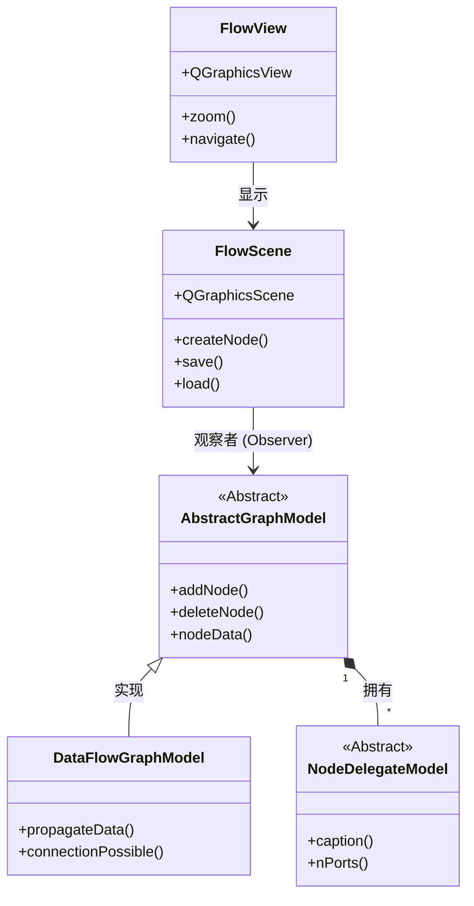

# NodeEditor (QtNodes) 综合技术报告

## 1. 项目概览 (Project Overview)

**项目名称**: QtNodes
**GitHub 仓库**: [paceholder/nodeeditor](https://github.com/paceholder/nodeeditor)
**核心定位**: 基于 C++/Qt 的通用节点编辑器库
**许可证**: BSD-3-Clause
**项目状态**: 活跃维护中 (v3 版本)

QtNodes 是一个基于 Qt 框架的通用 C++ 库，旨在为开发者提供一套功能强大的节点编辑器组件。它将复杂的图形渲染、交互逻辑与底层数据模型分离，使开发者能够专注于业务逻辑（如数据流处理、图形算法），而无需从头构建可视化的节点连接界面。

### 1.1 关键指标
*   **Stars**: 3.6k+
*   **语言**: C++ (91%)
*   **依赖**: Qt 5.15+ 或 Qt 6, CMake 3.8+, Catch2 (测试)

## 2. 核心特性与架构 (Architecture)

QtNodes 采用了严格的 **Model-View (MV)** 架构，这使得它既可以用于带有界面的桌面软件，也可以用于无界面的服务器端数据处理（Headless Mode）。

### 2.1 类关系图



### 2.2 核心组件
*   **AbstractGraphModel**: 数据模型的基类，掌管图的拓扑结构。
*   **FlowScene**: 视图层的核心，负责响应模型信号并创建 `QGraphicsItem`。
*   **Headless Mode**: 由于 Model 是独立的，可以在没有 GUI 的后台线程中运行完整的数据流逻辑。

## 3. 深度技术剖析 (Technical Deep Dive)

### 3.1 内存管理与所有权
*   **节点逻辑 (Logic)**: `DataFlowGraphModel` 是绝对的所有者。它维护了一个 `std::unordered_map<NodeId, std::unique_ptr<NodeDelegateModel>>`。使用 `std::unique_ptr` 确保了节点逻辑对象的生命周期与 GraphModel 严格绑定。
*   **节点视觉 (Visual)**: `FlowScene` (View层) 不拥有节点数据，只负责渲染。它通过 Signal/Slot 机制响应 Model 的变化。

### 3.2 数据流传播机制 (Propagation)
这是一个基于 **Push (推送)** 的递归传播系统：
1.  **源头触发**: 节点逻辑计算完成 -> 发射 `dataUpdated` 信号。
2.  **模型介入**: GraphModel 查找连接 -> 调用下游节点的 `setInData`。
3.  **链式反应**: 下游节点接收数据 -> 触发 `compute()` -> 继续发射信号。

### 3.3 渲染优化
为了支持大规模图表，QtNodes 采用了：
*   **DeviceCoordinateCache**: 节点被预渲染为 Pixmap 缓存在显存中，拖拽时无需重绘矢量路径。
*   **Strategy Pattern**: 绘图逻辑被封装在 `AbstractNodePainter` 中，允许通过代码或配置文件热切换整个图表的视觉风格。

### 3.4 C++ 高级特性
*   **多态数据传输**: 数据载体是 `std::shared_ptr<NodeData>`（纯虚基类），而非 `std::any`。这提供了更强的类型安全和多态能力。
*   **反射与工厂**: 利用 `NodeDelegateModelRegistry` 注册 Lambda 构造器，实现了基于字符串（如 JSON 中的 "ModelName"）动态创建 C++ 对象的能力。

## 4. 视觉展示 (Showcase)

该库已被用于多个复杂的生产环境项目：

### 4.1 汽车仿真 (CANdevStudio)


### 4.2 可视化编程 (Chigraph)


## 5. 代码与集成

快速启动一个包含数据流模型的场景：

```cpp
#include <QtNodes/FlowScene>
#include <QtNodes/FlowView>
#include <QtNodes/DataFlowGraphModel>
#include <QApplication>

using namespace QtNodes;

int main(int argc, char *argv[])
{
    QApplication app(argc, argv);

    // 1. 初始化注册表
    auto registry = std::make_shared<NodeDelegateModelRegistry>();
    // registry->registerModel<MyCustomNode>();

    // 2. 创建模型 (DataFlow 后端)
    auto model = std::make_shared<DataFlowGraphModel>(registry);

    // 3. 创建视图 (Scene & View)
    FlowScene scene(model);
    FlowView view(&scene);

    view.setWindowTitle("Final Report Demo");
    view.resize(800, 600);
    view.show();

    return app.exec();
}
```

## 6. 总结
QtNodes 是目前 Qt 生态中架构最清晰、性能最优的开源节点编辑器方案。其核心优势在于 **Model-View 的彻底分离**，不仅让代码易于测试，更为构建复杂的、甚至无需界面的数据流处理服务提供了可能。

---

## 附录：演讲讲解稿

### 开场白（1-2分钟）
大家好！今天我要为大家介绍一个非常强大的 C++ 开源库 —— **QtNodes**。它是一个专门用于构建**节点编辑器**的框架。

**什么是节点编辑器？** 如果你用过 Photoshop 的滤镜效果组合、或者玩过 Unreal 引擎的 Blueprint 蓝图系统，你就已经见过节点编辑器了。它允许用户通过拖拽"盒子"（节点）并用线连接它们，来可视化地构建复杂的逻辑流程或数据处理管道。

### 第一部分：项目概览（3-5分钟）

**（展示 GitHub 页面或 HTML 的 Hero Section）**

这个项目在 GitHub 上有 **3600+ Stars**，这说明它在开源社区非常受欢迎。它的代码 **91% 是 C++**，这意味着它的性能非常高，适合处理大规模的数据流。

**核心优势：**
1. **Model-View 架构分离** - 这是它最大的亮点。传统的图形界面库往往把数据和显示混在一起，但 QtNodes 把"数据"和"图形"完全分开了。
2. **Headless Mode（无头模式）** - 你可以在没有界面的服务器上运行节点逻辑，这对于后台数据处理非常有用。

### 第二部分：架构设计（5-8分钟）

**（展示类图）**

让我详细解释一下它的架构。QtNodes 采用了经典的 **Model-View (MV)** 模式，但做得比传统的 Qt 更彻底。

#### 核心类说明：

1. **AbstractGraphModel（抽象图模型）**
   - 这是"大脑"，负责存储所有的节点数据和连接关系。
   - 它不知道、也不关心界面长什么样。
   - 开发者通常会继承它来实现自己的业务逻辑。

2. **DataFlowGraphModel（数据流图模型）**
   - 这是 AbstractGraphModel 的一个具体实现。
   - 它增加了"数据自动传播"的功能。当一个节点输出数据时，它会自动推送到下游节点。
   - 比如在图像处理中，当你调整了"亮度"节点，它会自动重新计算并更新下游的"对比度"节点。

3. **FlowScene（流场景）**
   - 这是"眼睛"，负责显示图形界面。
   - 它监听 Model 发出的信号（比如 `nodeCreated` 信号），然后在屏幕上画出对应的图形项。

4. **FlowView（流视图）**
   - 这是窗口本身，负责处理用户的缩放、平移等交互操作。

**关键点：** Model 和 View 之间通过 **Qt 的信号槽机制**通信。这意味着它们完全解耦，你可以单独测试 Model 的逻辑，而不需要启动整个 UI。

### 第三部分：技术深度剖析（10-15分钟）

现在我来讲解一些底层的技术细节，这些是我通过研究源码发现的。

#### 3.1 内存管理

**（展示代码片段）**

```cpp
std::unordered_map<NodeId, std::unique_ptr<NodeDelegateModel>> _models;
```

这行代码很关键。它使用了 `std::unique_ptr`，这是 C++11 的智能指针。

**为什么这么做？**
- `unique_ptr` 保证了节点对象的**独占所有权**。当 Model 被销毁时，所有节点会自动释放，不会发生内存泄漏。
- View 层（FlowScene）不拥有节点数据，它只是"借用"指针来显示。如果用户关闭了窗口，Model 中的数据依然存在。

#### 3.2 数据传播机制

**（展示时序图）**

让我用一个具体例子说明数据是如何流动的：

1. 假设你有一个"输入图像"节点 A 和一个"高斯模糊"节点 B。
2. 当用户加载了一张新图片到节点 A，节点 A 的代码会调用 `Q_EMIT dataUpdated(outputPort)`。
3. DataFlowGraphModel 捕获这个信号，查找哪些节点连接到了节点 A 的输出端口。
4. 它发现节点 B 连接了，于是调用节点 B 的 `setInData(imageData)` 方法。
5. 节点 B 收到数据后，执行高斯模糊算法，然后再次发射 `dataUpdated`，继续传播给下游节点。

**这是一个递归的过程**，数据会自动流过整个网络。

#### 3.3 类型安全检查

你可能会问：如果我把一个"文本"输出连接到一个"图像"输入，会发生什么？

答案是：**连接会被拒绝**。QtNodes 在创建连接时，会检查两个端口的 `NodeDataType::id`。只有当它们的类型字符串完全匹配时，连接才会被允许。

```cpp
bool compatible = (sourceType.id == sinkType.id);
```

这在 UI 上的表现是：当你拖动连线时，不兼容的端口会变灰，无法连接。

#### 3.4 渲染优化

为了支持上千个节点，QtNodes 使用了一个关键技巧：**DeviceCoordinateCache**。

```cpp
setCacheMode(QGraphicsItem::DeviceCoordinateCache);
```

**这是什么意思？**
- 每个节点会被预先绘制成一张**位图（Pixmap）**，然后缓存在显存中。
- 当你拖动节点时，Qt 只需要移动这张位图的坐标，而不需要重新执行复杂的矢量绘图指令（如画圆角矩形、渐变色等）。
- 这就像游戏中的"精灵图"技术，大幅提升了性能。

### 第四部分：实际应用案例（5-8分钟）

**（展示 Showcase 图片）**

让我展示几个真实的项目，它们都是基于 QtNodes 构建的：

1. **CANdevStudio** - 这是一个汽车行业的工具，用于模拟 CAN 总线信号。你可以看到复杂的节点连接，每个节点代表一个信号源或监控器。

2. **Chigraph** - 这是一个"可视化的 C++ 编程语言"。它把 C++ 的函数、循环、条件判断都表示成节点，让初学者可以通过拖拽来学习编程。

3. **Spkgen** - 这是一个游戏开发工具，用于设计粒子特效。美术人员可以通过调整节点参数，实时预览爆炸、火焰等效果。

### 第五部分：如何开始学习（3-5分钟）

如果你想学习这个库，我建议按照以下路线：

**第1周：基础阶段**
- 克隆仓库，编译并运行官方示例（examples 文件夹）。
- 理解 `FlowScene`、`FlowView` 和 `AbstractGraphModel` 的关系。
- 尝试修改示例代码，添加一个简单的"数字加法"节点。

**第2周：进阶阶段**
- 学习如何定义自己的 `NodeData` 类（数据载体）。
- 实现一个小项目，比如一个"文本处理管道"：输入 -> 转大写 -> 反转 -> 输出。
- 尝试用 JSON 自定义节点的颜色和样式。

**第3-4周：高级阶段**
- 深入研究 `DataFlowGraphModel` 的源码，理解数据传播的实现。
- 集成 Undo/Redo 功能。
- 优化性能：处理 500+ 节点的场景。

**长期目标**
- 构建一个完整的应用，比如"音频效果器"或"图像滤镜编辑器"。
- 为开源社区贡献代码或写一篇技术博客。

### 第六部分：常见问题（Q&A准备）

**Q1: QtNodes 和 Unreal Blueprint 有什么区别？**
A: Unreal Blueprint 是专门为游戏引擎设计的，集成了大量游戏相关的节点（如角色控制、物理模拟）。而 QtNodes 是一个通用的"空白画布"，你可以用它构建任何领域的节点编辑器。

**Q2: 为什么不直接用 Python 的 NodeGraph-Qt？**
A: Python 版本更易学，但性能有限。如果你需要处理实时音视频流、或者集成到 C++ 的工业软件中，QtNodes 是更好的选择。

**Q3: 学习曲线陡吗？**
A: 如果你熟悉 Qt 框架和 C++，大约 1-2 周就能上手。如果是新手，建议先学习 Qt 的 Graphics View Framework 基础。

### 结尾（1-2分钟）

总结一下，QtNodes 是一个设计精良、性能卓越的节点编辑器库。它的 **Model-View 分离架构**、**Headless 模式**和**优秀的渲染优化**使其成为构建专业级工具软件的首选方案。

无论你是想做图像处理、游戏开发、音频工作站还是工业自动化，QtNodes 都能为你节省大量的基础开发时间，让你专注于业务逻辑的实现。

感谢大家的聆听！如果有任何问题，欢迎随时交流。

---

## 附录：关键术语解释

### Model-View (MV) 架构
- **Model（模型）**: 负责存储数据和业务逻辑。在 QtNodes 中，它是 `AbstractGraphModel`。
- **View（视图）**: 负责显示数据。在 QtNodes 中，它是 `FlowScene` 和 `FlowView`。
- **为什么分离？**: 便于测试（可以不启动 UI 直接测试逻辑）、便于复用（同一个 Model 可以用不同的 View 显示）。

### Headless Mode（无头模式）
- 指程序在没有图形界面的环境下运行。
- 用途：在服务器上批量处理数据、自动化测试、命令行工具。

### Signal/Slot（信号槽）
- Qt 框架的核心机制，用于对象间通信。
- **信号**: 当某个事件发生时，对象发射一个信号（如 `nodeCreated`）。
- **槽**: 其他对象的函数可以"订阅"这个信号，当信号发射时自动执行。

### DeviceCoordinateCache
- Qt Graphics View 的一个优化选项。
- 将图形项预渲染为位图并缓存，避免每次移动时都重新绘制。
- 类似于游戏中的"离屏渲染"技术。

### std::unique_ptr
- C++11 的智能指针，表示独占所有权。
- 当 `unique_ptr` 被销毁时，它指向的对象会自动释放内存。
- 比手动 `delete` 更安全，避免内存泄漏。
