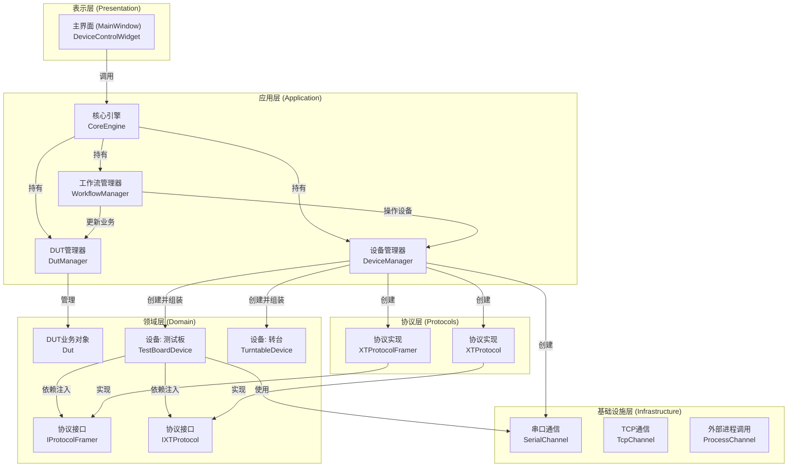
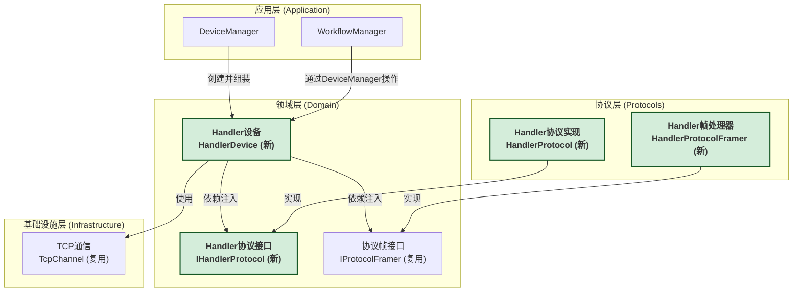

# TesterFramework - 模块化自动化测试系统

## 概述

TesterFramework是一个基于Qt/C++的模块化自动化测试系统框架，旨在为复杂的、多设备协作的测试场景提供一个健壮、可扩展、易于维护的软件基础。

该框架的核心设计思想是 **"面向统一设备管理的架构"**，将所有外部交互实体（无论是物理硬件还是外部软件）都抽象为统一的"设备"，并通过中心化的`DeviceManager`进行管理。在此之上，通过`DutManager`管理核心业务逻辑，实现硬件控制与业务状态的解耦。

### 核心特性
- **分层架构**: 清晰的领域、协议、基础设施、应用、表示层分离。
- **业务与控制解耦**: `DeviceManager`负责硬件控制，`DutManager`负责业务状态管理。
- **统一设备管理**: 所有外部硬件/软件都被抽象为`IDevice`接口，由`DeviceManager`统一生命周期。
- **依赖注入**: 上层模块不依赖下层实现，通过构造函数注入依赖，实现高度解耦。
- **可扩展性**: 遵循"开闭原则"，添加新设备无需修改核心代码，只需进行"填空式"开发。
- **工作流引擎**: 支持通过JSON文件定义复杂的自动化测试流程。
- **模块化UI**: 每种设备类型都可以拥有独立的控制界面，通过工厂模式动态创建。

---

## 系统架构

系统采用分层设计，确保了高内聚、低耦合。其核心是"面向统一设备管理的思想"，将所有外部交互统一管理，并通过依赖注入将各层粘合起来。

### 架构图



### 各层职责

-   **表示层 (Presentation)**: 用户界面。负责展示数据和状态，并将用户操作传递给应用层。它不包含业务逻辑。
-   **应用层 (Application)**: 系统的"大脑"和"装配工"。
    -   `CoreEngine`: 程序的入口，持有并协调其他管理器。
    -   `WorkflowManager`: 负责解析和执行测试工作流，协同`DeviceManager`（做什么）和`DutManager`（为什么做）来完成任务。
    -   `DeviceManager`: **硬件抽象层**。它读取配置文件，创建所有硬件相关的对象实例（设备、协议、通道），并通过依赖注入将它们**组装**在一起。它只关心"如何与外部世界打交道"。
    -   `DutManager`: **核心业务层**。它独立于硬件，专门负责追踪和管理每个芯片（DUT）的业务状态、测试数据和生命周期（例如，从"待测试"到"测试完成"）。
-   **领域层 (Domain)**: **业务核心**。
    -   定义核心业务对象（如 `TestBoardDevice`、`Dut`），封装其状态和行为。
    -   定义业务所需的**抽象接口**（如 `IProtocolFramer`, `IXTProtocol`），规定了它需要什么样的"服务"。领域层不关心这些服务如何实现。
-   **协议层 (Protocols)**: **适配器和翻译官**。
    -   负责**实现**领域层定义的协议接口。
    -   它将通用的字节流（来自基础设施层）翻译成领域层能理解的、有业务含义的数据和命令。
-   **基础设施层 (Infrastructure)**: **通用技术工具**。
    -   提供与具体业务无关的底层技术能力，如 `SerialChannel`（串口通信）、`TcpChannel`（TCP通信）等。

### 业务逻辑的实现：服务协同

本架构将**物理操作**和**业务逻辑**完全解耦。这两者通过 `WorkflowManager` 进行协同。

一个典型的工作流步骤（例如`IWorkflowStep`的实现）会：
1.  **从 `WorkflowContext` 中获取服务**: 同时拿到 `DeviceManager` 和 `DutManager` 的实例。
2.  **执行物理操作**: 调用 `DeviceManager` 来控制硬件（如 `handler->executeCommand("placeChip")`）。
3.  **更新业务状态**: 在物理操作成功后，调用 `DutManager` 来更新芯片的业务状态（如 `dutManager->updateDutStatus(chipId, "Testing")`）。

这种模式确保了 `IDevice` 的实现保持纯粹（只关心硬件指令），而业务状态的流转则由 `DutManager` 集中管理。

---

## 架构的扩展性：三大核心场景

本架构设计的核心优势在于其高度的模块化和可扩展性。设备、协议、通信通道三者被设计为可以独立变化、任意组合的模块。以下我们通过三个典型的开发场景，来展示如何在本架构中进行"填空式"开发。

### 场景1：新增设备，复用旧协议与通道

**目标**：添加一个`TestBoardV2`设备。它功能上是新的，但对外接口仍然使用现有的`XTProtocol`协议和`SerialChannel`串口通道。

**影响范围**：仅需在`Domain`层添加新设备逻辑，并在`Application`层"注册"这个新设备，无需触碰`Protocols`和`Infrastructure`层。

**步骤**：
1.  **领域层 (`Domain`)**: 创建 `TestBoardV2Device`。

    **示例: `include/domain/TestBoardV2Device.h`**
    ```cpp
    #include "domain/TestBoardDevice.h"

    namespace Domain {
    // V2设备可以有自己的逻辑, 但其依赖的协议接口不变
    class TestBoardV2Device : public TestBoardDevice {
    public:
        // 直接继承父类的构造函数，因为它依赖的协议接口是相同的
        using TestBoardDevice::TestBoardDevice;

        QString getName() const override { return "Test Board V2"; }
        // 假设在 IDevice::DeviceType 枚举中添加了 TestBoardV2
        DeviceType getType() const override { return DeviceType::TestBoardV2; }

        // 重写 executeCommand 以实现 V2 版本的特定功能
        QJsonObject executeCommand(const QString &command, const QJsonObject &params) override;
    };
    }
    ```

2.  **应用层 (`Application`)**: 在 `DeviceManager` 中添加创建逻辑。

    **示例: `src/services/DeviceManager.cpp`**
    ```cpp
    #include "domain/TestBoardV2Device.h" // 引入新设备头文件
    
    // 在 createDevice 方法中添加新分支
    std::shared_ptr<Domain::IDevice> DeviceManager::createDevice(const QJsonObject &deviceConfig)
    {
        QString deviceType = deviceConfig["deviceType"].toString();
        
        if (deviceType == "Turntable") {
            return createTurntableDevice(deviceConfig["deviceConfig"].toObject());
        } else if (deviceType == "TestBoard") {
            return createTestBoardDevice(deviceConfig["deviceConfig"].toObject());
        } else if (deviceType == "TestBoardV2") { // <-- 新增分支
            return createTestBoardV2Device(deviceConfig["deviceConfig"].toObject());
        } // ...
    }
    
    // 添加新的私有辅助方法来组装V2设备
    std::shared_ptr<Domain::IDevice> DeviceManager::createTestBoardV2Device(const QJsonObject &config)
    {
        // 复用已有的协议和帧处理器，因为它们是兼容的
        auto framer = std::make_unique<Protocols::XTProtocolFramer>();
        auto protocol = std::make_unique<Domain::Protocols::XTProtocol>();
        
        // 创建 V2 版本的设备实例并注入依赖
        auto device = std::make_shared<Domain::TestBoardV2Device>(std::move(framer), std::move(protocol));
        
        // (可选) 进行V2版本的特定配置
        // device->setV2SpecificConfig(...);
        
        return device;
    }
    ```

3.  **配置文件 (`config/devices.json`)**:
    -   添加一个新设备配置，并指定`"deviceType": "TestBoardV2"`。

---

### 场景2：升级协议，适配旧设备

**目标**：`TestBoard`的固件升级了，通信协议发生变化。我们需要开发一个`XTProtocolV2`来适配新固件，并应用到现有的`TestBoard`设备上。

**影响范围**：仅需在`Protocols`层添加新实现，并在`Application`层修改一行装配代码。`Domain`层的设备代码完全不变。

**步骤**：
1.  **协议层 (`Protocols`)**: 创建 `XTProtocolV2`。

    **示例: `include/protocols/XTProtocolV2.h`**
    ```cpp
    #include "domain/protocols/IXTProtocol.h"

    namespace Protocols {
    // V2协议仍然实现相同的接口
    class XTProtocolV2 : public Domain::Protocols::IXTProtocol {
        Q_OBJECT
    public:
        explicit XTProtocolV2(QObject *parent = nullptr);
        ~XTProtocolV2() override;

        // 根据V2固件重写命令的实现
        QByteArray createStartCommand(bool start, uint16_t dutActive, uint32_t timestamp) override;
        // ... 其他方法的V2实现 ...
    };
    }
    ```

2.  **应用层 (`Application`)**: 在 `DeviceManager` 中"偷梁换柱"。

    **示例: `src/services/DeviceManager.cpp`**
    ```cpp
    #include "protocols/XTProtocolV2.h" // 引入新协议头文件
    
    // 在 createTestBoardDevice 辅助函数中, 替换协议实现
    std::shared_ptr<Domain::IDevice> DeviceManager::createTestBoardDevice(const QJsonObject &config)
    {
        auto framer = std::make_unique<Protocols::XTProtocolFramer>();
        
        // 只需改变这一行，即可完成协议升级
        // auto protocol = std::make_unique<Domain::Protocols::XTProtocol>(); // <-- 旧代码
        auto protocol = std::make_unique<Protocols::XTProtocolV2>();       // <-- 新代码

        auto device = std::make_shared<Domain::TestBoardDevice>(
            std::move(framer),
            std::move(protocol)
        );
        return device;
    }
    ```

**结论**：这是架构解耦威力的最佳体现。`TestBoardDevice`对协议的升级无感知，因为它只依赖于抽象接口，这使得维护和升级变得极其简单。

---

### 场景3：集成使用TCP通信的全新设备 (Handler自动机)

**目标**：集成一个全新的`Handler`自动机。它使用自定义的TCP协议进行通信。

**影响范围**：最全面的情况，需要在每一层都添加新的实现，但仍然是"填空"，不修改任何已有代码。

**步骤 (自下而上)**:

1.  **基础设施层 (`Infrastructure`)**: 复用已有的`TcpChannel`。此步骤无需新增代码。

2.  **协议层 (`Protocols`)**:
    -   **创建帧处理器 `HandlerProtocolFramer`**: 对于TCP流式协议，必须有帧处理器来解决粘包、半包问题。它实现`IProtocolFramer`接口。
    -   **创建协议逻辑 `HandlerProtocol`**: 实现新创建的`IHandlerProtocol`接口，负责业务指令和字节流的相互转换。

3.  **领域层 (`Domain`)**:
    -   **创建协议接口 `IHandlerProtocol`**: 定义Handler业务需要的所有协议方法（如`createPickCommand`）。
    -   **创建设备 `HandlerDevice`**: 继承`IDevice`，但它的构造函数**同时依赖**于`IProtocolFramer`和`IHandlerProtocol`两个接口，以协同完成通信。

4.  **应用层 (`Application`)**: 在`DeviceManager`中将所有新零件组装起来。
    -   `createHandlerDevice`辅助函数将负责创建`HandlerProtocolFramer`和`HandlerProtocol`的实例，并将它们同时注入到`HandlerDevice`中。

### 架构扩展可视化 (场景3)

下图清晰地展示了在集成`Handler`设备后，新组件（绿色高亮）是如何无缝融入现有架构的。注意，这次我们正确地包含了`Framer`这一环。



---

## 编译与运行

### Windows（MinGW）

```bash
# 1. 进入项目目录
cd TesterFramework

# 2. 创建构建目录
mkdir build
cd build

# 3. 配置项目（根据您的Qt安装路径调整）
cmake .. -G "MinGW Makefiles" -DCMAKE_PREFIX_PATH="C:/Qt/5.15.2/mingw81_64"

# 4. 编译
cmake --build .
```

### Windows（Visual Studio）

```bash
# 使用Qt Creator打开项目
# 或者使用cmake配置Visual Studio项目
cmake .. -G "Visual Studio 16 2019" -DCMAKE_PREFIX_PATH="C:/Qt/5.15.2/msvc2019_64"
```

### Linux

```bash
# 安装依赖
sudo apt-get install qt5-default qtbase5-dev libqt5serialport5-dev cmake build-essential

# 编译
mkdir build && cd build
cmake ..
make -j4
```

## 配置文件说明

### 设备配置 (devices.json)

```json
{
    "devices": [
        {
            "deviceId": "turntable_1",
            "name": "Nidec Turntable",
            "type": "Turntable",
            "enabled": true,
            "deviceConfig": {
                "slaveAddress": 1,
                "homePosition": 0,
                "maxSpeed": 3000
            },
            "communicationConfig": {
                "channelType": "Serial",
                "parameters": {
                    "portName": "COM3",
                    "baudRate": "57600",
                    "parity": "2"  // 0=无校验, 2=偶校验
                }
            }
        },
        {
            "deviceId": "turntable_2",
            "deviceType": "Turntable",
            "enabled": true,
            "deviceConfig": {
                "slaveAddress": 2,  // 同一RS-485总线上的不同地址
                "homePosition": 0,
                "maxSpeed": 3000
            },
            "communicationConfig": {
                "channelType": "Serial",
                "parameters": {
                    "portName": "COM3",  // 共享同一串口
                    "baudRate": "57600",
                    "parity": "2"
                }
            }
        },
        {
            "deviceId": "testboard_1",
            "name": "XT Test Board",
            "type": "TestBoard",
            "enabled": true,
            "communicationConfig": {
                "channelType": "Serial",
                "parameters": {
                    "portName": "COM4",
                    "baudRate": "115200"
                }
            }
        }
    ]
}
```

### 工作流配置 (workflow_chip_test.json)

工作流配置定义了测试步骤的执行顺序：
1. 初始化设备
2. 转台回零
3. 开始数据采集
4. 在多个角度（0°, 90°, 180°, 270°）采集数据
5. 停止测试并分析结果

## 使用方法

### 1. 启动程序

```bash
# Windows
TesterFramework.exe [配置文件路径]

# Linux
./TesterFramework [配置文件路径]
```

### 2. 基本操作流程

1. **加载设备配置**
   - 菜单：文件 -> 加载设备配置
   - 选择 `config/devices.json`

2. **加载工作流**
   - 菜单：文件 -> 加载工作流
   - 选择 `config/workflow_chip_test.json`

3. **开始测试**
   - 点击工具栏的"开始测试"按钮
   - 系统将自动执行配置的测试流程

4. **监控状态**
   - 左侧：设备状态树
   - 中间：工作流步骤和测试结果
   - 下方：实时日志

### 3. 手动控制

通过"控制"菜单可以手动控制设备：
- 转台移动到指定位置
- 启动/停止数据采集
- 读取设备参数

## API使用示例

### 初始化核心引擎
```cpp
// main.cpp
#include "core/CoreEngine.h"
#include <memory>

auto coreEngine = std::make_shared<Core::CoreEngine>();
// 核心引擎在初始化时会自动加载配置文件
if (!coreEngine->initialize("config/devices.json")) {
    // 处理初始化失败
}
```

### 通过UI与设备交互
```cpp
// DeviceManagerDialog.cpp

// 用户点击 "打开控制面板"
void DeviceManagerDialog::onOpenDeviceControl()
{
    // 1. 获取选中的设备
    auto device = m_coreEngine->getDeviceManager()->getDevice(m_selectedDeviceId);
    if (!device) return;

    // 2. 使用工厂创建对应的控制界面
    // getOrCreateControlWidget 内部调用 DeviceControlWidgetFactory
    IDeviceControlWidget* controlWidget = getOrCreateControlWidget(device);
    if (!controlWidget) {
        QMessageBox::warning(this, "错误", "不支持该设备类型的控制界面");
        return;
    }

    // 3. 在UI中显示控制界面
    m_controlStack->setCurrentWidget(controlWidget);
    m_tabWidget->setCurrentIndex(1); // 切换到控制标签页
}

// TurntableControlWidget.cpp

// 用户点击 "移动" 按钮
void TurntableControlWidget::onMoveToPosition()
{
    if (!m_turntable) return;
    
    // 4. 控制界面将用户输入转换为命令
    double targetPosition = m_targetPositionSpinBox->value();
    
    QJsonObject params;
    params["position"] = targetPosition;
    
    // 5. 调用设备的 executeCommand 接口
    // 该命令将通过 协议层->传输层->通信层 发送到物理设备
    QJsonObject result = m_turntable->executeCommand("moveToPosition", params);
    
    if (!result["success"].toBool()) {
        m_errorLabel->setText(result["error"].toString());
    }
} 