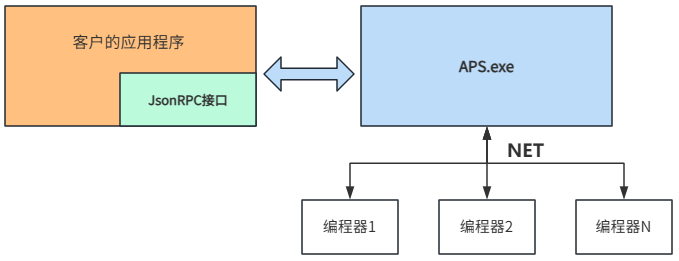

# APS软件 JsonRPC接口文档

## 本档案适用对象

  * 技术支持工程师 
  * 维护工程师 
  * 软件工程师
  * 客户二次开发

## 名词解释

| **名词** | **说明** |
|----------|----------|
| APS.exe | 昂科开发的App软件用于AP8000V2硬件，用于制作多工程任务、烧录等 |
| MultiAprog.exe | 昂科开发的App软件用于AP8000硬件，用于制作单工程、烧录等 |
| BPU | 一个站点由8个BPU组成，每个BPU上有2个SKT |
| SKT | 放置芯片的座子，全称socket |
| Json | 数据传输格式 |
| IPS.exe | 昂科开发的用于控制自动机生产的App软件 |  
  
## JsonRPC配置介绍

基于JsonRpc接口进行软件开发，通过该接口与APS.exe进行通信。APS.exe作为服务器端，接收客户程序的请求，执行相应操作，并返回响应的执行结果。客户可以根据JsonRpc接口来自定义一套烧录流程。



APS.exe可以通过前台和后台两种模式运作。以前台模式启动时，是无法使用JsonRPC进行交互的，需要人为与软件进行交互来执行烧录；以后台模式启动时，只能通过JsonRpc协议进行交互。

后台模式启动命令格式：`<APS.exe目录>`/APS.exe -r -p `<端口号>` ，-r表示以后台模式启动，-p表示与指定端口号的服务器进行连接。


## JsonRPC协议格式

### 连接协议

  * 传输协议: TCP;
  * IP: 127.0.0.1;
  * 端口: 可配置;
  * 连接方式: 长连接;
  * 数据格式: JSON-RPC 2.0

### 数据帧格式

| **头部标识** | **版本号** | **数据长度** | **保留字段** | **JSON消息（UTF-8编码）** |
|--------------|------------|--------------|--------------|---------------------------|
| 4 Bytes      | 2 Bytes    | 4 Bytes      | 22 Bytes     | N Bytes                   |  
  
  * MagicNumber: 固定为0x4150524F ("APRO")；
  * 版本号: 1；
  * 数据长度: JSON消息的字节长度；
  * 保留字段: 22字节，填充为0；
  * JSON消息：请看“**消息格式** ”章节介绍；

### 消息格式

#### 请求

每次请求需要使用不同的请求ID，主要用于与响应进行匹配，在相同的方法请求时，ID用于判断是哪次的请求。这个ID生成可以内部维护一个原子变量进行自增获取。

```json
{
  "jsonrpc": "2.0",
  "method": "<方法名>",
  "params": {
    // 请求参数
  },
  "id": "<请求ID>"
}
```

#### 正常响应

```json
{
  "jsonrpc": "2.0",
  "result": {
    // 成功结果
  },
  "id": "<请求ID>"
}
```

#### 错误响应

```json
{
  "jsonrpc": "2.0",
  "error": {
    "code": -32600,
    "message": "错误描述"
  },
  "id": "<请求ID>"
}
```

#### 异步或主动上报

```json
{
  "jsonrpc": "2.0",
  "method": "<通知方法名>",
  "params": {
    // 通知参数
  }
}
```

## JsonRPC方法

此章节介绍的是JsonRpc的 **“method”** 以及对应的数据内容。

### SiteScanAndConnect

请求烧录软件对指定网卡进行设备扫描，并连接扫描到的全部设备。此方法执行结果是异步的。

#### 请求

**连接所有扫描到的站点：**

```json
{
  "id": 1,
  "jsonrpc": "2.0",
  "method": "SiteScanAndConnect",
  "params": {}
}
```

**连接指定站点：**

通过`siteList`指定站点别名来连接指定的站点，下面示例表示连接站点Site03、Site02、Site01。

```json
{
  "id": 1,
  "jsonrpc": "2.0",
  "method": "SiteScanAndConnect",
  "params": {
    "siteList": [
      {
        "siteAlias": "Site03"
      },
      {
        "siteAlias": "Site02"
      },
      {
        "siteAlias": "Site01"
      }
    ]
  }
}
```

#### 应答

```json
{
  "id": 1,
  "jsonrpc": "2.0",
  "result": {
    "message": "Scan initiated successfully. Device discovery notifications will be sent."
  }
}
```

#### 执行结果（异步）

执行结果的`method`为`DeviceDiscovered`，扫描结果存储于`scanDevList`数据中。扫描结果涵盖站点的硬件版本、软件版本、MAC地址、SN序列号、站点别名及IP地址等详细信息。

下面示例表示已连接站点Site03，并返回了Site03的基础信息。

```json
{
  "jsonrpc": "2.0",
  "method": "DeviceDiscovered",
  "params": {
    "scanDevList": [
      {
        "device": {
          "chainID": 1,
          "dpsFpgaVersion": "0x2002285A",
          "dpsFwVersion": "V2.2.0006A",
          "firmwareVersion": "2.02.031",
          "firmwareVersionDate": "20250111",
          "fpgaLocation": "Normal",
          "fpgaVersion": "0x2030121A",
          "ip": "192.168.20.223",
          "isLastHop": true,
          "linkNum": -1,
          "mac": "00:3A:22:00:01:02",
          "mainBoardInfo": {
            "hardwareOEM": "ACVIEW",
            "hardwareSN": "A06U24120700012",
            "hardwareUID": "CCE3DF00A00C0672",
            "hardwareVersion": "0100-010000-010000-010000"
          },
          "muAppVersion": "2.02.029",
          "muAppVersionDate": "20240111",
          "muLocation": "Normal",
          "port": "8080",
          "siteAlias": "Site03"
        },
        "ipHop": "192.168.20.223:0"
      }
    ]
  }
}
```

### LoadProject

将工程下载到所有的站点，并进行站点初始化，此方法执行结果是异步的。

#### 请求

```json
{
  "id": 2,
  "jsonrpc": "2.0",
  "method": "LoadProject",
  "params": {
    "path": "D:\\\\COMPANY_PRO\\\\AP8000V2\\\\trunk\\\\AIPE\\\\Build\\\\task\\\\task.actask"
  }
}
```

#### 应答

```json
{
  "id": 2,
  "jsonrpc": "2.0",
  "result": {
    "message": "LoadProject"
  }
}
```

#### 执行结果（异步）

`loadProject`的执行结果是通过异步上报的，如果所有站点工程下载成功，则"data"的结果为"success"，否则为"failed".

```json
{
  "jsonrpc": "2.0",
  "method": "LoadProjectResult",
  "params": {
    "cmd": "LoadProject",
    "data": "success"
  }
}
```

### GetProjectInfo

获取任务中每个工程的基础路径以及默认座子使能情况，此方法的执行结果是同步的。

#### 请求

```json
{
  "id": 3,
  "jsonrpc": "2.0",
  "method": "GetProjectInfo",
  "params": {}
}
```

#### 应答

下面是方法的执行结果，如果任务有多个工程，`projects`数据会返回多个工程的信息.

| **参数** | **说明** |
|----------|----------|
| key | 工程的路径 |
| pair_first_string | 站点座子的默认使能状态，座子使能状态，1位代表一个座子，例如0x3代表1-2号座子使能，0x5代表1号和3号座子使能，0xFFFF代表1-16号座子使能。 |  
  
```json
{
  "id": 3,
  "jsonrpc": "2.0",
  "result": {
    "message": "Project info retrieved.",
    "projects": [
      {
        "key": "D: /COMPANY_PRO/AP8000V2/trunk/AIPE/Build/task/task.eapr",
        "pair_first_string": "0xffff"
      }
    ]
  }
}
```

### GetProjectInfoExt

查询单个工程的配置信息，此方法的执行结果是同步的。

#### 请求

下面示例是查询工程 `D:/COMPANY_PRO/AP8000V2/trunk/AIPE/Build/task/task.eapr`的信息。

```json
{
  "id": 4,
  "jsonrpc": "2.0",
  "method": "GetProjectInfoExt",
  "params": {
    "project_url": "D: /COMPANY_PRO/AP8000V2/trunk/AIPE/Build/task/task.eapr"
  }
}
```

#### 应答

**参数**| **说明**  
---|---  
AdpName| 适配器名称  
CheckSum| 档案校验值  
ScoketNum| 支持16个座子  
Type| 芯片类型  
doCmdSequenceArray| 执行任务的任务名以及其序列参数, “DoJob”方法会用到。  
pro_chipdata| 芯片详细数据  
pro_url| 工程路径  
  
```json
{
  "id": 4,
  "jsonrpc": "2.0",
  "result": {
    "message": "GetProjectInfoExt",
    "projects": {
      "AdpName": "BGA153(11.5x13)-P050-G16-01",
      "CheckSum": "0x00000400",
      "SocketNum": 16,
      "Type": "eMMC",
      "doCmdSequenceArray": [
        {
          "CmdID": "1801",
          "CmdRun": "Erase",
          "CmdSequences": [
            {
              "ID": "801",
              "Name": "Erase"
            },
            {
              "ID": "803",
              "Name": "BlankCheck"
            }
          ],
          "CmdSequencesGroupCnt": 2
        },
        {
          "CmdID": "1803",
          "CmdRun": "Blank",
          "CmdSequences": [
            {
              "ID": "803",
              "Name": "BlankCheck"
            }
          ],
          "CmdSequencesGroupCnt": 1
        },
        {
          "CmdID": "1800",
          "CmdRun": "Program",
          "CmdSequences": [
            {
              "ID": "807",
              "Name": "Erase If BlankCheck Failed"
            },
            {
              "ID": "803",
              "Name": "BlankCheck"
            },
            {
              "ID": "800",
              "Name": "Program"
            },
            {
              "ID": "802",
              "Name": "Verify"
            }
          ],
          "CmdSequencesGroupCnt": 4
        },
        {
          "CmdID": "1802",
          "CmdRun": "Verify",
          "CmdSequences": [
            {
              "ID": "802",
              "Name": "Verify"
            }
          ],
          "CmdSequencesGroupCnt": 1
        },
        {
          "CmdID": "1804",
          "CmdRun": "Secure",
          "CmdSequences": [
            {
              "ID": "804",
              "Name": "Secure"
            }
          ],
          "CmdSequencesGroupCnt": 1
        },
        {
          "CmdID": "1806",
          "CmdRun": "Read",
          "CmdSequences": [
            {
              "ID": "806",
              "Name": "Read"
            }
          ],
          "CmdSequencesGroupCnt": 1
        },
        {
          "CmdID": "1901",
          "CmdRun": "Self",
          "CmdSequences": [],
          "CmdSequencesGroupCnt": 0
        }
      ],
      "pro_chipdata": {
        "bDebug": true ,
        "bottomBoard": "",
        "chipAdapter": "BGA153(11.5x13)-P050-G16-01",
        "chipAdapter2": "NULL",
        "chipAdapter3": "NULL",
        "chipAdapterID": "48A9",
        "chipAlgoFile": "Drv-eMMC.drv",
        "chipAppFile": "burn.app",
        "chipBufferSize": 0,
        "chipBufferSizeHigh": 0,
        "chipChipInfo": "bbbb.html",
        "chipCurSbk": "NULL",
        "chipDrvParam": 1,
        "chipFPGAFile": "MUX64.jbc",
        "chipFPGAFile2": "G8eMMC-TGeneric180.jbc",
        "chipHelpFile": "NULL",
        "chipId": "0",
        "chipIdACXML": "",
        "chipModifyInfo": "",
        "chipMstkoFile": "Mst-eMMC.drv",
        "chipName": "eMMC-TGeneric-1.8",
        "chipOperCfgJson": 
        "{\"baseOper\": {\"blank\": true,\"blockProg\": true,\"erase\": true,\"function\": false,\"illegalBit\": false,\"prog\": true,\"read\": true,\"secure\": true,\"verify\": true},\"bitsOper\": {\"bit12\": false,\"bit16\": false,\"bit4\": false,\"bit8\": false},\"checkSumOper\": {\"crc16\": false,\"crc32\": false,\"sum\": false,\"wordSum\": false},\"fileLoadOper\": {\"bigEndian\": false,\"wordAddress\": false},\"otherOper\": {\"EEPROM\": false,\"IDCheck\": false,\"addressRelocate\": false,\"compare\": false,\"emptyBuffer\": false,\"enableSN\": false,\"insection\": false,\"loopFun\": false,\"masterCopy\": false,\"online\": false,\"pin\": false,\"protect\": false,\"unTest\": true,\"vccVerify\": true}}",
        "chipOperateConfigMask": 0,
        "chipPackage": "BGA153(11.5x13)",
        "chipProgType": 83886083,
        "chipSbkId": 0,
        "chipSectorSize": 1048576,
        "chipStatus": "",
        "chipType": "eMMC",
        "manufacture": "AlleMMCManu",
        "nVersion": 0
      },
      "pro_url": "D: /COMPANY_PRO/AP8000V2/trunk/AIPE/Build/task/task.eapr"
    }
  }
}
```

### GetAllSitesAdpEn

获取所有站点的座子使能状态，此方法执行结果是异步的。

#### 请求

```json
{
  "id": 7,
  "jsonrpc": "2.0",
  "method": "GetAllSitesAdpEn",
  "params": {}
}
```

#### 应答

```json
{
  "id": 7,
  "jsonrpc": "2.0",
  "result": {
    "message": "accepted"
  }
}
```

### SetAdapterEn

设置座子的使能状态，此方法只会设置APS软件界面上座子的使能显示状态，不会对实际物理设备进行控制。此方法执行结果是同步的。

#### 请求

**参数**| **说明**  
---|---  
AdpEn| 座子使能状态，1位代表一个座子，例如0x3代表1-2号座子使能，0x5代表1号和3号座子使能，0xFFFF代表1-16号座子使能。  
DevSN| 站点SN  
  
```json
{
  "id": 8,
  "jsonrpc": "2.0",
  "method": "SetAdapterEn",
  "params": {
    "AdpEn": 3,
    "DevSN": "A06U24120700012"
  }
}
```

#### 执行结果（异步）

获取的结果存到`AdpEnMap`数组里面，参数解析如下：

**参数**| **说明**  
---|---  
AdpEn| 座子使能状态，1位代表一个座子，例如0x3代表1-2号座子使能，0x5代表1号和3号座子使能，0xFFFF代表1-16号座子使能。  
DevSN| 站点SN  
  
```json
{
  "jsonrpc": "2.0",
  "method": "GetAllSitesAdpEnResult",
  "params": {
    "AdpEnMap": [
      {
        "AdpEn": 65535,
        "DevSN": "A06U24120700012"
      }
    ]
  }
}
```

#### 应答

```json
{
  "id": 8,
  "jsonrpc": "2.0",
  "result": {
    "message": "SetAdapterEn success."
  }
}
```

### DoCustom格式

有些命令需要定制化，不包含在系统主要框架内，用该命令来执行。该命令预留后续的扩展之用。一些后续的厂商特定命令可用此命令实现。此方法的执行结果是异步的。

#### 请求

**参数**| **说明**  
---|---  
BPUID| 固定为8  
CmdFlag| 固定为0  
CmdID| 执行命令的ID，对应的CmdID执行配置请看<**DoCustom(Cmd == xxx) >章节**  
DevSN| 站点SN  
PortID| 固定为0  
SKTEn| 执行命令的座子BIT，最低位为1为表示1号座子执行指令，其他位同理，0-表示不需要座子执行。65535表示16个座子都执行指令。  
data| 执行指令所需的配置参数  
  
下面的示例表示的是执行CmdID为1078（0x436）指令

```json
{
  "id": 6,
  "jsonrpc": "2.0",
  "method": "DoCustom",
  "params": {
    "BPUID": 8,
    "CmdFlag": 0,
    "CmdID": 1078,
    "DevSN": "A06U24120700012",
    "PortID": 0,
    "SKTEn": 0,
    "data": {
      //_命令参数_
    }
  }
}
```

#### 应答

```json
{
  "id": 6,
  "jsonrpc": "2.0",
  "result": {
    "message": "DoCustom request accepted."
  }
}
```

#### 执行结果（异步）

下面示例表示返回DevSN为A06U24120700012执行指令CmdID为1078（0x436）的结果，执行结果保存在`data`里面

```json
{
  "jsonrpc": "2.0",
  "method": "SetDoCustomResult",
  "params": {
    "DevSN": "A06U24120700012",
    "cmdID": 1078,
    "data": {
      //_执行结果_
    }
  }
}
```

### DoCustom (CmdID == 1078)

此指令用于查询站点指定座子的基本信息，执行结果是异步的。具体参数说明请看“**DoCustom格式** ”章节。

#### 请求

**参数**| **说明**  
---|---  
BPUID| 固定为8  
CmdFlag| 固定为0  
CmdID| 1078  
DevSN| 站点SN  
PortID| 固定为0  
SKTEn| 固定为0  
data| “**BPUEn**
”表示查询的座子，查询是以BPU为单位的，1个BPU有2个座子，例如0x1表示查询1-2号座子的信息，0x3表示查询1-4号座子的信息。  
  
```json
{
  "id": 6,
  "jsonrpc": "2.0",
  "method": "DoCustom",
  "params": {
    "BPUID": 8,
    "CmdFlag": 0,
    "CmdID": 1078,
    "DevSN": "A06U24120700012",
    "PortID": 0,
    "SKTEn": 0,
    "data": {
      "BPUEn": 255
    }
  }
}
```

#### 应答

```json
{
  "id": 6,
  "jsonrpc": "2.0",
  "result": {
    "message": "DoCustom request accepted."
  }
}
```

#### 执行结果（异步）

  * BPUEn: Bit0-Bit7每一位表示BPU是否被选择，例如3表示BPU0+BPU1；
  * BPUInfo: 以BPU为单位，返回每个座子的信息；

**SKTInfo**| **含义**  
---|---  
UID| 16进制字符串，8个字节为当前座子的UID，两个座子的UID是一样的。  
LifeCycleShow| 座子使用次数上限  
InstCnt0| BPUx座子0的使用次数 (假设BPUIdx=2，则这个代表4号座子的使用次数)  
FailCnt0| BPUx座子0的失败次数  
InstCnt1| BPUx座子1的使用次数  
FailCnt1| BPUx座子1的失败次数  
  
```json
{
  "jsonrpc": "2.0",
  "method": "SetDoCustomResult",
  "params": {
    "DevSN": "A06U24120700012",
    "cmdID": 1078,
    "data": {
      "BPUEn": 255,
      "BPUInfo": [
        {
          "BPUIdx": 0,
          "SKTInfo": {
            "FailCnt0": 0,
            "FailCnt1": 0,
            "InstCnt0": 0,
            "InstCnt1": 0,
            "LifeCycleShow": 3000,
            "UID": "87654301"
          }
        },
        {
          "BPUIdx": 1,
          "SKTInfo": {
            "FailCnt0": 0,
            "FailCnt1": 0,
            "InstCnt0": 0,
            "InstCnt1": 0,
            "LifeCycleShow": 3000,
            "UID": "87654302"
          }
        },
        {
          "BPUIdx": 2,
          "SKTInfo": {
            "FailCnt0": 0,
            "FailCnt1": 0,
            "InstCnt0": 0,
            "InstCnt1": 0,
            "LifeCycleShow": 3000,
            "UID": "87654303"
          }
        },
        {
          "BPUIdx": 3,
          "SKTInfo": {
            "FailCnt0": 0,
            "FailCnt1": 0,
            "InstCnt0": 0,
            "InstCnt1": 0,
            "LifeCycleShow": 3000,
            "UID": "87654304"
          }
        },
        {
          "BPUIdx": 4,
          "SKTInfo": {
            "FailCnt0": 0,
            "FailCnt1": 0,
            "InstCnt0": 0,
            "InstCnt1": 0,
            "LifeCycleShow": 3000,
            "UID": "87654305"
          }
        },
        {
          "BPUIdx": 5,
          "SKTInfo": {
            "FailCnt0": 0,
            "FailCnt1": 0,
            "InstCnt0": 0,
            "InstCnt1": 0,
            "LifeCycleShow": 3000,
            "UID": "87654306"
          }
        },
        {
          "BPUIdx": 6,
          "SKTInfo": {
            "FailCnt0": 0,
            "FailCnt1": 0,
            "InstCnt0": 0,
            "InstCnt1": 0,
            "LifeCycleShow": 3000,
            "UID": "87654307"
          }
        },
        {
          "BPUIdx": 7,
          "SKTInfo": {
            "FailCnt0": 0,
            "FailCnt1": 0,
            "InstCnt0": 0,
            "InstCnt1": 0,
            "LifeCycleShow": 3000,
            "UID": "87654308"
          }
        }
      ]
    }
  }
}
```

### DoJob

执行工程中配置的指令集，允许执行的指令集可以查看**“GetProjectInfoExt”** 章节的`doCmdSequenceArray`
中的`CmdRun`，此方法执行结果是异步的。

注意：一个站点执行DoJob方法后，必须等待结果返回再重新请求。

#### 请求

**参数**| **说明**  
---|---  
BPUID| 固定为8  
CmdFlag| 固定为0  
CmdID| 固定为1047（0x417）  
DevSN| 需要执行指令的站点SN  
PortID| 固定为0  
SKTEn|
执行指令的座子位置，1位代表一个座子，例如0x3代表1-2号执行指令，0x5代表1号和3号号执行指令，0xFFFF代表1-16号座子号执行指令。  
docmdSeqJson| 执行的指令Json数据，可由<**GetProjectInfoExt >**方法获取，示例中的执行的指令是CmdRun =
Program 即烧录指令。  
operation| 等于docmdSeqJson中CmdRun的值。  
  
```json
{
  "id": 9,
  "jsonrpc": "2.0",
  "method": "DoJob",
  "params": {
    "BPUID": 8,
    "CmdFlag": 0,
    "CmdID": 1047,
    "DevSN": "A06U24120700012",
    "PortID": 0,
    "SKTEn": 3,
    "docmdSeqJson": {
      "CmdID": "1800",
      "CmdRun": "Program",
      "CmdSequences": [
        {
          "ID": "807",
          "Name": "Erase If BlankCheck Failed"
        },
        {
          "ID": "803",
          "Name": "BlankCheck"
        },
        {
          "ID": "800",
          "Name": "Program"
        },
        {
          "ID": "802",
          "Name": "Verify"
        }
      ],
      "CmdSequencesGroupCnt": 4
    },
    "operation": "Program"
  }
}
```

#### 应答

```json
{
  "id": 9,
  "jsonrpc": "2.0",
  "result": {
    "message": "Dojob request accepted."
  }
}
```

#### 执行结果（异步）

下面示例表示返回DevSN为A06U24120700012执行指令cmd为 "Program" 的结果，执行结果保存在`data`里面。

**data中的参数**| **说明**  
---|---  
AdpCnt| 执行指令的座子数量  
AdpResultInfo| sktIdx| 座子序号，从1开始  
status|

  * “Success”: 执行指令成功；
  * “UnUsed”: 座子没有使用；
  * “Failed” : 执行指令失败；
  * “Unknown”: 未知错误；

  
  
```json
{
  "jsonrpc": "2.0",
  "method": "SetDoJobResult",
  "params": {
    "DevSN": "A06U24120700012",
    "cmd": "Program",
    "data": {
      "AdpCnt": 2,
      "AdpResultInfo": [
        {
          "sktIdx": 1,
          "status": "Success"
        },
        {
          "sktIdx": 2,
          "status": "Success"
        }
      ]
    }
  }
}
```

### DoJob (接触检查)

除了工程配置中设置的指令集外，为满足生产测试需要，另外扩展了一些指令，这个指令使用的方法仍然是DoJob，只不过执行的CmdID不一样。此方法的执行结果是异步的。

注意：此处和DoJob一样，一个站点执行DoJob方法后，必须等待结果返回再重新请求。

#### 请求

**参数**| **说明**  
---|---  
BPUID| 固定为8  
CmdFlag| 固定为0  
CmdID| 固定为1059（0x423）  
DevSN| 需要执行指令的站点SN  
PortID| 固定为0  
SKTEn|
执行指令的座子位置，1位代表一个座子，例如0x3代表1-2号执行指令，0x5代表1号和3号号执行指令，0xFFFF代表1-16号座子号执行指令。  
docmdSeqJson| 为空  
operation| 固定为"InsertionCheck"  
  
```json
{
  "id": 9,
  "jsonrpc": "2.0",
  "method": "DoJob",
  "params": {
    "BPUID": 8,
    "CmdFlag": 0,
    "CmdID": 1047,
    "DevSN": "A06U24120700012",
    "PortID": 0,
    "SKTEn": 65535,
    "docmdSeqJson": {},
    "operation": "InsertionCheck"
  }
}
```

#### 应答

```json
{
  "id": 9,
  "jsonrpc": "2.0",
  "result": {
    "message": "Dojob request accepted."
  }
}
```

#### 执行结果（异步）

下面示例表示返回DevSN为A06U24120700012执行指令cmd为 "InsertionCheck" 的结果，执行结果保存在`data`里面。

**data中的参数**| **说明**  
---|---  
AdpCnt| 执行指令的座子数量  
AdpResultInfo| sktIdx| 座子序号，从1开始  
status|

  * “Inserted”: 芯片已放入；
  * “Removed”: 芯片没有放入；
  * “NoSupport” : 芯片不支持接触检查；

  
  
```json
{
  "jsonrpc": "2.0",
  "method": "SetDoJobResult",
  "params": {
    "DevSN": "A06U24120700012",
    "cmd": "InsertionCheck",
    "data": {
      "AdpCnt": 2,
      "AdpResultInfo": [
        {
          "sktIdx": 1,
          "status": "Inserted"
        },
        {
          "sktIdx": 2,
          "status": "Removed"
        }
      ]
    }
  }
}
```

### SetMissionResult

当使用搭配自动机软件IPS.exe进行使用时，在烧录良品或者供给数达成后，APS.exe会主动向客户端发送执行完成的消息。此消息是服务端主动上报的消息。

#### 主动上报

```json
{
  "jsonrpc": "2.0",
  "method": "SetMissionResult",
  "params": {
    "data": "finished"
  }
}
```

## 版本记录

| **文档版本** | **文档编者** | **发布日期** | **修改说明** |
|--------------|--------------|--------------|--------------|
| V1.0         | Chet         | 20250826     | • 初稿拟定   |

