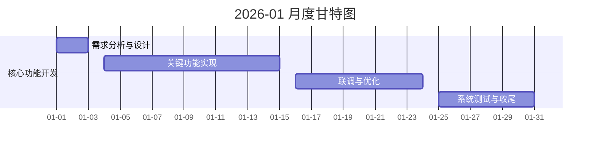

# 2026-01 月度工作记录

> **更新时间**: 2026-01-31
> **开发周期**: 2026-01-01 至 2026-01-31
> **术语说明**: DUT(Device Under Test)=被测设备 | QC=质量控制 | SOP=标准操作程序

## 目录

<!-- TOC-BEGIN -->

- [本月计划任务](#本月计划任务)
- [每日进度日志](#每日进度日志)
- [任务排期表](#任务排期表)
- [甘特图](#甘特图)
- [关键决策点](#关键决策点)
- [与最新沟通记录对齐补充](#与最新沟通记录对齐补充)
- [待办事项](#待办事项)
- [整体进度统计](#整体进度统计)
- [文档更新记录](#文档更新记录)

<!-- TOC-END -->

## 本月计划任务

### 核心功能开发

- **模块/功能** (0%):
  - 目标/范围：
  - 依赖/前置条件：
- **模块/功能** (0%):
  - 目标/范围：
  - 依赖/前置条件：

---

## 每日进度日志

### 2026-01-01

- 适配温度设备和压力设备的新协议
- 分析自动机协议流程，查缺补漏（自动机部分更新，一个站点 16个socket 按温区来划分）
- 重新分析项目，清理归纳需求

### 2026-01-06

- 晶存项目问题分析
  - 温度出现异常升温情况：开启十个库位测试，会出现四十个测试盒升温，十个测试盒不升温的现象
    - 解决方案：分析log文件和config文件，log文件会记录是否对测试盒进行降温的操作，config文件会记录用户是否设置正确的补偿温度
    - 工作量：预计一个工作日：半个工作日排查问题，半个工作日自测多次
  - 软件一键下电功能失败问题：软件发送一键下电，仅对设备进行下电指令的发送，会判断发送成功与否，不会实时监控设备上电状态--已修改，进行进度条的提示以及成功提示
  - 上下电不稳定问题：根据之前的方案Tester提供上电指令，嵌入式端会进行上电操作，Tester只需要监控上电状态，其余上下电问题Tester没有方法进行硬件端处理
  - handler与测试机端口不一致问题：该问题已于12.19中午已解决，在项目群中有记录

### 2026-01-07

- 晶存项目现场新需求
  - 需求1：控制面板界面中每个BIB添加连接远程桌面的按钮，一键点击即可打开对应远程桌面进行测试盒的控制--开会确定方案
  - 需求2：客户软件在进行不同工单的测试时，需要加载不同的固件文件，客户软件需提供接口支持控制他们的软件进行对应的操作，下午与客户研发人员对接再确定方案--方案已初步和客户研发进行沟通，开会确定方案
  - 需求3：需要解决客户软件及ACAPP的在线升级问题，需项目组确定方案后实施--已跟客户软件开发沟通，开会确定方案
  - 需求4：控制面板界面需要显示分BIN的具体结果，同时BIN别的颜色可手动配置--开会确定方案
  - 需求5：每个BIB需要良率显示，需要连续不良停止测试的配置，需要累计测试次数的报警--开会确定方案

### 2026-01-21

- 客户软件分bin与自动机对应关系修改
  - 返回值 -1 对应 错误编码 200
  - 返回值 0 对应 错误编码 201
  - 返回值 1 对应 良品 BIN 1
  - 返回值 2-7 对应 不良品 BIN 2-7
- 晶存软件运行流程部分
  - 1.输入框输入固件版本及配置名
    ↓
  - 2.组装准备指令: <<START;1;1;1;23082404;1;固件版本;配置名;2;2;2;2>>
    ↓
  - 3.模组向上位机发送<< DOWNLOAD:PL名称>>
    ↓
  - 4.上位机向模组发送下载结果，<< DOWNLOAD:00,00,00,00,00,00,00,00>>
    ↓
  - 5.模组向上位机发送准备开始指令<<START;1;1;1;23082404;1;固件版本;配置名;2;2;2;2>>
    ↓
  - 6.等待2s，模组向上位机发送开始指令<`<START>`>
    ↓
  - 7.上位机自检完成后，向模组发送<< INITIALOK>>
    ↓
  - 8.模组向上位机发送正式开始指令<< NEXT>>
    ↓
  - 9.上位机向模组发送测试结果和分bin<< ERRCODE:01,01,01,01,01,01,01,01>>

---

## 任务排期表

#### 三温四区开发时间（暂定）

**开发开始日期**：2026-01-04

| 序号           | 任务内容                                                                                                                           | 预估工作日                  | 状态 |
| -------------- | ---------------------------------------------------------------------------------------------------------------------------------- | --------------------------- | ---- |
| 1              | 温度设备调试：协议适配＋实际设备调试                                                                                               | 1.5                         | ☐   |
| 2              | 压力设备调试：协议适配＋实际设备调试                                                                                               | 1.5                         | ☐   |
| 3              | 自动机设备协议适配及对接                                                                                                           | 2                           | ☐   |
| 4              | 配置文件的设计及实际应用                                                                                                           | 1                           | ☐   |
| 5              | 双向通信＋配置参数预加载（包括确认方式及重试机制）                                                                                 | 2                           | ☐   |
| 6              | 4p4t流程设计及工作流构思                                                                                                           | 2                           | ☐   |
| 7              | 标定参数计算、写入寄存器、误差检验流程、功能安全自检标定流程开发及验证； 序列号生成、crc计算、OTP配置文件生成、烧录及回读验证 | 4                           | ☐   |
| 8              | 软件界面优化、sop文档、适配电压切换（嵌入式暂未开发）                                                                              | 2                           | ☐   |
| 9              | 数据保存与四温区数据追溯                                                                                                           | 2                           | ☐   |
| 10             | 自测                                                                                                                               | 5                           | ☐   |
| 11             | QC测试                                                                                                                             | 未知                        | ☐   |
| **总计** |                                                                                                                                    | **23工作日 + QC测试** |      |

### 第1周 (01-01 至 01-07)

- **01-01 周X**:
- **01-02 周X**:

### 第2周 (01-08 至 01-14)

- **01-08 周X**:
- **01-09 周X**:

### 第3周 (01-15 至 01-21)

- **01-15 周X**:
- **01-16 周X**:

### 第4周 (01-22 至 01-28)

- **01-22 周X**:
- **01-23 周X**:

### 第5周 (01-29 至 01-31)

- **01-29 周X**:
- **01-30 周X**:

---

## 甘特图

（01-01 至 01-31）

---

## 关键决策点

- **决策点**:

---

## 与最新沟通记录对齐补充

- **2026-01-01 沟通记录**：

---

## 待办事项

### 模块/功能

---

## 整体进度统计

- 本月关键里程碑：
- 完成率估算：
- 风险项数量：

---

## 文档更新记录

| 日期       | 文档 | 变更摘要 | 负责人 |
| ---------- | ---- | -------- | ------ |
| 2026-01-01 |      |          |        |
