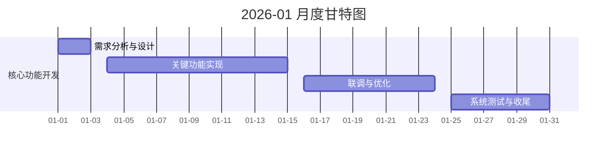

# 2026-01 月度工作记录

> **更新时间**: 2026-01-31
> **开发周期**: 2026-01-01 至 2026-01-31
> **术语说明**: DUT(Device Under Test)=被测设备 | QC=质量控制 | SOP=标准操作程序

## 目录

<!-- TOC-BEGIN -->

- [本月计划任务](#本月计划任务)
- [KPI 绩效概述](#kpi-绩效概述)
- [每日进度日志](#每日进度日志)
- [任务排期表](#任务排期表)
- [甘特图](#甘特图)
- [关键决策点](#关键决策点)
- [与最新沟通记录对齐补充](#与最新沟通记录对齐补充)
- [待办事项](#待办事项)
- [整体进度统计](#整体进度统计)
- [文档更新记录](#文档更新记录)

<!-- TOC-END -->

## 本月计划任务

### 核心功能开发

- **三温四区项目** (100%):
  - 目标/范围：实现四个温区的切换及标定测试流程，开放客户区烧录接口。
  - 依赖/前置条件：硬件及嵌入式端协议支持。
- **测试软件迭代 v1.0** (100%):
  - 目标/范围：基于晶存 SLT 项目进行模块化划分，提升后续项目开发效率。
  - 依赖/前置条件：晶存项目需求及 Log 协议。

---

一、核心维度概览 (权重分配)

A. 项目交付与开发 (50%)

   目标：主导上位机核心项目开发，兼顾项目管理职责，确保功能、进度与硬件联调完美交付。

B. 工程质量与技术 (15%)

   目标：保障上位机与底层设备通讯稳定，降低现场故障率，优化代码架构。

C. 团队协作与赋能 (15%)

   目标：沉淀上位机通用组件库，优化软硬协作流程，提升团队整体效率。

D. 个人成长 (PMP专项) (20%)

   目标：完成PMP认证，将项目管理方法论应用于上位机研发全流程。

二、详细考核指标

【A. 项目交付与开发】权重：50%

目标：作为技术核心与执行负责人，主导上位机软件从需求到上线的全生命周期。

1. 核心功能开发与交付

   - 行动：主导三温四区项目/晶存项目上位机软件的代码开发，按期交付率 100%。
   - 行动：负责现场联调支持，确保软件在客户现场一次性验收通过率 ≥95%。
   - 验收：软件版本发布记录、软件使用文档。
   - 截止时间：三温四区项目截止4.30、晶存项目持续提供支持
2. 项目全生命周期管理 (PMP实践区)

   - 行动：担任该项目执行负责人，制定详细的任务分解表与开发甘特图，关键节点（里程碑）达成率 100%。
   - 行动：主持需求评审与技术交底，输出《需求规格说明书》并获各方签字确认，减少后期需求变更 ≥30%。
   - 验收：项目章程 & WBS表、进度甘特图、会议纪要。
   - 截止时间：持续进行
3. 硬件兼容性与稳定性

   - 行动：完成软件在1-2 种不同硬件配置/操作系统环境下的兼容性测试，无重大崩溃事故。
   - 行动：确保软件连续运行 72小时 压力测试无内存泄漏及闪退事件。
   - 验收：兼容性测试报告。
   - 截止时间：5月31日
4. 文档与交付物完整性

   - 行动：输出完整的交付文档包，包括：《用户操作手册》、《通讯协议定义文档》、《部署安装指南》、《常见问题FAQ》。
   - 行动：文档更新与软件版本同步，无滞后。
   - 验收：全套交付文档、版本更新日志。
   - 截止时间：随版本发布

【B. 工程质量与技术】权重：15%

目标：针对上位机软件特性，重点攻克通讯稳定性与架构可维护性。

1. 代码质量与规范

   - 行动：核心代码 Code Review 通过率 100%，符合团队编码规范。
   - 行动：关键业务逻辑单元测试覆盖率 ≥80%，确保数据处理算法准确无误。
   - 验收：单元测试报告。
   - 截止时间：6月30日
2. 线上/现场故障控制

   - 行动：负责模块的现场严重故障（P0/P1级，如：通讯中断、数据丢失）数量为 0。
   - 行动：一般性问题（P2/P3）平均解决时间（MTTR）小于 4小时。
   - 验收：故障记录表、售后支持日志。
   - 截止时间：持续进行

【C. 团队协作与赋能】权重：15%

目标：沉淀上位机通用资产，优化软硬协作流程。

1. 通用组件库建设

   - 行动：封装并输出3个 通用的上位机组件/类库（如：通用Modbus/TCP通讯驱动、设备控制模块、图表控件），供团队复用。
   - 行动：编写组件使用文档，并在至少1个其他项目中成功应用。
   - 验收：组件库源码/DLL、使用说明书、应用案例证明。
   - 截止时间：5月30日
2. 流程优化与知识分享

   - 行动：组织 1次 技术分享会。
   - 行动：优化“软件-硬件-电气”三方协作流程，提出2条被采纳的改进建议（如：联调前置检查表）。
   - 验收：流程优化文档及技术分享文档。
   - 截止时间：5月31日
3. 跨部门协作支持

   - 行动：协助团队进行前期项目评估，提供软件可行性分析报告。
   - 行动：指导测试人员完善自动化测试脚本，提升测试效率。
   - 验收：可行性分析报告、自动化测试脚本贡献记录。
   - 截止时间：持续进行

【D. 个人成长 (PMP专项)】权重：20%

目标：以考促学，将PMP理论体系转化为上位机项目的实际管理能力。

1. PMP资质认证

   - 行动：在2026年6月正式通过PMP考试并获得证书。
   - 验收：PMP电子证书。
   - 截止时间：6月30日
2. 管理理论落地实践

   - 行动：结合本年度上半年负责的上位机项目，输出一份《PMP方法论在工业自动化软件项目中的实践总结》。
   - 行动：重点复盘：如何利用WBS拆解软硬耦合任务、如何进行干系人管理、如何控制范围蔓延。
   - 验收：实践总结报告、改进后的项目模板。
   - 截止时间：6月25日
3. 行业视野拓展

   - 行动：阅读 1本 项目管理或工业软件架构类书籍。
   - 行动：调研业界先进的上位机架构或低代码平台，输出 1份 技术调研报告，提出 1条 架构演进建议。
   - 验收：技术调研报告。
   - 截止时间：6月30日

三、所需支持与资源

为了确保上述KPI（特别是项目管理职责）的顺利达成，需要领导提供以下支持：

1. 角色授权：明确授权我在项目中担任项目接口人，参与到项目管理的工作，主持项目例会及进度追踪等，赋予协调软硬件资源的权限。
2. 试点机会：允许我在负责的项目中尝试流程化管理工具，并在团队内推广验证有效的部分。

## 每日进度日志

### 2026-01-01

- 适配温度设备和压力设备的新协议
- 分析自动机协议流程，查缺补漏（自动机部分更新，一个站点 16个socket 按温区来划分）
- 重新分析项目，清理归纳需求

### 2026-01-06

- 晶存项目问题分析
  - 温度出现异常升温情况：开启十个库位测试，会出现四十个测试盒升温，十个测试盒不升温的现象
    - 解决方案：分析log文件和config文件，log文件会记录是否对测试盒进行降温的操作，config文件会记录用户是否设置正确的补偿温度
    - 工作量：预计一个工作日：半个工作日排查问题，半个工作日自测多次
  - 软件一键下电功能失败问题：软件发送一键下电，仅对设备进行下电指令的发送，会判断发送成功与否，不会实时监控设备上电状态--已修改，进行进度条的提示以及成功提示
  - 上下电不稳定问题：根据之前的方案Tester提供上电指令，嵌入式端会进行上电操作，Tester只需要监控上电状态，其余上下电问题Tester没有方法进行硬件端处理
  - handler与测试机端口不一致问题：该问题已于12.19中午已解决，在项目群中有记录

### 2026-01-07

- 晶存项目现场新需求
  - 需求1：控制面板界面中每个BIB添加连接远程桌面的按钮，一键点击即可打开对应远程桌面进行测试盒的控制--开会确定方案
  - 需求2：客户软件在进行不同工单的测试时，需要加载不同的固件文件，客户软件需提供接口支持控制他们的软件进行对应的操作，下午与客户研发人员对接再确定方案--方案已初步和客户研发进行沟通，开会确定方案
  - 需求3：需要解决客户软件及ACAPP的在线升级问题，需项目组确定方案后实施--已跟客户软件开发沟通，开会确定方案
  - 需求4：控制面板界面需要显示分BIN的具体结果，同时BIN别的颜色可手动配置--开会确定方案
  - 需求5：每个BIB需要良率显示，需要连续不良停止测试的配置，需要累计测试次数的报警--开会确定方案

### 2026-01-21

- 客户软件分bin与自动机对应关系修改
  - 返回值 -1 对应 错误编码 200
  - 返回值 0 对应 错误编码 201
  - 返回值 1 对应 良品 BIN 1
  - 返回值 2-7 对应 不良品 BIN 2-7
- 晶存软件运行流程部分
  - 1.输入框输入固件版本及配置名
    ↓
  - 2.组装准备指令: <<START;1;1;1;23082404;1;固件版本;配置名;2;2;2;2>>
    ↓
  - 3.模组向上位机发送<< DOWNLOAD:PL名称>>
    ↓
  - 4.上位机向模组发送下载结果，<< DOWNLOAD:00,00,00,00,00,00,00,00>>
    ↓
  - 5.模组向上位机发送准备开始指令<<START;1;1;1;23082404;1;固件版本;配置名;2;2;2;2>>
    ↓
  - 6.等待2s，模组向上位机发送开始指令<`<START>`>
    ↓
  - 7.上位机自检完成后，向模组发送<< INITIALOK>>
    ↓
  - 8.模组向上位机发送正式开始指令<< NEXT>>
    ↓
  - 9.上位机向模组发送测试结果和分bin<< ERRCODE:01,01,01,01,01,01,01,01>>

---

## 任务排期表

#### 三温四区开发时间（暂定）

**开发开始日期**：2026-01-04

##### 详细开发排期

|        开发项        | 开始时间 | 完成时间 | 周期 | 备注                             |
| :------------------: | :------: | :------: | :--: | :------------------------------- |
|  工控机软件环境配置  |   3/2   |   3/2   |  1  |                                  |
|  3.4.3 补偿误差检验  |   3/2   |   3/3   |  1  |                                  |
| 3.5 功能安全自检标定 |          |          |  1  |                                  |
|     3.6 OTP烧写     |          |          |  2  |                                  |
|    3.7 烧写后测试    |          |          |  2  |                                  |
|    3.8 客户区烧写    |   TBD   |   TBD   | TBD | 功能预留可以后续开发，不影响使用 |
|       软件测试       |          |          |      | 3.4部分之后均需要开发中测试      |

| 序号           | 任务内容                                                                                                                                                                                                     | 预估工作日                  | 已完成的进度  | 状态                       |
| -------------- | ------------------------------------------------------------------------------------------------------------------------------------------------------------------------------------------------------------ | --------------------------- | ------------- | -------------------------- |
| 1              | 温度设备调试：协议适配＋实际设备调试--25/45/65/115°C                                                                                                                                                        | 3                           | 1.5           | ☐                         |
| 2              | 压力设备调试：协议适配＋实际设备调试                                                                                                                                                                         | 2                           | 2             | ☑                         |
| 3              | 自动机设备协议适配及对接                                                                                                                                                                                     | 2                           | 1             | ☐                         |
| 4              | 配置文件的设计及实际应用                                                                                                                                                                                     | 1                           | 0             | ☐                         |
| 5              | 双向通信＋配置参数预加载（包括确认方式及重试机制）                                                                                                                                                           | 2                           | 0             | ☐                         |
| 6              | 4p4t流程设计及工作流构思--延时，稳定条件                                                                                                                                                                     | 4                           | 0             | ☐                         |
| 7              | 标定参数计算、写入寄存器、误差检验流程、功能安全自检标定流程开发及验证； 序列号生成、crc计算、OTP配置文件生成、烧录及回读验证（需要确定温度传感器和压力传感器的数值） --目前只支持ap8000的psi5调试 | 6                           | 2             | ☐                         |
| 8              | 软件界面优化、sop文档、适配电压切换（嵌入式暂未开发）--嵌入式端需要开发获取uid                                                                                                                               | 3                           | 0             | ☐                         |
| 9              | 数据保存与四温区数据追溯--mes&数据库                                                                                                                                                                         | 2                           | 0             | ☐                         |
| 10             | 其他功能补充及自测                                                                                                                                                                                           | 5                           | 0             | ☐                         |
| 11             | QC测试                                                                                                                                                                                                       | 未知                        | 未知          | ☐                         |
| **总计** |                                                                                                                                                                                                              | **30工作日 + QC测试** | **6.5** | **还需 23.5 工作日** |

### 第1周 (01-01 至 01-07)

- **01-01 周X**:
- **01-02 周X**:

### 第2周 (01-08 至 01-14)

- **01-08 周X**:
- **01-09 周X**:

### 第3周 (01-15 至 01-21)

- **01-15 周X**:
- **01-16 周X**:

### 第4周 (01-22 至 01-28)

- **01-22 周X**:
- **01-23 周X**:

### 第5周 (01-29 至 01-31)

- **01-29 周X**:
- **01-30 周X**:

---

## 甘特图

（01-01 至 01-31）

```mermaid
gantt
    title 2026-01 月度甘特图
    dateFormat  MM-DD
    axisFormat  %m-%d

    section 核心功能开发
    需求分析与设计        :a1, 01-01, 01-03
    关键功能实现          :a2, 01-04, 01-15
    联调与优化            :a3, 01-16, 01-24
    系统测试与收尾        :a4, 01-25, 01-31
```

---

## 关键决策点

- **决策点**:

---

## 与最新沟通记录对齐补充

- **2026-01-01 沟通记录**：

---

## 待办事项

### 模块/功能

---

## 整体进度统计

- 本月关键里程碑：
- 完成率估算：
- 风险项数量：

---

## 文档更新记录

| 日期       | 文档 | 变更摘要 | 负责人 |
| ---------- | ---- | -------- | ------ |
| 2026-01-01 |      |          |        |
