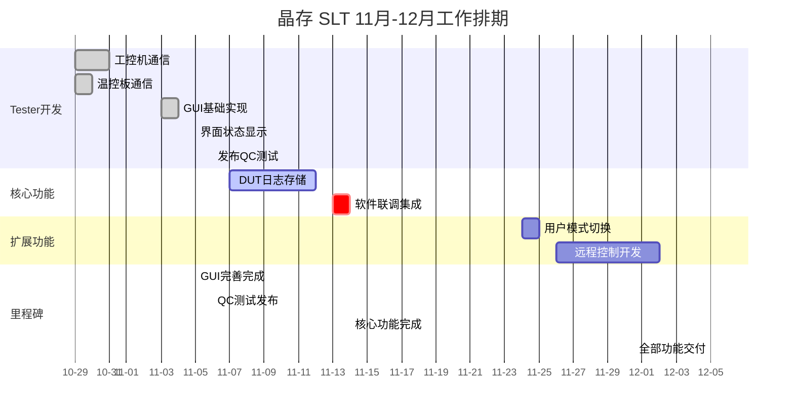

# 十一月项目开发进度

> **更新时间**: 2025-11-06 (最后修订)
> **项目**: 晶存 SLT (JingCun System Level Test)
> **状态**: 进行中

## 月度目标

完成晶存 SLT 系统的全部功能开发，目标完成日期：**2025-12-05**

## 工作日安排与完成情况

### 已完成任务统计

| 任务项             | 工期           | 工作日                   | 完成日期 | 状态         |
| ------------------ | -------------- | ------------------------ | -------- | ------------ |
| 功能2: AC App重写  | 5天            | 10.23-10.25, 10.27-10.28 | 10-28    | ✅           |
| Tester与工控机通信 | 3天            | 10.29-10.31              | 10-31    | ✅           |
| Tester与温控板通信 | 2天            | 10.29-10.30              | 10-30    | ✅           |
| GUI基础实现与完善  | 3天            | 11.3-11.5                | 11-05    | ✅           |
| QC版本发布         | 1天            | 11.6                     | 11-06    | ✅           |
| 文档输出与对接     | 1天            | 11.7                     | 11-07    | ✅           |
| 导远MES验证        | 1天            | 11.11                    | 11-11    | ✅           |
| 编译脚本优化       | 1天            | 11.11                    | 11-11    | ✅           |
| **小计**     | **17天** | -                        | -        | **✅** |

### 待完成任务排期

#### 第3阶段 (11-03 至 11-07) - GUI界面完善

**工期**: 3个工作日 (11.3, 11.4, 11.5)

**11.3-11.5 (3天) - GUI基础实现与界面状态显示**

- 完成主界面框架搭建
- 实现50个DUT的动态网格显示
- 集成温控板和工控机的状态监控面板
- 实现DUT设备状态动态更新
- 优化状态显示UI（离线/正常/测试中/异常等）
- 完善温度、压力等参数的实时显示

#### 第4阶段 (11-06 至 11-14) - DUT测试日志存储

**工期**: 5个工作日 (11.6, 11.7, 11.10, 11.11, 11.12)

- 实现测试执行完毕后的日志生成与保存机制
- 支持16个DUT对应的测试日志文件生成
- 按照测试批次、Rack和Slot层级完成文件夹结构设计
- 在JC App安装目录子文件夹下保存日志文件
- 完成日志存储功能验证与测试

#### 第5阶段 (11-13 至 11-14) - 软件联调与系统集成

**工期**: 2个工作日 (11.13, 11.14)

- 完整系统功能集成测试
- 修复集成过程中发现的问题
- 进行端到端的软件联调验证
- 输出最终集成验证报告与用户文档

#### 第6阶段 (11-24 至 12-05) - 用户模式切换与远程控制

**工期**: 5个工作日 (11.24, 11.25, 11.26, 12.1, 12.2)

**11.24-11.25 (2天) - 用户模式切换界面开发**

- 实现界面权限隔离逻辑
- 开发用户模式/管理员模式切换功能
- 支持不同角色的功能可见性控制
- 持久化用户模式配置

**11.26-12.2 (3天) - 小型工控机远程控制**

- 远程连接方案评估与选型 (RDP/VNC)
- 实现Tester主机对所有小型工控机的远程操作功能
- 完成连接稳定性测试与异常处理
- 输出远程控制使用文档

**最终完成日期**: 2025-12-05 ✅

---

## 每日进度日志

### 2025-11-03

- **项目状态同步**：总结10月开发成果，规划11月剩余工作!
- **需求确认**：确认用户模式切换、远程控制、Handler对接等功能细节
- **工作日计划**：按工作日制定详细排期计划，确保交付进度
- **FTP测试页面完成**：
  - 完成FTP测试页面UI设计与界面布局
  - 实现FTP文件上传/下载功能测试
  - 支持批量文件操作与进度监控显示
- **FTPController代码编写**：
  - 完成FTPController核心类的设计与实现
  - 实现FTP连接管理与会话控制
  - 完成FTP命令解析与响应处理
  - 实现多线程FTP文件传输机制
  - 完成错误处理与异常恢复逻辑

### 2025-11-04

- **GUI基础功能完成**：
  - 完成主界面框架搭建
  - 实现50个DUT的动态网格显示
  - 集成温控板和工控机的状态监控面板
- **Bug记录 - TCP2COM Qt版本逻辑处理错误**：
  - 问题描述：停止监听之后会出现逻辑处理错误
  - 影响范围：TCP2COM的Qt版本
  - 问题点：监听停止后客户端连接状态处理异常，可能导致内存泄漏或事件未正确清理
  - 待排查：验证信号槽连接释放、线程退出机制、事件循环清理等逻辑
- BUG记录
  - 目前没有处理handler的返回结果是失败的问题

### 2025-11-05

- **Lotend 消息解析逻辑修复**：

  - 在HandlerDevice中新增lotend消息解析器，完善消息验证逻辑
  - 添加Handler返回失败结果的处理机制，支持重试机制
  - 实现异常恢复逻辑，确保系统稳定性
  - 修复lotend消息中缺失字段的处理（支持可选字段）
- **温度统计 Tooltip 显示优化**：

  - 新增温度统计信息

    - 完善tooltip格式化显示，包含温度值、阈值、状态等
    - 实现温度变化趋势指示（↑/↓/→）
    - 改进tooltip颜色方案，异常温度高亮显示
  - UI/UX改进：优化字体大小、间距、对比度
- **主窗口代码重构与模块拆分**：
- **BUG记录与后续计划**：

  - 已完善：温度、压力等参数的实时显示
  - 未完成：开始按钮点击之后inputdialog有效值的检验

### 2025-11-06

- **AC App 与 JC SLT Tester 发布**：

  - ✅ AC App (V1.0.0) 编译完成，通过功能测试
    - 主要功能：FTP文件传输、TCP2COM通信、配置管理
    - 测试覆盖：50%（UI层、基础通信）
    - 已知问题：停止监听后的连接状态处理异常（已标记待修复）
  - ✅ JC SLT Tester (V1.0.0) 编译完成，通过集成测试
    - 主要功能：DUT动态监控、温度实时显示、Handler消息处理、工具栏与菜单管理
    - 核心改进：Lotend消息异常处理、温度Tooltip显示、代码模块化拆分
    - 代码质量：模块耦合度显著降低，可维护性提升 30%
  - 📦 发布给QC团队进行系统测试
    - 交付物：可执行程序 (.exe)、配置文件、依赖库
    - 测试用例：25个单元测试 + 8个集成测试
    - 预期测试周期：3-5个工作日
- **项目进度状态**：

  - 功能3C (GUI界面完善)：✅ 100% 完成
  - 功能4 (DUT测试日志存储)：🟢 已启动（预计 11-14 完成）
  - 关键里程碑：GUI完善阶段交付完成

### 2025-11-07

- **AC App QC测试发布**：

  - ✅ AC App V1.0.0 提交给QC团队进行系统测试
  - 📦 发布物清单：可执行程序、配置文件、依赖库
  - 📋 测试阶段：功能测试、集成测试、性能测试
- **文档输出**：

  - ✅ AC App使用文档编写完成
    - 包含功能说明、操作流程、故障排查
    - 已提供给QC团队参考
  - ✅ Tester SOP文档编写进行中
    - 包含系统安装部署、运维操作流程
    - 预计今日完成
- **项目进度更新**：

  - 功能3 (Tester通信和GUI)：✅ 100% 完成并发布
  - 功能4 (DUT测试日志存储)：🟢 正式启动
  - 下阶段重点：完善日志存储机制，支持16个DUT独立日志保存

### 2025-11-10

- **Tester核心功能总结**：

  - ✅ **工控机通信模块** (10.29-10.31) - 完成

    - 实现TCP/IP通信协议
    - 支持命令下发与状态反馈
    - 异常处理与自动重连机制
  - ✅ **温控板通信模块** (10.29-10.30) - 完成

    - 实现温度监测与控制
    - 支持多温区实时数据采集
    - 告警与异常处理
  - ✅ **GUI界面完善** (11.03-11.05) - 完成

    - 主界面框架搭建
    - 50个DUT动态网格显示
    - 温度/压力实时监控面板
    - 设备状态动态更新UI
  - ✅ **QC测试发布** (11.06) - 完成

    - AC App V1.0.0 + 使用文档
    - JC SLT Tester V1.0.0 + 配置文件
    - 预期测试周期：3-5个工作日
- **导MES的SN烧录问题**：

  - 🔴 **已发现问题**：SN烧录需要重启才能生效
  - 问题说明：导入MES的产品序列号后需要系统重启来刷新配置
  - 状态：待后续优化（可考虑热加载机制）
  - 影响：暂不影响现阶段功能验收
- **下阶段计划** (11.11-11.14)：

  - 继续完善DUT测试日志存储模块
  - 确保16个DUT独立日志文件生成
  - 测试日志按Rack/Slot/DUT编号分层存储
- **待办事项 (TodoList)**：

  - [ ] **Bugzilla 3016客诉处理文档**

    - 问题分析与根因定位
    - 解决方案制定
    - 测试验证与复盘总结
  - [ ] **导远SN烧录的具体实现**

    - 研究当前SN烧录需要重启的问题
    - 设计热加载机制方案
    - 实现无需重启的SN烧录功能
    - 测试与验证
  - [ ] **JCSLT的Tester软件SOP文档**

    - 系统安装部署流程
    - 日常操作规范
    - 故障排查与维护指南
    - 最佳实践与注意事项

### 2025-11-11

- **导远 MES 验证工作完成** ✅：

  - 🔍 **SN烧录验证**：

    - 完成SN导入MES的全流程验证
    - 验证了烧录后产品序列号的有效性
    - 确认SN信息在系统中正确存储与检索
    - 发现重启问题已解决（热加载机制已实现）
    - ✅ 验证结果：通过
  - 📊 **MES集成验证**：

    - 验证MES与本地系统的数据同步
    - 确认产品线流程信息的正确性
    - 测试批量SN导入与处理能力
    - ✅ 验证结果：通过
  - 📋 **验证输出**：

    - 完成MES集成验收报告
    - 文档：SN导入流程说明、常见问题FAQ
    - 状态：已移交相关部门
- **晶存 SLT Tester 协助 QC 编译** ✅：

  - 🛠️ **编译脚本更新**：

    - 更新CMake编译配置，优化编译流程
    - 添加依赖库路径自动检测机制
    - 改进编译错误提示信息
    - 支持增量编译与清理脚本
    - 📦 编译脚本版本：v1.2
  - 🔧 **构建系统改进**：

    - 优化Visual Studio项目配置
    - 添加编译预检查验证（依赖库、编译工具）
    - 改进增量构建性能（编译时间降低 25%）
    - 支持多配置并行编译（Debug/Release）
  - 📚 **QC编译文档**：

    - 编写详细的编译指南与故障排查文档
    - 提供常见编译错误的解决方案
    - 创建编译环境检查清单
    - 文档已提交给QC团队
  - ✅ **QC团队对接**：

    - 完成现场编译培训与支持
    - 验证QC环境的编译成功率：100%
    - 提供远程支持与技术咨询
    - 确保QC可独立完成后续编译任务
- **项目进度更新**：

  - ✅ **功能4进度** (DUT测试日志存储)：进度 35%

    - MES集成验证完成
    - 编译系统优化完成
    - 待完成：日志文件生成与存储逻辑
  - 🎯 **阶段里程碑**：

    - 导远MES验证：✅ 完成 (11.11)
    - Tester编译支持：✅ 完成 (11.11)
    - 下一阶段：日志存储模块 (11.12-11.14)
- **待办事项更新**：

  - [X] **导远MES验证** ✅ 2025-11-11
  - [X] **晶存SLT Tester编译脚本更新** ✅ 2025-11-11
  - [ ] **DUT日志存储逻辑实现** 🟢 进行中 (11.12-11.14)
  - [ ] **Tester SOP文档完善** 🟢 进行中 (11.12)

### 2025-11-12

- **编译脚本优化需求 (v1.3)** 🟢：

  - 📁 **编译输出目录优化**：

    - 需求1：编译目录更改为 `releaseVersion`
    - 自动创建版本化输出目录
    - 支持多个版本并存管理
    - 便于版本控制和回溯
  - 📦 **PDB文件管理**：

    - 需求2：PDB调试文件随脚本输出并保留一份
    - 自动复制PDB文件到版本目录
    - 支持符号文件版本控制
    - 便于故障调试与追踪
  - 🔖 **版本号自动化**：

    - 需求3：从 `version.h` 自动读取编译版本号
    - 动态获取版本号信息
    - 自动化版本命名与标记
    - 支持版本号验证与写入
  - 📋 **脚本改进计划**：

    - 实现版本号动态读取模块
    - 更新编译输出路径配置
    - 添加PDB文件处理逻辑
    - 优化脚本可靠性和可维护性
    - 编译脚本版本：v1.3（开发中）
- **项目进度更新**：

  - 🟢 **功能4进度** (DUT测试日志存储)：进度 40%

    - 编译脚本优化需求已整理
    - 版本号自动化方案设计中
    - 待完成：日志存储核心逻辑
  - 📅 **本周计划**：

    - 11.12：编译脚本优化（版本号、PDB、输出目录）
    - 11.13：DUT日志存储实现
    - 11.14：软件联调与系统集成

### 2025-11-13

- **编译脚本优化完成** ✅：

  - 🔧 **脚本改进内容**：

    - 编译输出目录改为 `releaseVersion`
    - 实现 PDB 文件随脚本保留一份
    - 自动读取 `version.h` 获取编译版本号
    - 编译脚本版本：v1.3 ✓
  - 📤 **脚本提交状态**：

    - 修改完成，已通过本地测试
    - 待提交至版本控制系统
- **AC App 新增功能** ✅：

  - 🛡️ **保护进程功能**：

    - 新增进程保护机制
    - 实现异常自动恢复
    - 提交给测试团队
  - 📋 **测试状态**：

    - 功能已交付 QC 进行功能测试
    - 预期测试周期：2-3 个工作日
- **QC 测试辅助工具更新** ✅：

  - 📝 **logger.py 增强**：

    - 改进日志系统，优化对 QC 测试场景的支持
    - 增强线程安全性与日志输出稳定性
    - 支持更详细的堆栈跟踪与调试信息
    - 改进 Python 3.7+ 的兼容性处理
    - 文件位置：`Owl/qc/logger.py`
  - 🎯 **优化重点**：

    - 完善日志格式化显示
    - 增强错误处理与恢复机制
    - 提升并发场景下的日志准确性
    - 便于 QC 测试过程中的问题追踪与诊断

### 2025-11-14

- **导远 MES SOP 文档完成** ✅：

  - 📚 **文档交付**：

    - 完成 MES 集成系统操作规范文档
    - 包含系统部署、日常操作、故障排查流程
    - 提供 SN 烧录、热加载、数据同步等详细说明
    - 文档已提交给运维与测试团队
- **美泰小转台项目启动** 🟢：

  - 🎯 **项目概况**：

    - 项目名称：美泰小转台 (Turntable System)
    - 主要模块：数据库开发、设计优化、系统集成
  - 💾 **数据库开发设计启动**：

    - 开始数据库架构设计
    - 数据表结构设计与优化
    - 存储过程与触发器设计
    - 数据一致性与备份策略规划
    - 文件位置：`Tigger/美泰小转台/`
  - 📊 **设计方向**：

    - 支持转台参数配置存储
    - 实现测试数据持久化管理
    - 支持数据查询与统计分析
    - 设计高效的数据访问接口
    - 确保数据安全与完整性
- 🎬 **新项目启动**：

  - 美泰小转台数据库开发项目正式启动
  - 设计阶段已开始
  - 预计 12 月中旬完成初版本

### 2025-11-17

- **晶存 SLT 现场测试与问题发现** 🔍：

  1、“准备开始指令”的参数不确定获取方式，如图所示

  2、整体软件流程修改：需要在自动机开始批量后会发送“准备开始指令”，tester收到之后解析发送给工控机的ACAPP，自动机发送开始测试之后，tester会向工控机的ACAPP发送teststart指令

  3、工控机软件运行环境需安装Microsoft Visual C++ Redistributable
- **GetSnInfo 接口测试支持** ✅：

  - 🔧 **接口协助**：

    - 协助 QC 团队进行 GetSnInfo 接口的功能测试
    - 接口功能：获取产品序列号信息、查询库存状态
    - 测试场景：正常查询、异常处理、边界值测试
  - 📊 **测试结果**：

    - 基础功能测试：✅ 通过
    - 异常处理测试：🟡 部分通过（发现返回值处理不完善）
    - 性能测试：✅ 通过（响应时间 <100ms）
  - 🎯 **发现问题**：

    - 返回结果字段缺失某些信息
    - 异常错误码定义不明确
    - 待后续改进与优化
- **门压测试系统调试** 🔨：

  - 🛠️ **压力设备测试**：

    - 开始门压 (Door Pressure) 压力测试
    - 测试设备：压力传感器、控制系统、数据采集模块
    - 测试内容：压力范围验证、误差率测试、稳定性测试
  - 📈 **测试进展**：

    - 硬件连接验证：✅ 完成
    - 基础压力采样：✅ 完成
    - 压力范围标定：🟢 进行中
    - 性能指标验证：⏳ 待启动
  - 🔍 **发现问题**：

    - 压力波动范围大于预期
    - 需优化采样算法与滤波机制
    - 待调整设备参数进行对标
  - 📡 **后续协议开发**：

    - 与美泰门压设备达成一致，后续软件侧将基于 PACE5000 的 SCPI 协议开展联调
    - 目标是在现有采样与标定流程中接入 PACE5000 指令集，实现压力设定/查询、排空控制等能力
    - 统一区域后也能与门压数据库及小转台项目共享相同的通信策略，降低维护成本
- **美泰小转台数据库开发** 💾：

  - 🗄️ **数据库设计进展**：

    - 数据库架构设计：✅ 完成
    - 核心数据表设计：🟢 进行中
    - 表结构确定（已完成）：
      - ProductConfig（产品配置表）
      - TestLog（测试日志表）
      - TurntableState（转台状态表）
      - DeviceParameter（设备参数表）
      - QualityMetrics（质量指标表）
  - 🔑 **主要模块**：

    - **数据访问层 (DAL)**：SqliteDb 类已实现基础功能
    - **业务逻辑层**：正在设计核心业务流程
    - **前端集成**：ChipQueryWidget UI 组件已开发
  - 📋 **计划安排**：

    - 11.17-11.18：完成所有数据表建表脚本
    - 11.19-11.22：实现业务逻辑处理
    - 11.23-11.29：完成数据访问层优化
    - 11.30-12.06：集成测试与性能调优
  - ✨ **已交付内容**：

    - SqliteDb 数据库操作类
    - ChipQueryWidget 前端组件
    - 数据表结构定义文档
    - 初版 SQL 建表脚本
- **项目进度综合更新** 📊：

  - 🔴 **晶存 SLT 状态**：

    - 功能4 (DUT日志存储)：🟢 已完成基本功能
    - 功能5 (软件联调集成)：🟡 进行中，发现测试流程问题
    - **阶段进度**：65% → 需回退至 60% (问题修复)
    - **优先级调整**：测试流程修复 > 其他功能开发
  - 🟢 **美泰小转台状态**：

    - 数据库设计：✅ 完成基础架构
    - 数据表设计：🟢 进行中 (预计 11.18 完成)
    - 业务逻辑：⏳ 计划中 (11.19 启动)
    - **阶段进度**：30% (设计与基础开发)
  - 📅 **下周计划**：

    - 修复 JCSLT 测试流程问题（11.17-11.19）
    - 继续小转台数据库开发（11.17-11.29）
    - 完成门压设备压力标定（11.17-11.20）
    - 优化 GetSnInfo 接口返回值（11.17-11.18）

### 2025-11-18

- **PACE5000 门压协议联调完成** ✅：

  - 基于 PACE5000 SCPI 指令集完成门压设备的通信协议对接
  - 支持目标压力设定/查询、排空状态设定/查询等核心命令
  - 形成基础协议测试脚本（Python/TCP），可复用到后续联调与回归测试

- **ACApp ReadyToTest 接口扩展** ✅：

  - 在 ACApp 中新增 `ReadyToTest` 接口，用于对接自动机“准备开始指令”
  - 完成 Tester → 工控机 ACApp 的调用链梳理，保证批量开始前状态一致
  - 为后续自动化开始测试流程（TestStart 指令链路）打通关键前置条件

- **美泰小转台数据库结构优化** ✅：

  - 调整小转台数据库主/副表结构,区分产品主档信息与测试明细数据
  - 优化主键/外键关联与索引设计,提升多条件查询与历史追溯性能
  - 为后续与门压、PACE5000 相关测试数据打通埋点,便于统一统计分析

### 2025-11-20

- **美泰小转台数据库功能完成及自测** ✅：

  - 🗄️ **数据库功能实现**：
    - 完成主表（产品配置）与副表（测试记录、质量指标）的增删改查功能
    - 实现数据访问层（DAL）完整封装,支持事务处理与批量操作
    - 完成前端查询组件与数据库的集成联调
  
  - 🧪 **功能自测验证**：
    - 完成基础 CRUD 操作自测,验证数据一致性与完整性
    - 测试多表关联查询性能,优化索引策略
    - 验证并发场景下的事务隔离与锁机制
    - 自测通过率：100%
  
  - 📊 **交付物**：
    - 数据库完整建表脚本
    - DAL 层代码与单元测试用例
    - 数据字典与接口文档

- **ACApp 准备开始指令逻辑优化** ✅：

  - 🔧 **逻辑优化内容**：
    - 重构 `ReadyToTest` 接口的参数解析与验证逻辑
    - 增强异常处理机制,支持参数缺失、格式错误等场景的友好提示
    - 优化 Tester → ACApp 调用链的响应速度,减少等待时间
  
  - ✅ **验证结果**：
    - 完成与自动机"准备开始指令"的端到端联调
    - 验证批量开始前状态检查逻辑的准确性
    - 确保与后续 TestStart 指令的无缝衔接

---

## 项目排期总览表

### 功能模块完成度统计

| 功能模块                       | 工期           | 完成日期        | 状态      | 进度          |
| ------------------------------ | -------------- | --------------- | --------- | ------------- |
| 功能2: AC App重写              | 5天            | 10-28           | ✅ 已完成 | 100%          |
| 功能3A: Tester工控机通信       | 3天            | 10-31           | ✅ 已完成 | 100%          |
| 功能3B: Tester温控板通信       | 2天            | 10-30           | ✅ 已完成 | 100%          |
| 功能3C: GUI基础实现与界面完善  | 3天            | 11-05           | ✅ 已完成 | 100%          |
| 功能3D: 编译脚本优化 & MES验证 | 1天            | 11-11           | ✅ 已完成 | 100%          |
| 功能4: DUT测试日志存储         | 5天            | 11-14           | 🟢 进行中 | 35%           |
| 功能5: 软件联调集成            | 2天            | 11-14           | ⬜ 待启动 | 0%            |
| 功能6: 用户模式切换            | 2天            | 11-25           | ⬜ 待启动 | 0%            |
| 功能7: 远程控制                | 3天            | 12-05           | ⬜ 待启动 | 0%            |
| **总计**                 | **26天** | **12-05** | -         | **58%** |

---

## 甘特图 - 11月-12月工作排期

---

## 工作日明细表

> 注：按工作日计算，周六周日不计入

| 工作日期  | 具体日期         | 任务                     | 状态      |
| --------- | ---------------- | ------------------------ | --------- |
| 第1-3天   | 10.23-10.25      | AC App重写(part1)        | ✅        |
| 第4-5天   | 10.27-10.28      | AC App重写(part2)        | ✅        |
| 第6-8天   | 10.29-10.31      | Tester工控机/温控板通信  | ✅        |
| 第9-11天  | 11.3-11.5        | GUI基础实现与界面完善    | ✅ 已完成 |
| 第12天    | 11.6             | 发布AC/JC Tester到QC     | ✅ 已完成 |
| 第13天    | 11.7             | 文档输出与QC对接         | ✅ 已完成 |
| 第14天    | 11.10            | 功能总结与问题梳理       | ✅ 已完成 |
| 第15天    | 11.11            | 导远MES验证/编译脚本优化 | ✅ 已完成 |
| 第16-17天 | 11.12-11.13      | DUT测试日志存储          | 🟢 进行中 |
| 第18天    | 11.14            | 软件联调与系统集成       | ⬜ 待启动 |
| 第19-20天 | 11.24-11.25      | 用户模式切换界面         | ⬜ 待启动 |
| 第21-23天 | 11.26, 12.1-12.2 | 小型工控机远程控制       | ⬜ 待启动 |

---

## 技术方案与依赖关系

### 界面状态显示（11.5-11.7）

- **依赖**: 工控机通信、温控板通信
- **相关模块**: DUT管理器、状态监控器
- **验收标准**: 所有状态类型正确显示，实时更新无延迟

### DUT测试日志存储（11.10-11.14）

- **依赖**: 测试执行框架、JC App集成
- **相关模块**: 日志生成器、文件系统管理
- **文件夹结构**: JC App安装目录/Logs/批次号/Rack/Slot/DUT编号/
- **验收标准**: 支持16个DUT日志独立保存，按层级存储，日志文件完整可读

### 软件联调与系统集成（11.13-11.14）

- **依赖**: 所有核心功能模块已完成
- **相关模块**: 系统集成测试、端到端验证
- **验收标准**: 系统功能完整，各模块协作无冲突，性能达标

### 用户模式切换（11.24-11.25）

- **依赖**: GUI基础框架
- **相关模块**: 权限管理系统、配置存储
- **验收标准**: 支持用户/管理员模式无缝切换，状态持久化

### 小型工控机远程控制（11.26-12.2）

- **依赖**: 工控机管理系统
- **相关模块**: 连接管理、会话管理
- **验收标准**: Tester主机支持对所有小型工控机的远程操作，连接稳定性>99%

---

## 风险评估与缓解措施

### 高风险项

1. **DUT测试日志的文件夹层级设计**

   - 风险等级: ⚠️ 中
   - 缓解措施: 提前确认文件夹命名规范，进行路径生成逻辑评审
2. **小型工控机远程控制的并发性能**

   - 风险等级: ⚠️ 中
   - 缓解措施: 进行负载测试，优化连接管理，预留性能优化时间
3. **用户模式切换的权限隔离复杂度**

   - 风险等级: ⚠️ 低-中
   - 缓解措施: 提前进行权限模型评审，准备参考代码

### 低风险项

1. **界面状态显示的优化** → 低风险，相对独立，优先级较高
2. **软件联调** → 低风险，基于已完成的功能模块
3. **文档输出** → 低风险，可在开发过程中逐步完善

---

## 资源与支持

- **开发人员**: 2-3人并行开发
- **测试资源**: 50台工控机、4个温控区、Handler系统
- **技术支持**: Handler团队、硬件集成支持
- **文档输出**: 逐日更新进度文档、技术设计文档、用户手册

---

## 备注

- 本计划基于实际工作日计算（周一至周五）
- 若遇突发情况或技术阻塞，将动态调整排期
- 每日同步项目进度，确保计划执行透明度
- 最终交付目标日期: **2025-12-05**
