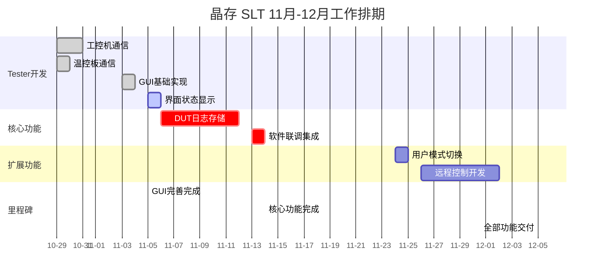

# 十一月项目开发进度

> **更新时间**: 2025-11-03 (最后修订)
> **项目**: 晶存 SLT (JingCun System Level Test)
> **状态**: 进行中

## 月度目标

完成晶存 SLT 系统的全部功能开发，目标完成日期：**2025-12-05**

## 工作日安排与完成情况

### 已完成任务统计

| 任务项             | 工期           | 工作日                   | 完成日期 | 状态         |
| ------------------ | -------------- | ------------------------ | -------- | ------------ |
| 功能2: AC App重写  | 5天            | 10.23-10.25, 10.27-10.28 | 10-28    | ✅           |
| Tester与工控机通信 | 3天            | 10.29-10.31              | 10-31    | ✅           |
| Tester与温控板通信 | 2天            | 10.29-10.30              | 10-30    | ✅           |
| **小计**     | **10天** | -                        | -        | **✅** |

### 待完成任务排期

#### 第3阶段 (11-03 至 11-07) - GUI界面完善

**工期**: 3个工作日 (11.3, 11.4, 11.5)

**11.3-11.5 (3天) - GUI基础实现与界面状态显示**

- 完成主界面框架搭建
- 实现50个DUT的动态网格显示
- 集成温控板和工控机的状态监控面板
- 实现DUT设备状态动态更新
- 优化状态显示UI（离线/正常/测试中/异常等）
- 完善温度、压力等参数的实时显示

#### 第4阶段 (11-06 至 11-14) - DUT测试日志存储

**工期**: 5个工作日 (11.6, 11.7, 11.10, 11.11, 11.12)

- 实现测试执行完毕后的日志生成与保存机制
- 支持16个DUT对应的测试日志文件生成
- 按照测试批次、Rack和Slot层级完成文件夹结构设计
- 在JC App安装目录子文件夹下保存日志文件
- 完成日志存储功能验证与测试

#### 第5阶段 (11-13 至 11-14) - 软件联调与系统集成

**工期**: 2个工作日 (11.13, 11.14)

- 完整系统功能集成测试
- 修复集成过程中发现的问题
- 进行端到端的软件联调验证
- 输出最终集成验证报告与用户文档

#### 第6阶段 (11-24 至 12-05) - 用户模式切换与远程控制

**工期**: 5个工作日 (11.24, 11.25, 11.26, 12.1, 12.2)

**11.24-11.25 (2天) - 用户模式切换界面开发**

- 实现界面权限隔离逻辑
- 开发用户模式/管理员模式切换功能
- 支持不同角色的功能可见性控制
- 持久化用户模式配置

**11.26-12.2 (3天) - 小型工控机远程控制**

- 远程连接方案评估与选型 (RDP/VNC)
- 实现Tester主机对所有小型工控机的远程操作功能
- 完成连接稳定性测试与异常处理
- 输出远程控制使用文档

**最终完成日期**: 2025-12-05 ✅

---

## 每日进度日志

### 2025-11-03

- **项目状态同步**：总结10月开发成果，规划11月剩余工作!
- **需求确认**：确认用户模式切换、远程控制、Handler对接等功能细节
- **工作日计划**：按工作日制定详细排期计划，确保交付进度
- **FTP测试页面完成**：
  - 完成FTP测试页面UI设计与界面布局
  - 实现FTP文件上传/下载功能测试
  - 支持批量文件操作与进度监控显示
- **FTPController代码编写**：
  - 完成FTPController核心类的设计与实现
  - 实现FTP连接管理与会话控制
  - 完成FTP命令解析与响应处理
  - 实现多线程FTP文件传输机制
  - 完成错误处理与异常恢复逻辑

### 2025-11-04

- **GUI基础功能完成**：
  - 完成主界面框架搭建
  - 实现50个DUT的动态网格显示
  - 集成温控板和工控机的状态监控面板

---

## 项目排期总览表

### 功能模块完成度统计

| 功能模块                      | 工期           | 完成日期        | 状态      | 进度          |
| ----------------------------- | -------------- | --------------- | --------- | ------------- |
| 功能2: AC App重写             | 5天            | 10-28           | ✅ 已完成 | 100%          |
| 功能3A: Tester工控机通信      | 3天            | 10-31           | ✅ 已完成 | 100%          |
| 功能3B: Tester温控板通信      | 2天            | 10-30           | ✅ 已完成 | 100%          |
| 功能3C: GUI基础实现与界面完善 | 3天            | 11-05           | 🟢 进行中 | 0%            |
| 功能4: DUT测试日志存储        | 5天            | 11-14           | ⬜ 待启动 | 0%            |
| 功能5: 软件联调集成           | 2天            | 11-14           | ⬜ 待启动 | 0%            |
| 功能6: 用户模式切换           | 2天            | 11-25           | ⬜ 待启动 | 0%            |
| 功能7: 远程控制               | 3天            | 12-05           | ⬜ 待启动 | 0%            |
| **总计**                | **25天** | **12-05** | -         | **40%** |

---

## 甘特图 - 11月-12月工作排期

---

## 工作日明细表

> 注：按工作日计算，周六周日不计入

| 工作日期  | 具体日期               | 任务                    | 状态      |
| --------- | ---------------------- | ----------------------- | --------- |
| 第1-3天   | 10.23-10.25            | AC App重写(part1)       | ✅        |
| 第4-5天   | 10.27-10.28            | AC App重写(part2)       | ✅        |
| 第6-8天   | 10.29-10.31            | Tester工控机/温控板通信 | ✅        |
| 第9-11天  | 11.3-11.5              | GUI基础实现与界面完善   | 🟢 进行中 |
| 第12-16天 | 11.6-11.7, 11.10-11.12 | DUT测试日志存储         | ⬜ 待启动 |
| 第17-18天 | 11.13-11.14            | 软件联调与系统集成      | ⬜ 待启动 |
| 第19-20天 | 11.24-11.25            | 用户模式切换界面        | ⬜ 待启动 |
| 第21-23天 | 11.26, 12.1-12.2       | 小型工控机远程控制      | ⬜ 待启动 |

---

## 技术方案与依赖关系

### 界面状态显示（11.5-11.7）

- **依赖**: 工控机通信、温控板通信
- **相关模块**: DUT管理器、状态监控器
- **验收标准**: 所有状态类型正确显示，实时更新无延迟

### DUT测试日志存储（11.10-11.14）

- **依赖**: 测试执行框架、JC App集成
- **相关模块**: 日志生成器、文件系统管理
- **文件夹结构**: JC App安装目录/Logs/批次号/Rack/Slot/DUT编号/
- **验收标准**: 支持16个DUT日志独立保存，按层级存储，日志文件完整可读

### 软件联调与系统集成（11.13-11.14）

- **依赖**: 所有核心功能模块已完成
- **相关模块**: 系统集成测试、端到端验证
- **验收标准**: 系统功能完整，各模块协作无冲突，性能达标

### 用户模式切换（11.24-11.25）

- **依赖**: GUI基础框架
- **相关模块**: 权限管理系统、配置存储
- **验收标准**: 支持用户/管理员模式无缝切换，状态持久化

### 小型工控机远程控制（11.26-12.2）

- **依赖**: 工控机管理系统
- **相关模块**: 连接管理、会话管理
- **验收标准**: Tester主机支持对所有小型工控机的远程操作，连接稳定性>99%

---

## 风险评估与缓解措施

### 高风险项

1. **DUT测试日志的文件夹层级设计**

   - 风险等级: ⚠️ 中
   - 缓解措施: 提前确认文件夹命名规范，进行路径生成逻辑评审
2. **小型工控机远程控制的并发性能**

   - 风险等级: ⚠️ 中
   - 缓解措施: 进行负载测试，优化连接管理，预留性能优化时间
3. **用户模式切换的权限隔离复杂度**

   - 风险等级: ⚠️ 低-中
   - 缓解措施: 提前进行权限模型评审，准备参考代码

### 低风险项

1. **界面状态显示的优化** → 低风险，相对独立，优先级较高
2. **软件联调** → 低风险，基于已完成的功能模块
3. **文档输出** → 低风险，可在开发过程中逐步完善

---

## 资源与支持

- **开发人员**: 2-3人并行开发
- **测试资源**: 50台工控机、4个温控区、Handler系统
- **技术支持**: Handler团队、硬件集成支持
- **文档输出**: 逐日更新进度文档、技术设计文档、用户手册

---

## 备注

- 本计划基于实际工作日计算（周一至周五）
- 若遇突发情况或技术阻塞，将动态调整排期
- 每日同步项目进度，确保计划执行透明度
- 最终交付目标日期: **2025-12-05**
