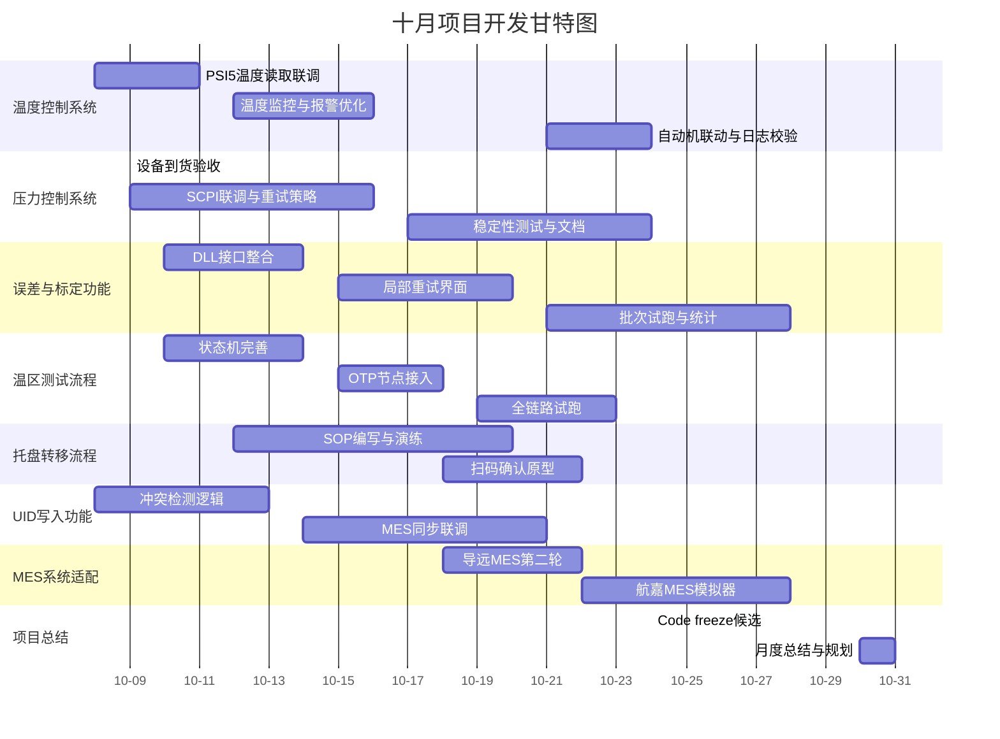

# 十月项目开发进度

> **更新时间**: 2## 本月计划任务

### 核心功能收尾

- **温度控制系统** (目标完成度 80%，当前 0%)：
  - 节后首周完成 PSI5 温度采集接口封装与模拟测试；
  - 引入滑动窗口判定策略并配置阈值来源（config.temperature.json）；
  - 与自动机联调"达标判定"信号，输出日志模板。
- **压力控制系统** (目标完成度 100%，当前 35%)：
  - 压力设备到货后完成现场联调与稳定性测试；
  - 拆分 PaceDevice driver，补充异常重试与安全停机；
  - 输出操作手册首版，附录 SCPI 指令映射。
- **误差与标定功能** (目标完成度 60%，当前 10%)：
  - 整合 DLL 输入输出流程，完成 input_txt 生成与结果回放；
  - 设计"局部重试"界面与数据持久化策略；
  - 完成 2 个样本批次试跑并记录统计。
- **温区测试流程** (目标完成度 60%，当前 10%)：
  - 完成四温区流程的状态机落地（含 WAIT_TRANSFER）；
  - 加入 OTP 写入节点与重试策略；
  - 完成 1 次全链路走通并留存日志。
- **流程配置系统** (目标完成度 100%，当前 100%)：
  - 本月聚焦"应用场景分类"配置模板与权限校验脚本；
  - 输出管理员操作指南。
- **UID写入功能** (目标完成度 70%，当前 20%)：
  - 完成数据库字段校验与冲突检测；
  - 与 MES 适配层联调"写入 → 同步"链路；
  - 补齐错误码映射表。
- **托盘转移流程** (目标完成度 60%，当前 10%)：
  - 细化手动/半自动两套流程并制作 SOP 草案；
  - 引入扫码确认原型，验证 UI 可行性；
  - 预演异常流程（掉电、急停）。
- **MES 系统适配** (目标完成度 60%，当前 25%)：
  - 完成导远 MES 第 2 轮 API 联调、记录接口差异；
  - 航嘉 MES：落实字段映射文档并搭建模拟器；
  - 输出统一适配层接口规范。

---

## 每日进度日志

> 注：10 月 1-7 日为国庆假期，主要安排资料整理与方案评审；节后按以下节奏推进。

### 2025-10-01（国庆资料日）

- 汇总 9 月交付文档并在 Confluence 建立"门压项目十月总览"页面；
- 对标定 DLL 与温区流程的接口文档进行标签整理，补充未决问题列表。

### 2025-10-03（国庆值班）

- 在 SCPI 模拟器上复盘压力曲线脚本，记录需要现场确认的 3 个异常码；
- 更新 Mock 数据，确保节后可直接联调。

### 2025-10-08（节后首日）

- PSI5 温度采集模块代码复查 + 单元测试基线搭建；
- 安排温度阈值确认会议（美泰提供数据→配置文件落地）。

### 2025-10-09

- 压力设备到货验收（检查固件版本、SCPI 指令集）；
- 与硬件同事完成首轮连线测试并记录日志。

### 2025-10-10

- 温区状态机设计评审，确认 WAIT_TRANSFER 细节；
- UID 写入冲突检测方案讨论，达成数据库约束设计。

### 2025-10-14（预定）

- 首批实机联调（温度+压力+OTP 全链路）；
- 误差/标定界面原型评审，收集操作岗反馈。

### 2025-10-18（预定）

- 托盘转移 SOP 走查并记录异常处理策略；
- 导远 MES 第 2 轮联调，输出差异清单。

### 2025-10-24（预定）

- 门压项目 code freeze 候选版本提交 QA；
- 完成日志标准检查脚本并纳入 CI。

### 2025-10-28（预定）

- 航嘉 MES 模拟器联调完成 & 适配层接口定稿；
- 误差/标定批次统计报告生成模板评审。

### 2025-10-31（月度收尾）

- 发布 10 月交付总结，包含进度、风险与文档列表；
- 制定 11 月迭代目标草案并提交审批。

---

### 2025-10-12（ToDo）

1) 完成 PSI5 温度采集联调与日志验证；
2) 压力设备安全停机逻辑开发与回放测试；
3) 误差/标定 DLL 接口的错误码映射表整理；
4) UID 写入冲突检测 + MES 同步链路走通；
5) 托盘转移扫码确认原型落地。

### 2025-10-12（今日完成占位）

- （待节后实际数据更新）

### 2025-10-19（ToDo）

1) 温区流程全链路试跑并记录日志样例；
2) 托盘转移 SOP 演练，补充异常回退策略；
3) 导远 MES 第二轮联调问题收敛；
4) 航嘉 MES 模拟器上线，完成首轮请求录制；
5) 编制 10 月中期进度周报。

### 2025-10-19（今日完成占位）

- （待实际进展填写）

### 2025-10-26（ToDo）

1) 误差/标定批次统计报告生成并评审；
2) UID 写入链路纳入 CI 测试；
3) 托盘流程异常回放脚本整理；
4) 压力设备稳定性测试 24h 运行记录；
5) 统一日志结构检查脚本输出。

### 2025-10-26（今日完成占位）

- （待实际进展填写）

### 2025-10-31（今日完成占位）

- （计划在月末补充实际交付项、风险闭环与下一步规划。）

---

## 任务排期表

### 第1周 (10-01 至 10-05)

- 国庆假期资料整理、Mock 数据维护、方案评审。
- 输出节后首周行动清单和会议排程。

### 第2周 (10-06 至 10-10)

- 温度采集联调、压力设备现场接入、托盘状态机设计评审。
- 同步启动 UID 写入冲突检测方案。

### 第3周 (10-13 至 10-17)

- 首批实机全链路联调，确认 OTP 写入策略；
- DLL 接口错误码映射、误差统计原型。

### 第4周 (10-20 至 10-24)

- 托盘 SOP 演练 + MES 第 2 轮联调；
- Code freeze 候选版本提交 QA；
- 日志规范检查脚本接入 CI。

### 第5周 (10-27 至 10-31)

- MES 适配层定稿 & 模拟器验证；
- 误差/标定统计报告、UID 同步链路回归；
- 月度总结与 11 月计划草案。

---

## 甘特图

（10-01 至 10-31）

### 备用表格格式

| 项目/任务      | 10.01-07 | 10.08-11 | 10.12-18 | 10.19-24 | 10.25-31 |
| -------------- | -------- | -------- | -------- | -------- | -------- |
| 温度控制系统   | 资料整理 | ███   | ███   | ███   | -        |
| 压力控制系统   | -        | ███   | ███   | ███   | -        |
| 误差与标定功能 | -        | -        | ███   | ███   | ███   |
| 温区测试流程   | -        | -        | ███   | ███   | -        |
| MES系统适配    | -        | -        | -        | ███   | ███   |
| 流程配置系统   | -        | -        | █       | █       | -        |
| UID写入功能    | -        | ███   | ███   | ███   | -        |
| 托盘转移流程   | -        | -        | ███   | ███   | █       |
| 项目总结       | -        | -        | -        | -        | ███   |

---**开发周期**: 2025-10-01 至 2025-10-31  
> **说明**: 十月规划延用九月 Mind 的总体结构与内容，除特别标注外请直接参考 `septemberMind.md` 对应章节。

## 目录

<!-- TOC-BEGIN -->

- [关键决策点](#关键决策点)
- [新增/细化点（原文档未充分覆盖）](#新增细化点原文档未充分覆盖)
- [外部依赖追踪](#外部依赖追踪)
- [本地数据库表（十月复核版）](#本地数据库表十月复核版)
- [失败 & 重试流程（十月复盘）](#失败--重试流程十月复盘)
- [状态机（托盘/流程十月修订）](#状态机托盘流程十月修订)
- [待确认决策点（十月版）](#待确认决策点十月版)
- [与最新沟通记录对齐补充](#与最新沟通记录对齐补充)
- [整体进度统计](#整体进度统计)
- [文档更新记录](#文档更新记录)

<!-- TOC-END -->

## 本月计划任务

> 任务拆解与优先级沿用 `septemberMind.md` 的“本月计划任务”章节。十月仅新增：国庆后需在压力设备实机到货后完成联调；若设备延迟，则维持模拟器方案。

## 每日进度日志

> 按《九月每日进度日志》模板记录；节后将新增条目录入此处。本月暂无差异化内容，保持占位。

## 任务排期表

> 排程仍按九月的周节奏拆分。十月第一周为国庆假期，假期后直接承接九月末排期，请参照 `septemberMind.md` 中“任务排期表”并根据实机到货时间调整具体起止日期。

## 甘特图

> 继续复用九月甘特图节点配置；如需查看具体任务条目，请在 `septemberMind.md` 中查阅并将日期向后平移一周即可。

## 关键决策点

> 决策列表保持与九月一致，实时结论统一记录在九月文档。十月仅补充跟进项：压力设备实机差异复核、扫码硬件是否按期到货。

## 新增/细化点（原文档未充分覆盖）

> 暂无新增条目，后续若有补充直接写入 `septemberMind.md` 对应段落，并在此处放置引用链接即可。

## 外部依赖追踪

> 依赖项延续九月清单。若有状态更新，优先在 `septemberMind.md` 修改，同时在此处备注“见九月文档最新状态”。

## 本地数据库表（十月复核版）

> 数据表结构参考九月版本，无额外变更。仅在 `septemberMind.md` 维护正式表结构与索引建议。

## 失败 & 重试流程（十月复盘）

> 沿用九月定义的失败与重试策略，如需调整请在九月文档的对应章节更新，再于此处作注记。

## 状态机（托盘/流程十月修订）

> 状态机设计保持不变，待扫码硬件联调完成后再决定是否追加新状态。细节仍由九月文档维护。

## 待确认决策点（十月版）

> 决策列表借用九月版本，十月仅需在九月文档中更新实际结论或新增编号。本节保持引用说明即可。

## 与最新沟通记录对齐补充

- **2025-09-29 项目组周例会**：确认 10 月 8 日完成温度阈值参数交接，强调国庆期间需完成文档整理；
- **2025-09-30 供应链同步**：压力设备 10-09 到货，扫码硬件预计 10-18；未到货需人工方案兜底；
- **2025-10-03 技术值班同步**：SCPI 模拟器脚本已更新，节后直接改指向实机即可；
- **Pending**：等待导远、航嘉分别提供最新 API；本月需重点跟进字段映射差异。

## 整体进度统计

> 统计数据与九月表格一致，十月的实际数值统一在 `septemberMind.md` 中更新。此处可加一句“详见九月文档最新统计”。

## 文档更新记录

- **2025-09-29**：整理九月交付文档索引，补齐日志规范附件清单；
- **2025-09-30**：新建《十月项目总览》Confluence 页面，指向九月 Mind 作为详细说明；
- 后续更新将统一记录在 `septemberMind.md`，此处仅保留引用。

