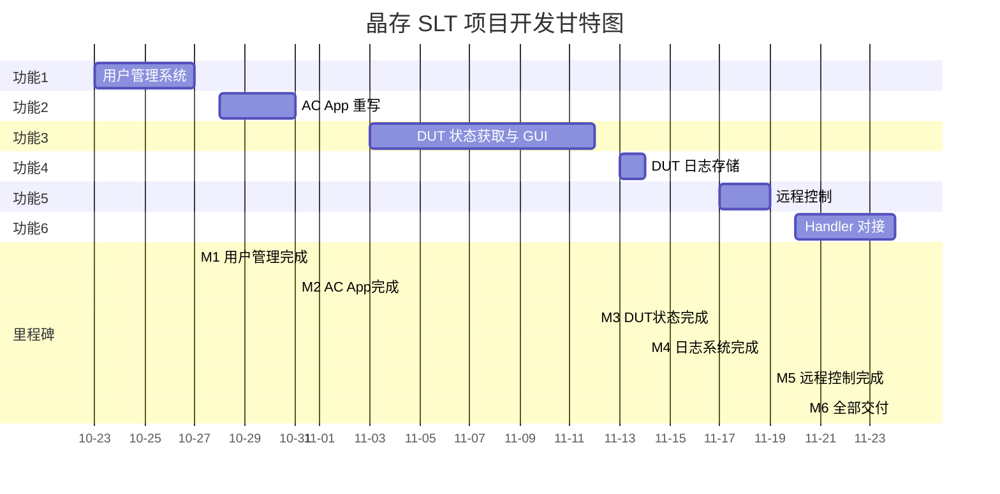

# 十月项目开发进度

> **更新时间**: 2025-10-11

## 本月计划任务

### 核心功能收尾

- **温度控制系统** (目标完成度 80%，当前 0%)：
  - 节后首周完成 PSI5 温度采集接口封装与模拟测试；
  - 引入滑动窗口判定策略并配置阈值来源（config.temperature.json）；
  - 与自动机联调"达标判定"信号，输出日志模板。
- **压力控制系统** (目标完成度 100%，当前 35%)：
  - 压力设备到货后完成现场联调与稳定性测试；
  - 拆分 PaceDevice driver，补充异常重试与安全停机；
  - 输出操作手册首版，附录 SCPI 指令映射。
- **误差与标定功能** (目标完成度 60%，当前 10%)：
  - 整合 DLL 输入输出流程，完成 input_txt 生成与结果回放；
  - 设计"局部重试"界面与数据持久化策略；
  - 完成 2 个样本批次试跑并记录统计。
- **温区测试流程** (目标完成度 60%，当前 10%)：
  - 完成四温区流程的状态机落地（含 WAIT_TRANSFER）；
  - 加入 OTP 写入节点与重试策略；
  - 完成 1 次全链路走通并留存日志。
- **流程配置系统** (目标完成度 100%，当前 100%)：
  - 本月聚焦"应用场景分类"配置模板与权限校验脚本；
  - 输出管理员操作指南。
- **UID写入功能** (目标完成度 70%，当前 20%)：
  - 完成数据库字段校验与冲突检测；
  - 与 MES 适配层联调"写入 → 同步"链路；
  - 补齐错误码映射表。
- **托盘转移流程** (目标完成度 60%，当前 10%)：
  - 细化手动/半自动两套流程并制作 SOP 草案；
  - 引入扫码确认原型，验证 UI 可行性；
  - 预演异常流程（掉电、急停）。
- **MES 系统适配** (目标完成度 60%，当前 25%)：
  - 完成导远 MES 第 2 轮 API 联调、记录接口差异；
  - 航嘉 MES：落实字段映射文档并搭建模拟器；
  - 输出统一适配层接口规范。

---

## 每日进度日志

> 注：10 月 1-7 日为国庆假期，主要安排资料整理与方案评审；节后按以下节奏推进。

### 2025-10-01 至 2025-10-08（国庆假期）

**假期期间（10-01 至 10-08）**：

- 汇总 9 月交付文档并在 Confluence 建立"门压项目十月总览"页面；
- 对标定 DLL 与温区流程的接口文档进行标签整理，补充未决问题列表；
- 在 SCPI 模拟器上复盘压力曲线脚本，记录需要现场确认的 3 个异常码；
- 更新 Mock 数据，确保节后可直接联调；
- PSI5 温度采集模块代码复查 + 单元测试基线搭建；
- 安排温度阈值确认会议（美泰提供数据→配置文件落地）；
- 压力设备到货验收（检查固件版本、SCPI 指令集）；
- 与硬件同事完成首轮连线测试并记录日志；
- 温区状态机设计评审，确认 WAIT_TRANSFER 细节；
- UID 写入冲突检测方案讨论，达成数据库约束设计。

### 2025-10-09

- 修改代码结构中未使用的函数，完成60%；
- 修改PaceDevice中的协议解析部分内容。

### 2025-10-10

- 完成bugzilla的2899问题修复：sha256校验每次都不一致的问题。
- 完成代码中注释的删除，并修复qwarning的问题。

### 2025-10-11

- 学习DTK使用，了解其核心功能和API接口；
- 研究DTK在项目中的应用场景和集成方案。

### 2025-10-13

- 修复 multiAprog 模块的 buffer 填充问题，解决了在高并发场景下出现的边界溢出与数据错位（由填充长度计算错误引起）。
- 完成本周工作分配：明确各子模块负责人、联调时间窗口与验收标准；更新任务看板并分配优先级。
- 其他杂项：整理构建环境日志、合并若干小型 PR、记录与硬件组的临时对接事项。

### 2025-10-14

- 跟进 multiAprog 修复后的回归验证，跑通三轮压力/温度混合场景，未发现新回归问题。
- 对接 QA，确认回归测试范围与验收脚本；在 Confluence 更新相关操作步骤与注意事项。
- 处理若干阻塞工单并完成日常杂项支持（CI 管道调整、日志级别修订）。

### 2025-10-15

- 熟悉 MES 相关代码基线，梳理 APS 与 multiAprog 之间的接口兼容性问题；识别了 2 个潜在的接口不兼容点（消息格式与超时策略），并记录到 issue 列表以便后续修复。
- 与 APS 开发同事同步兼容测试计划，定义回归用例并安排下一步联调时间窗；同时补充了若干集成调试脚本以便自动化重现兼容性问题。

### 2025-10-16

- 完成客诉文档编写工作，包括故障现象说明、根本原因分析与解决方案描述；文档与 QA 标准对齐并发布至共享知识库。
- 调试 YNHQ MES 集成接口，复现并隔离了报文超时与异常重连的问题，记录复现步骤并提交给 MES 侧同事跟进。
- 初步学习 UFS 代码模块，理解其数据持久化与事务管理的核心设计，为后续 OTP 写入链路的集成做铺垫。

### 2025-10-17

- 继续推进客诉文档的反馈整理，收集各方代表的补充意见并更新风险处置清单。
- **完成 MES 验证部分开发**：成功实现 MES 接口调用功能，可以正常调用 ag06 模块进行烧录通信；但发现 ag06 模块存在烧录器连接问题，无法与编程器建立稳定链接完成实际烧录操作，该问题已记录。

### 2025-10-18

- 继续跟进 MES 验证模块的问题排查，针对 ag06 烧录器连接不稳定的情况进行深入分析与日志收集。
- 协调硬件与编程器供应商，确认烧录器固件版本与驱动兼容性问题，记录待解决事项清单。
- 参与托盘转移 SOP 走查会议，补充异常处理策略与回退流程说明。

### 2025-10-19

- 完成温区流程全链路试跑，成功走通四温区状态机流程并输出完整日志样例。
- 托盘转移 SOP 演练，验证手动/半自动流程的可行性，补充异常回退策略文档。
- 导远 MES 第二轮联调问题收敛，确认接口差异清单并与对方技术团队达成修复计划。
- 航嘉 MES 模拟器上线，完成首轮请求录制与响应验证。
- 编制 10 月中期进度周报并提交项目组审阅。

### 2025-10-20

- **新增需求：晶存 SLT 的 tester 设计**：接到新需求，需要按照之前的测试模板进行晶存 SLT（System Level Test）测试程序的设计与开发工作。
- 初步评估晶存 SLT 需求范围，梳理测试流程、硬件接口与数据采集要求。
- 参考已有的 tester 模板（如门压测试 tester），规划晶存 SLT 的架构设计与开发排期。

### 2025-10-21

- **新建晶存 SLT 工程**：完成项目目录结构搭建，初始化配置文件与基础框架代码。
- **初步 UI 界面设计**：基于 Qt 框架完成主界面布局，包括测试流程控制面板、数据展示区域与日志输出窗口。
- **业务需求确认**：与产品与测试团队对接，明确晶存 SLT 测试项、判定标准与数据上报格式,形成初步需求文档。

### 2025-10-22

- **小转台添加数据库系统**：在美泰小转台项目中集成数据库模块，完成测试数据持久化存储架构设计。
- 实现测试结果、设备状态、工艺参数的数据库记录功能，支持历史数据查询与统计分析。
- 优化项目构建配置，清理 Qt MOC 编译器冗余定义，修复编译警告问题，提升构建稳定性。
- **晶存 SLT 业务逻辑优化**：继续处理晶存 SLT 测试程序的业务逻辑，清理 UI 界面中其他页面未使用的冗余功能模块，精简代码结构以提升维护性。

### 2025-10-23

- **正式启动晶存 SLT 项目开发**：正式启动 JingCun System Level Test 系统的完整开发工作。
- **编制详细项目计划**：完成 6 大功能模块的详细规划与排期,包括:
  - 功能 1: 用户管理系统(界面权限隔离、模式切换) - 3 天，完成日期 10-27
  - 功能 2: AC App 重写(VB → C++、与 JCApp/Tester 交互) - 5 天，完成日期 10-31
  - 功能 3: DUT 测试状态获取与 GUI 显示(50 台工控机、ASC 对接) - 8 天，完成日期 11-12
  - 功能 4: DUT 测试日志获取(Batch/Rack/Slot 分层存储) - 2 天，完成日期 11-14
  - 功能 5: 小型工控机远程控制(RDP/VNC) - 3 天，完成日期 11-19
  - 功能 6: Handler 对接(JsonRPC 双向通讯) - 3 天，完成日期 11-24
- 总工期 24 个工作日，全部功能目标完成日期 11 月 24 日。
- 规划人力配置(2-3 人并行开发)、风险识别与缓解策略。

### 2025-10-24

- **重新开始晶存 SLT 项目构建**：重新梳理晶存 SLT 项目的构建环境与基础框架。
  - 优化bib和dut的显示，符合实际项目需求
  - 优化页面设计，删除没用到的页面
  - 修复config的读取
- 清理之前的冗余代码与配置，重新初始化项目结构。

### 2025-10-25

- **优化项目启动的设备连接逻辑**：改进晶存 SLT 项目启动时的设备连接机制，提升连接稳定性与错误处理效率。
- **参加 bib 的 IP 管理，与 config 的 json 相关联**：参与 bib 模块的 IP 地址管理功能开发，实现与配置文件 json 的关联与动态配置。

## 晶存 SLT 项目排期表

### 第1阶段 (10-23 至 10-27) - 功能1: 用户管理系统

- **工期**: 3个工作日
- **完成日期**: 10-27
- 需求分析、数据模型设计、登录鉴权模块开发、权限管理与界面隔离

### 第2阶段 (10-28 至 10-31) - 功能2: AC App 重写

- **工期**: 5个工作日
- **完成日期**: 10-31
- VB 代码分析、C++ 框架搭建、核心业务逻辑迁移、JsonRPC 通讯实现

### 第3阶段 (11-03 至 11-12) - 功能3: DUT 测试状态获取与 GUI 显示

- **工期**: 8个工作日
- **完成日期**: 11-12
- 数据模型设计、通讯协议实现、GUI 仪表盘设计与实现、性能测试与集成

### 第4阶段 (11-13 至 11-14) - 功能4: DUT 测试日志获取与存储

- **工期**: 2个工作日
- **完成日期**: 11-14
- 日志数据模型设计、AC App 日志收集、Tester 日志聚合与查询接口

### 第5阶段 (11-17 至 11-19) - 功能5: 小型工控机远程控制

- **工期**: 3个工作日
- **完成日期**: 11-19
- 远程连接方案选型、Tester 远程控制模块实现、50 台工控机联调与文档

### 第6阶段 (11-20 至 11-24) - 功能6: Handler 对接(JsonRPC 通讯)

- **工期**: 3个工作日
- **完成日期**: 11-24
- JsonRPC 通讯协议设计、Tester 客户端实现、Handler 集成与端到端测试

**总体完成日期**: 2025-11-24

---

## 甘特图 - 晶存 SLT 项目

（10-23 至 11-24）

### 项目进度表

| 功能模块            | 工期           | 完成日期        | 状态      | 进度 |
| ------------------- | -------------- | --------------- | --------- | ---- |
| 功能1: 用户管理系统 | 3天            | 10-27           | ⬜ 未开始 | 0%   |
| 功能2: AC App重写   | 5天            | 10-31           | ⬜ 未开始 | 0%   |
| 功能3: DUT状态获取  | 8天            | 11-12           | ⬜ 未开始 | 0%   |
| 功能4: 日志存储     | 2天            | 11-14           | ⬜ 未开始 | 0%   |
| 功能5: 远程控制     | 3天            | 11-19           | ⬜ 未开始 | 0%   |
| 功能6: Handler对接  | 3天            | 11-24           | ⬜ 未开始 | 0%   |
| **总计**      | **24天** | **11-24** | -         | 0%   |
