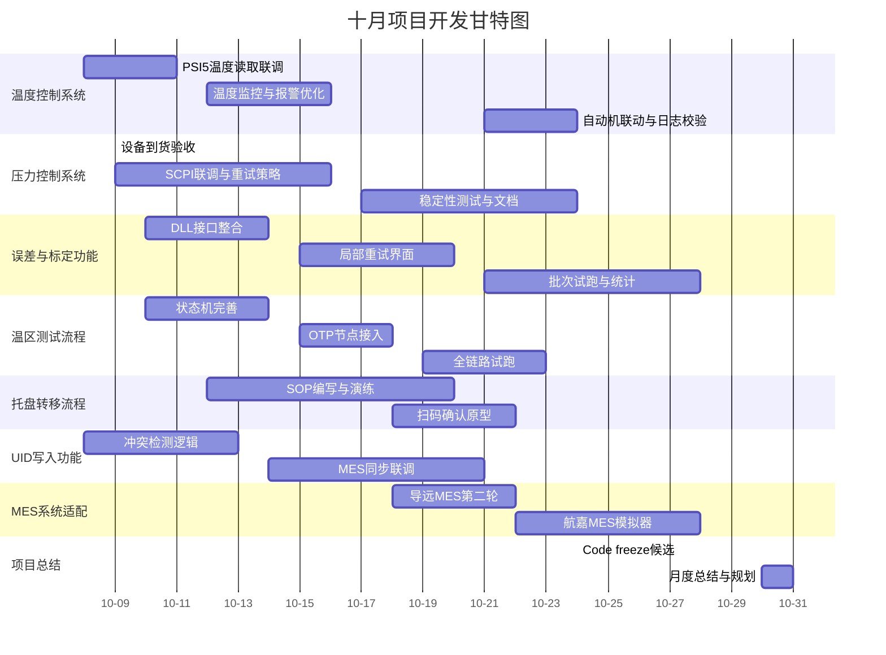

# 十月项目开发进度

> **更新时间**: 2025-10-11

## 本月计划任务

### 核心功能收尾

- **温度控制系统** (目标完成度 80%，当前 0%)：
  - 节后首周完成 PSI5 温度采集接口封装与模拟测试；
  - 引入滑动窗口判定策略并配置阈值来源（config.temperature.json）；
  - 与自动机联调"达标判定"信号，输出日志模板。
- **压力控制系统** (目标完成度 100%，当前 35%)：
  - 压力设备到货后完成现场联调与稳定性测试；
  - 拆分 PaceDevice driver，补充异常重试与安全停机；
  - 输出操作手册首版，附录 SCPI 指令映射。
- **误差与标定功能** (目标完成度 60%，当前 10%)：
  - 整合 DLL 输入输出流程，完成 input_txt 生成与结果回放；
  - 设计"局部重试"界面与数据持久化策略；
  - 完成 2 个样本批次试跑并记录统计。
- **温区测试流程** (目标完成度 60%，当前 10%)：
  - 完成四温区流程的状态机落地（含 WAIT_TRANSFER）；
  - 加入 OTP 写入节点与重试策略；
  - 完成 1 次全链路走通并留存日志。
- **流程配置系统** (目标完成度 100%，当前 100%)：
  - 本月聚焦"应用场景分类"配置模板与权限校验脚本；
  - 输出管理员操作指南。
- **UID写入功能** (目标完成度 70%，当前 20%)：
  - 完成数据库字段校验与冲突检测；
  - 与 MES 适配层联调"写入 → 同步"链路；
  - 补齐错误码映射表。
- **托盘转移流程** (目标完成度 60%，当前 10%)：
  - 细化手动/半自动两套流程并制作 SOP 草案；
  - 引入扫码确认原型，验证 UI 可行性；
  - 预演异常流程（掉电、急停）。
- **MES 系统适配** (目标完成度 60%，当前 25%)：
  - 完成导远 MES 第 2 轮 API 联调、记录接口差异；
  - 航嘉 MES：落实字段映射文档并搭建模拟器；
  - 输出统一适配层接口规范。

---

## 每日进度日志

> 注：10 月 1-7 日为国庆假期，主要安排资料整理与方案评审；节后按以下节奏推进。

### 2025-10-01 至 2025-10-08（国庆假期）

**假期期间（10-01 至 10-08）**：
- 汇总 9 月交付文档并在 Confluence 建立"门压项目十月总览"页面；
- 对标定 DLL 与温区流程的接口文档进行标签整理，补充未决问题列表；
- 在 SCPI 模拟器上复盘压力曲线脚本，记录需要现场确认的 3 个异常码；
- 更新 Mock 数据，确保节后可直接联调；
- PSI5 温度采集模块代码复查 + 单元测试基线搭建；
- 安排温度阈值确认会议（美泰提供数据→配置文件落地）；
- 压力设备到货验收（检查固件版本、SCPI 指令集）；
- 与硬件同事完成首轮连线测试并记录日志；
- 温区状态机设计评审，确认 WAIT_TRANSFER 细节；
- UID 写入冲突检测方案讨论，达成数据库约束设计。

### 2025-10-09

- 修改代码结构中未使用的函数，完成60%；
- 修改PaceDevice中的协议解析部分内容。

### 2025-10-10

- 完成bugzilla的2899问题修复：sha256校验每次都不一致的问题。
- 完成代码中注释的删除，并修复qwarning的问题。

### 2025-10-11

- 学习DTK使用，了解其核心功能和API接口；
- 研究DTK在项目中的应用场景和集成方案。

### 2025-10-13

- 修复 multiAprog 模块的 buffer 填充问题，解决了在高并发场景下出现的边界溢出与数据错位（由填充长度计算错误引起）。
- 完成本周工作分配：明确各子模块负责人、联调时间窗口与验收标准；更新任务看板并分配优先级。
- 其他杂项：整理构建环境日志、合并若干小型 PR、记录与硬件组的临时对接事项。

### 2025-10-14

- 跟进 multiAprog 修复后的回归验证，跑通三轮压力/温度混合场景，未发现新回归问题。
- 对接 QA，确认回归测试范围与验收脚本；在 Confluence 更新相关操作步骤与注意事项。
- 处理若干阻塞工单并完成日常杂项支持（CI 管道调整、日志级别修订）。

---

## 未来计划与待办事项

### 2025-10-12（计划任务）

1) 完成 PSI5 温度采集联调与日志验证；
2) 压力设备安全停机逻辑开发与回放测试；
3) 误差/标定 DLL 接口的错误码映射表整理；
4) UID 写入冲突检测 + MES 同步链路走通；
5) 托盘转移扫码确认原型落地。

### 2025-10-14（计划任务）

- 首批实机联调（温度+压力+OTP 全链路）；
- 误差/标定界面原型评审，收集操作岗反馈。

### 2025-10-18（计划任务）

- 托盘转移 SOP 走查并记录异常处理策略；
- 导远 MES 第 2 轮联调，输出差异清单。

### 2025-10-19（计划任务）

1) 温区流程全链路试跑并记录日志样例；
2) 托盘转移 SOP 演练，补充异常回退策略；
3) 导远 MES 第二轮联调问题收敛；
4) 航嘉 MES 模拟器上线，完成首轮请求录制；
5) 编制 10 月中期进度周报。

### 2025-10-24（计划任务）

- 门压项目 code freeze 候选版本提交 QA；
- 完成日志标准检查脚本并纳入 CI。

### 2025-10-26（计划任务）

1) 误差/标定批次统计报告生成并评审；
2) UID 写入链路纳入 CI 测试；
3) 托盘流程异常回放脚本整理；
4) 压力设备稳定性测试 24h 运行记录；
5) 统一日志结构检查脚本输出。

### 2025-10-28（计划任务）

- 航嘉 MES 模拟器联调完成 & 适配层接口定稿；
- 误差/标定批次统计报告生成模板评审。

### 2025-10-31（月度收尾）

- 发布 10 月交付总结，包含进度、风险与文档列表；
- 制定 11 月迭代目标草案并提交审批。

---

## 任务排期表

### 第1周 (10-01 至 10-05)

- 国庆假期资料整理、Mock 数据维护、方案评审。
- 输出节后首周行动清单和会议排程。

### 第2周 (10-06 至 10-10)

- 温度采集联调、压力设备现场接入、托盘状态机设计评审。
- 同步启动 UID 写入冲突检测方案。

### 第3周 (10-13 至 10-17)

- 首批实机全链路联调，确认 OTP 写入策略；
- DLL 接口错误码映射、误差统计原型。

### 第4周 (10-20 至 10-24)

- 托盘 SOP 演练 + MES 第 2 轮联调；
- Code freeze 候选版本提交 QA；
- 日志规范检查脚本接入 CI。

### 第5周 (10-27 至 10-31)

- MES 适配层定稿 & 模拟器验证；
- 误差/标定统计报告、UID 同步链路回归；
- 月度总结与 11 月计划草案。

---

## 甘特图

（10-01 至 10-31）

### 备用表格格式

| 项目/任务      | 10.01-07 | 10.08-11 | 10.12-18 | 10.19-24 | 10.25-31 |
| -------------- | -------- | -------- | -------- | -------- | -------- |
| 温度控制系统   | 资料整理 | ███   | ███   | ███   | -        |
| 压力控制系统   | -        | ███   | ███   | ███   | -        |
| 误差与标定功能 | -        | -        | ███   | ███   | ███   |
| 温区测试流程   | -        | -        | ███   | ███   | -        |
| MES系统适配    | -        | -        | -        | ███   | ███   |
| 流程配置系统   | -        | -        | █       | █       | -        |
| UID写入功能    | -        | ███   | ███   | ███   | -        |
| 托盘转移流程   | -        | -        | ███   | ███   | █       |
| 项目总结       | -        | -        | -        | -        | ███   |

---

## 与最新沟通记录对齐补充

- **2025-09-29 项目组周例会**：确认 10 月 8 日完成温度阈值参数交接，强调国庆期间需完成文档整理；
- **2025-09-30 供应链同步**：压力设备 10-09 到货，扫码硬件预计 10-18；未到货需人工方案兜底；
- **2025-10-03 技术值班同步**：SCPI 模拟器脚本已更新，节后直接改指向实机即可；
- **Pending**：等待导远、航嘉分别提供最新 API；本月需重点跟进字段映射差异。