# 软件需求文档 (Software Requirements Document)

## 文档信息

| 项目名称 | 门控压力测试系统 - MT门压芯片自动化测试 |
| -------- | --------------------------------------- |
| 文档版本 | v1.0                                    |
| 创建日期 | 2025-08-05                              |
| 最后更新 | 2025-08-07                              |
| 作者     | Constantine                             |
| 审核人   | [审核人姓名]                            |
| 状态     | 草稿                                    |

---

## 目录

1. [1. 引言](#1-引言)
2. [2. 项目概述](#2-项目概述)
3. [3. 功能需求](#3-功能需求)
4. [4. 非功能需求（初版）](#4-非功能需求初版)
5. [5. 系统架构](#5-系统架构)
6. [6. 用户界面需求](#6-用户界面需求)
7. [7. 数据需求](#7-数据需求)
8. [8. 接口需求](#8-接口需求)
9. [9. 验收标准](#9-验收标准)
10. [10. 附录](#10-附录)
11. [11. 文档审批](#文档审批)

---

## 1. 引言

### 1.1 文档目的

本文档是针对客户门压芯片（如SMP475等）的自动化测试方案说明，明确系统的功能、性能及接口等需求，指导开发团队实现对门压芯片的自动化测试、标定和数据采集，确保测试系统满足客户的实际应用需求。

### 1.2 适用范围

本文档适用于：

- 技术支持工程师
- 测试工程师
- 软件工程师
- 项目管理团队

### 1.3 术语定义

| 术语   | 定义                                       |
| ------ | ------------------------------------------ |
| SMP475 | 门压芯片型号                               |
| PSI5   | 通信接口协议                               |
| UPH    | 每小时单位产量                             |
| DUT    | Device Under Test (被测设备)               |
| PT点   | 压力-温度测试点                            |
| OTP    | One-Time Programmable (一次性可编程存储器) |
| Socket | 设备上的测试接口，用于连接被测器件         |

### 1.4 技术架构

为避免与第5章重复，本节仅给出指引：详见第[5.2 技术栈](#52-技术栈)与[5.3 系统组件](#53-系统组件)。

### 1.5 参考文档

- 美泰PSI5指令命令说明_250730V1.4.pdf
- 使用ACSvcTCPCtrl进行编程器控制说明V3.1.pdf
- 用ACSvc ActiveX控件进行二次开发V4.9.pdf
- 门压测试自动化实施方案V1.2-20250625.pdf
- 自动化门压标定流程.sdr
- 《门压芯片测试规范》
- 《PSI5通信协议手册》
- 《自动化测试系统设计文档》

---

## 2. 项目概述

### 2.1 项目背景

门控压力测试系统是一个基于Qt框架开发的自动化测试平台，专门用于多站点并行测试门控设备的压力性能。系统采用8站点架构，支持温区测试、误差测试等多种测试模式，能够实现全自动化的压力测试流程。

### 2.2 项目目标

- 实现对门压芯片（如SMP475等）的自动化测试与标定
- 支持芯片寄存器的自动读写
- 支持多温区、多压力点的自动测试
- 实现芯片自动取放，提升测试效率
- 满足客户对压力范围、温区数量等硬件要求

### 2.3 项目范围

#### 2.3.1 包含范围

- 支持门压芯片型号：SMP475等
- 通信接口：PSI5
- 芯片寄存器的自动读写
- 在不同压力、温度点下自动读取芯片内部寄存器
- 完成芯片标定过程，并将标定结果写入寄存器
- 自动进行芯片的取放操作
- 支持四个独立温区
- 支持压力范围≤300KPa
- 自动化UPH不低于1200

#### 2.3.2 不包含范围

- 非PSI5接口芯片的测试
- 超出压力范围300KPa的测试
- 超出四温区的测试需求

---

## 3. 功能需求

### 3.1 用户角色定义

| 角色                 | 描述                       | 主要职责                                                                              | 系统权限                                                                            |
| -------------------- | -------------------------- | ------------------------------------------------------------------------------------- | ----------------------------------------------------------------------------------- |
| **系统管理员** | 负责系统维护和配置管理     | • 系统配置管理 `<br>`• 用户权限分配 `<br>`• 设备连接管理 `<br>`• 数据库维护 | • 所有模块访问权限 `<br>`• 系统参数修改 `<br>`• 用户管理 `<br>`• 设备配置 |
| **测试工程师** | 负责执行测试流程和结果分析 | • 执行自动化测试 `<br>`• 测试参数设置 `<br>`• 测试结果分析 `<br>`• 异常处理 | • 测试流程执行 `<br>`• 测试参数修改 `<br>`• 测试数据查看 `<br>`• 报告生成 |
| **操作员**     | 负责日常测试操作           | • 启动/停止测试 `<br>`• 装卸芯片 `<br>`• 监控测试状态 `<br>`• 基本故障处理  | • 测试操作界面 `<br>`• 状态监控 `<br>`• 基本参数查看 `<br>`• 测试记录查询 |

### 3.2 功能模块

#### 3.2.1 自动化测试流程

**功能描述**：

实现门压芯片自动化测试的全流程控制，整体流程由硬件自动化系统和软件测试系统协同完成。其中Step1-2和Step5为硬件自动化操作，Step3-4为软件测试系统的核心功能。

**动作流程**：

1. **Step1**：从1位置取料，经过2位置到达3位置进行预冷（如有预冷需求）。

   - *硬件自动化系统操作*
2. **Step2**：从3位置进入4位置，进行当前温度下多个压力数据的变化读取。

   - *硬件自动化系统操作*
3. **Step3**：从4-1依次移动到4-4，完成多个PT点位的测试。

   - **软件测试系统操作**
   - **温区1-3**：执行简单的压力-温度数据测试
     - 温区1-2为低温区域
     - 温区3为最高温度测试点
     - 仅进行数据采集，不执行标定和OTP操作
   - **温区4**：执行完整的标定流程
     - 进行压力-温度数据测试
     - 执行芯片标定操作
     - 执行OTP写入操作
4. **Step4**：在温区4完成所有芯片处理操作后生成最终结果。

   - **软件测试系统操作**
   - 基于温区1-4的完整测试数据进行结果分析
   - 生成测试结果（OK/NG）
   - 为后续分Bin提供判定依据
5. **Step5**：自动化系统根据OK/NG结果将芯片分Bin处理。

   - *硬件自动化系统操作*

**软件测试流程说明**：

本软件系统主要负责Step3和Step4的测试操作，包含两个核心测试流程：

- **标定流程**：包含标定操作和OTP写入，仅在温区4执行，详细流程参见 [3.2.3 标定流程详细说明](#323-标定流程详细说明)
- **误差检测流程**：在所有温区执行数据验证和精度检测，详细流程参见 [3.2.5 误差确认流程](#325-误差确认流程)

**温区配置说明**：

- **温区1-2**: 低温区域，用于低温环境下的压力测试
- **温区3**: 高温区域，系统最高温度测试点
- **温区4**: 高温区域，次高温度测试点

**自动化注意事项**：

- 考虑到标定、误差测试等环节会要求芯片在不同温区内流转，自动化控制系统需具备灵活的温区选择和流转机制。
- 测试流程中应允许芯片根据需求直接从某一PT点（如PT-1）跳转至另一PT点（如PT-3），以适应不同测试和标定场景的要求。

#### 3.2.2 整体流程说明

门压标定测试过程分为两个大阶段：

1.**标定+OTP写入流程**：芯片依次经过4个温区，完成NPNT（多温区测试）后进行标定和OTP写入，流程结束后芯片回到出料盘。

2.**误差确认流程**：操作员切换流程为测试流程，并将芯片重新投入进料盘。系统根据测试的PT点确认DUT（被测芯片）是否符合预期，最终完成结果判定。

> 后续将对标定、OTP写入和误差确认这三个流程做详细分解说明。

**整体流程图示意：**

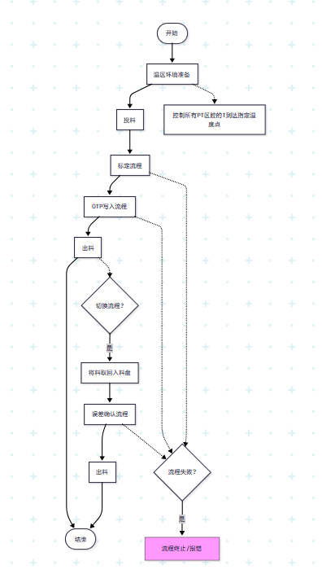

#### 3.2.3 标定流程详细说明

**流程概述**：

客户约定的4P4T或更多点位都需要遍历到位，得到每个DUT对应的所有PT点的采样信息。其中温度和压力数据来自指定的寄存器读取。

**标定流程图**：

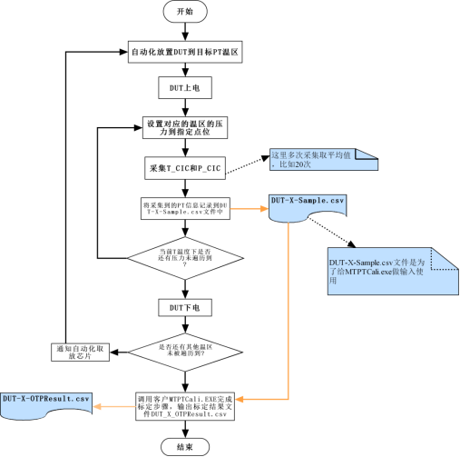

**寄存器信息**：

系统通过PSI5通信协议读取芯片内部寄存器，获取压力和温度的原始数据用于标定计算。

1. **压力标定参数寄存器**：

   - **Op1**: 压力标定基准寄存器，存储低温区域下的压力标定数字量
   - **Op2**: 4KPa量程压力数据寄存器，用于小量程压力测量
   - **Op3**: 16KPa量程压力数据寄存器，用于中量程压力测量
   - **Op4**: 64KPa量程压力数据寄存器，用于大量程压力测量
   - **Op5**: 复合寄存器，由Op3寄存器的高8位和低8位组合而成
2. **温度标定参数寄存器**：

   - **OpTh**: 高温区域温度数据寄存器，用于高温环境下的温度补偿
   - **OpTl**: 低温区域温度数据寄存器，用于低温环境下的温度补偿

**注**: 具体的寄存器地址和数据格式请参考芯片技术手册。系统会根据当前温区和压力设定自动选择相应的寄存器进行数据读取。

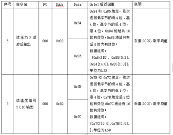（注：图片中为寄存器映射表的补充说明）

##### 数据文件管理

**文件存储配置**

- **默认路径**：D:\MT\Cache（可配置）
- **文件编码**：DUT-X格式，其中X根据测试序号编码
- **后续处理**：完成测试后可将文件迁移到对应的Server上

**主要数据文件格式**

**1. DUT-X-Sample.csv（标定采样数据）**

- **文件命名**：DUT-X-CaliSample.csv
- **用途**：存储标定流程中所有PT点的采样信息，作为MTPTCali.exe的输入文件
- **数据格式**：CSV格式，包含4列数据
  - 第一列：设置给PT温区的压力值（P值）
  - 第二列：设置给PT温区的温度值（T值）
  - 第三列：当前PT值下采样得到的DUT实际压力值
  - 第四列：当前PT值下采样得到的DUT实际温度值
- **数据量**：如客户指定4P4T，则包含16行采样结果

**2. DUT-X-OTPResult.csv（OTP写入结果）**

- **文件命名**：DUT-X-OTPResult.csv
- **用途**：存储校准结果和OTP的写入信息

**3. DUT-X-TestSample.csv（误差测试数据）**

- **文件命名**：DUT-X-TestSample.csv
- **用途**：存储误差确认流程的采样数据
- **数据格式**：与DUT-X-Sample.csv一致，但测试点位可能更少

##### 标定流程执行步骤

**操作流程节点**

1. **自动化放置DUT到目标PT温区**：将芯片自动放置到指定的压力-温度测试温区
2. **DUT上电**：为被测芯片供电
3. **设置压力**：设置对应温区的压力到指定点位
4. **数据采集**：采集温度和压力标定参数数据（多次采集取平均值，如20次）
5. **数据记录**：将采集到的PT信息记录到DUT-X-Sample.csv文件中
6. **压力循环**：遍历当前温度下的所有压力点
7. **温度循环**：遍历所有温区
8. **调用标定工具**：调用客户MTPTCali.EXE完成标定步骤，输出标定结果文件DUT_X_OTPResult.csv

**异常处理机制**

- 如果有DUT在这个环节有NG，则不进行下一个流程
- 任何一个流程失败就退出剩余流程并报告错误

#### 3.2.4 OTP写入流程

**流程说明**：

本流程用于将标定结果写入芯片OTP区域。Tester读取DUT-X-OTPResult.csv文件，序列化数据并通过驱动写入芯片，随后进行数据校验。若有DUT在此环节写入NG，则流程终止，不进入下一个流程。

**OTP写入流程图**：

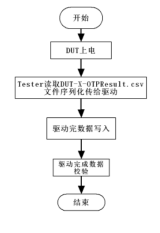

#### 3.2.5 误差确认流程

**流程说明**：

误差确认流程与标定流程类似，需要在多个PT点完成数据采样，采样结果保存为DUT-X-SampleTest.csv（内容格式与DUT-X-Sample.csv一致）。流程结束后，调用MTPTCheck.exe对csv文件的各个点位PT采样结果进行判定。

**误差确认流程图**：

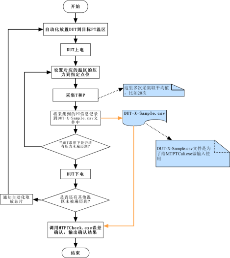

#### 3.2.6 数据注意事项

##### 1. 流水线标定与测试管理

- **温区逻辑**：系统包含4个温区（PT-1至PT-4），DUT从PT-1温区依次转移至PT-4温区。每个温区转移后，Handler会补充新的DUT到PT-1温区，确保最多64个DUT同时在温区内。
- **标记要求**：软件需为每个DUT标记其经过的所有PT点，确保完成标定+OTP写入或误差确认操作。

##### 2. 数据记录要求

- **标定阶段**：Cache文件夹需同时记录64颗DUT的采样数据。
- **测试阶段**：Cache文件夹需同时记录64 颗DUT的采样数据。

##### 3. CSV通用格式规范

- 编码：UTF-8（无BOM）
- 分隔符：英文逗号`,`
- 小数精度：压力保留3位小数（KPa），温度保留2位小数（℃）
- 列头：必须包含列头，建议为：`Set_P,Set_T,Measured_P,Measured_T`
- 单位：压力单位KPa，温度单位℃；列头不含单位时需在文件头注释或配置中注明
- 时间戳：建议增加`Timestamp`列（ISO8601）以辅助追溯
- 命名规则：`X = {StationId}-{SlotId}-{SerialNo}-{Seq}`（示例：`S03-04-DUT000123-01`），确保全局唯一，避免文件名冲突
- 样例：

```
Set_P,Set_T,Measured_P,Measured_T,Timestamp
64.125,25.00,64.102,24.98,2025-08-07T14:30:00Z
128.000,25.00,127.985,24.99,2025-08-07T14:31:00Z
...
```

### 3.3 业务规则

- 芯片测试顺序必须按照温区编号从小到大执行
- 标定结果未通过时，禁止进入OTP写入流程
- 误差确认流程中，采样数据必须与标定数据一致
- 所有流程必须在DUT唯一标识（条码/序列号）下进行，确保可追溯
- 任一环节产生NG时：
  - 立即停止该DUT后续流程并分配至NG Bin
  - 记录NG原因、发生环节、温区、站点、时间戳
  - 是否允许复测由配置项`AllowRetest`控制；若允许，复测次数由`MaxRetestCount`限制
- 分Bin规则：
  - OK → Bin-OK；NG → Bin-NG；异常（如通信失败/超时）→ Bin-EX
- 外部工具调用失败（超时/返回码非零）视为该DUT本环节NG，并记录日志及错误码映射

### 3.4 用户界面需求调研问卷

*本章节以问卷形式提供给客户和项目经理，请根据实际需求填写相关要求。*

#### 3.4.1 主界面设计需求调研

**问题1**: 对于主界面的设计风格，您更倾向于：

- [ ] 现代扁平化设计
- [ ] 传统工业界面风格
- [ ] 自定义风格（请描述）：_______________

**问题2**: 界面显示需求（可多选）：

- [ ] 支持高分屏显示
- [ ] 支持多语言切换
- [ ] 支持界面自定义布局
- [ ] 需要夜间模式/深色主题

**问题3**: 主界面必须显示的信息（可多选）：

- [ ] 实时系统状态
- [ ] 测试进度显示
- [ ] 设备连接状态
- [ ] 当前测试阶段（标定/测试模式）
- [ ] 其他：_______________

**当前界面设计参考**：

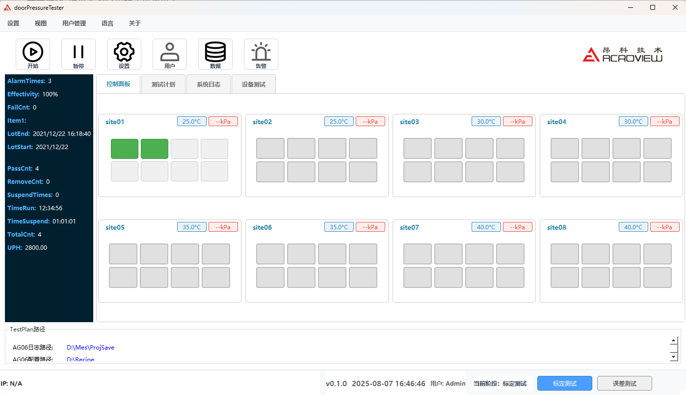

*请对当前设计提出意见：*

---

#### 3.4.2 设备管理界面需求调研

**问题1**: 设备管理界面需要显示的信息（可多选）：

- [ ] 设备实时状态（在线/离线）
- [ ] 设备参数配置
- [ ] 设备故障诊断
- [ ] 设备操作日志
- [ ] 设备性能指标

**问题2**: 设备控制功能需求（可多选）：

- [ ] 手动设备控制
- [ ] 设备连接测试
- [ ] 设备校准功能
- [ ] 批量设备操作

**当前界面设计参考**：


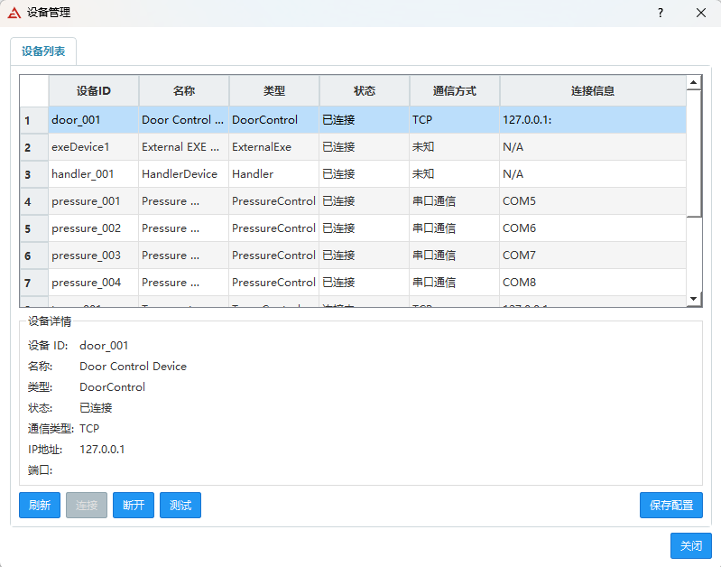

*请对当前设计提出意见：*

---

#### 3.4.3 系统日志界面需求调研

**问题1**: 日志显示级别需求（可多选）：

- [ ] 错误级别日志
- [ ] 警告级别日志
- [ ] 信息级别日志
- [ ] 调试级别日志

**问题2**: 日志功能需求（可多选）：

- [ ] 实时日志显示
- [ ] 日志搜索功能
- [ ] 日志导出功能
- [ ] 日志自动清理

**当前界面设计参考**：

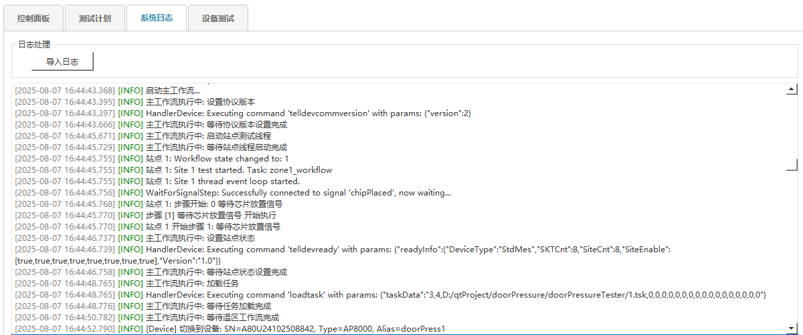

*请对当前设计提出意见：*

---

#### 3.4.4 测试计划管理需求调研

**问题1**: 工作流配置方式偏好：

- [ ] 可视化拖拽式配置
- [ ] 表单式参数配置
- [ ] 代码式配置
- [ ] 模板式配置

**问题2**: 测试计划功能需求（可多选）：

- [ ] 工作流模板保存/加载
- [ ] 测试参数批量设置
- [ ] 执行状态实时监控
- [ ] 历史记录查看

**当前界面设计参考**：


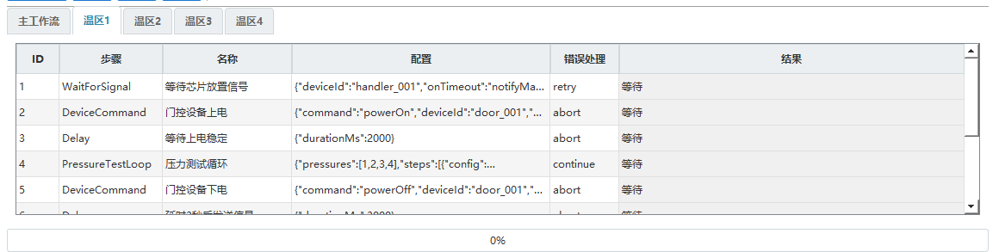

*请对当前设计提出意见：*

---

#### 3.4.5 设备测试页面需求调研

**问题1**: 设备测试功能优先级排序（请按重要性排序1-5）：

- [ ] 单设备功能测试（排序：___）
- [ ] 设备通信检测（排序：___）
- [ ] 设备性能测试（排序：___）
- [ ] 设备校准功能（排序：___）
- [ ] 多设备对比测试（排序：___）

**问题2**: 测试结果展示需求（可多选）：

- [ ] 实时数据显示
- [ ] 图表形式展示
- [ ] 测试报告生成
- [ ] 历史数据对比

**当前界面设计参考**：

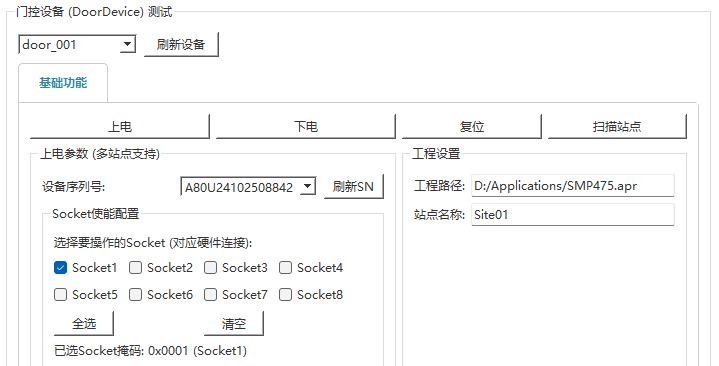

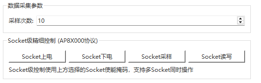

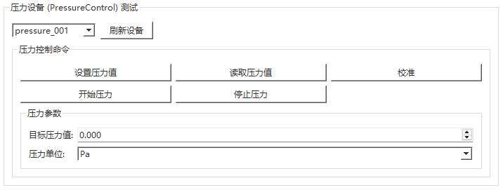

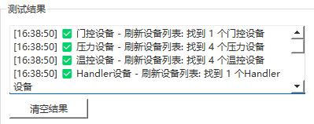

*请对当前设计提出意见：*

---

#### 问卷总结

**整体界面需求**：

1. 您认为当前界面设计是否满足日常操作需求？
   ---
2. 还有哪些界面功能是必需但当前缺失的？
   ---
3. 对界面操作流程有什么改进建议？
   ---

*请填写完成后返回给开发团队，我们将根据您的反馈调整界面设计。*

### 3.5 数据管理需求

#### 3.5.1 配置管理

- **需求描述**: 管理系统配置和测试参数
- **功能要求**:
  - 支持JSON格式的配置文件
  - 提供配置的导入导出功能
  - 支持配置的版本管理
  - 提供配置的备份和恢复

#### 3.5.2 数据存储

- **需求描述**: 安全可靠地存储测试数据和配置信息
- **功能要求**:
  - 使用SQLite数据库存储结构化数据
  - 支持CSV格式的数据导出
  - 提供数据备份和恢复功能
  - 实现数据的加密存储

#### 3.5.3 日志管理

- **需求描述**: 记录系统运行和测试过程的详细日志
- **功能要求**:
  - 使用spdlog实现高性能日志记录
  - 支持不同级别的日志输出
  - 提供日志的查询和过滤功能
  - 支持日志文件的自动轮转

#### 3.5.4 调度策略（并发与温区/站点映射）

- 站点-温区映射：每个温区包含2个站点（共4温区=8站点），支持动态映射调整
- 调度策略：
  - 进入优先级：按温区编号从小到大；同温区按到达时间先进先出（FIFO）
  - 跳转策略：允许从指定PT点直达目标PT点（例如PT-1→PT-3），由测试计划控制
  - 超时策略：单步骤超时阈值可配置（如采样超时、外部工具超时）；超时即判定本环节NG
  - 资源锁：同一DUT在同一时刻只绑定一个站点，使用DUT级互斥锁防止并发写入
  - 故障转移：站点不可用时自动转移至同温区另一站点，并记录事件

#### 3.5.5 配置项清单（示例）

```json
{
  "CacheRoot": "D:/MT/Cache",
  "Stations": 8,
  "ThermalZones": 4,
  "PressurePoints": [64.125, 128.000, 256.000],
  "TemperaturePoints": [-20.0, 25.0, 85.0, 125.0],
  "AllowRetest": true,
  "MaxRetestCount": 1,
  "MTPTCaliExePath": "D:/MT/tools/MTPTCali.exe",
  "MTPTCheckExePath": "D:/MT/tools/MTPTCheck.exe",
  "ExternalToolTimeoutSec": 60,
  "HashVerify": true,
  "UPHTarget": 1200,
  "Csv": {
    "DecimalPlaces": { "Pressure": 3, "Temperature": 2 },
    "Delimiter": ",",
    "AddTimestamp": true,
    "Headers": ["Set_P", "Set_T", "Measured_P", "Measured_T", "Timestamp"]
  }
}
```

---

#### 3.5.6 工作流文件说明（docs/workflow）

- 目录：`docs/workflow/`
- 目的：通过JSON定义可配置的测试/标定/误差流程，供工作流引擎加载与执行。

文件概览（简述）
- `mainWorkflow.json`：主流程编排，负责在“标定流程”和“误差确认流程”之间切换与汇流。
- `calibration_zone{1..4}Workflow.json`：各温区的标定子流程，包含该温区内的PT点遍历、采样与产物输出（CaliSample/OTPResult）。
- `error_test_zone{1..4}Workflow.json`：各温区的误差确认子流程，包含该温区内PT点遍历、采样与判定（TestSample/Check）。

命名与约定
- 命名：`<流程类型>_zone<温区序号>Workflow.json`，如 `calibration_zone1Workflow.json`。
- 放置路径固定为 `docs/workflow/`，由配置项 `WorkflowRoot`（可扩展）管理。

结构要点（通用）
- 顶层字段建议：
  - `name`：工作流名称
  - `version`：工作流版本（语义化，例如 1.0.0）
  - `zoneId`：温区编号（1-4），主流程可无此字段
  - `params`：可变参数（如PT点表、重试次数、超时阈值、产物路径等）
  - `steps`：步骤数组（顺序执行/条件跳转）
- 常见步骤类型：
  - `setPressure`、`waitTemperature`、`measure`（采样多次取平均）
  - `callTool`（如 MTPTCali.exe、MTPTCheck.exe）
  - `persistCsv`（写入 CSV：CaliSample/TestSample/OTPResult）
  - `decision`（基于条件路由到下一步）
- 容错与重试：
  - 每步支持 `timeoutSec` 与 `retry` 策略；失败需产生标准化错误码与日志
  - NG时触发 `onFail` 分支（如分Bin、记录追溯信息）
- 参数化：
  - PT点、DUT标识、文件命名中的`X`、Cache路径、外部工具路径、超时等通过 `params`/配置文件注入
- 版本与追溯：
  - 建议每个工作流文件包含 `version` 与 `lastModified`（可选），执行时将版本写入日志

极简JSON示例（结构示意）
```json
{
  "name": "calibration_zone1",
  "version": "1.0.0",
  "zoneId": 1,
  "params": {
    "pressurePoints": [64.125, 128.0],
    "measureRepeat": 20,
    "cacheRoot": "D:/MT/Cache",
    "toolCali": "D:/MT/tools/MTPTCali.exe",
    "timeoutSec": 60
  },
  "steps": [
    { "type": "waitTemperature", "target": 25.0, "tolerance": 0.5, "timeoutSec": 300 },
    { "type": "setPressure", "value": 64.125 },
    { "type": "measure", "repeat": "@params.measureRepeat", "saveTo": "@cacheRoot/DUT-X-CaliSample.csv" },
    { "type": "setPressure", "value": 128.0 },
    { "type": "measure", "repeat": "@params.measureRepeat", "saveTo": "@cacheRoot/DUT-X-CaliSample.csv" },
    { "type": "callTool", "exe": "@params.toolCali", "args": ["--input", "DUT-X-CaliSample.csv", "--output", "DUT-X-OTPResult.csv"], "timeoutSec": "@params.timeoutSec" },
    { "type": "decision", "when": "@lastTool.returnCode == 0", "then": "NEXT", "else": "FAIL" }
  ]
}
```

执行规则（摘要）
- 主流程加载 `mainWorkflow.json`，按状态选择进入各温区的标定/误差子流程。
- 子流程在对应温区内完成PT点遍历与数据产物生成，失败即返回NG并停止该DUT后续流程。
- 日志必须记录：工作流名、版本、zoneId、DUT_ID、开始/结束时间、外部工具返回码与产物路径。

---

#### 3.5.7 工作流步骤类型规范（摘要）

- 通用字段（所有步骤）：
  - `type`(必填)：步骤类型
  - `timeoutSec`(可选, 默认60)
  - `retry`(可选, 默认0)
  - `onFail`(可选)：失败分支（如 `FAIL`/`BIN_NG`）
  - `note`(可选)：备注

- setPressure
  - 参数：`value`(必填, KPa, 数值)
  - 验证：压力到位±容差（由配置 `PressureTolerance`）

- waitTemperature
  - 参数：`target`(必填, ℃), `tolerance`(可选, 默认±0.5℃)
  - 验证：在`timeoutSec`内达到目标±容差

- measure
  - 参数：`repeat`(可选, 默认1), `saveTo`(必填), `channels`(可选：P/T)
  - 规则：多次采样取平均值，写入CSV并校验列头完整

- persistCsv
  - 参数：`path`(必填), `headers`(必填), `append`(可选, 默认true)
  - 规则：UTF-8编码、逗号分隔、追加写时校验列头一致

- callTool
  - 参数：`exe`(必填), `args`(可选数组), `expectExitCode`(可选, 默认0)
  - 规则：执行前可选哈希校验；返回码与`expectExitCode`一致视为成功

- decision
  - 参数：`when`(必填, 表达式), `then`/`else`(必填)
  - 规则：表达式结果布尔化后路由

#### 3.5.8 工作流验收标准

- 结构与配置
  - [ ] 所有工作流JSON通过JSON Schema校验（结构、类型、必填字段）
  - [ ] `name/version/steps`字段完整，zone子流程包含`zoneId`
  - [ ] 参数注入键存在且与配置清单一致
- 可执行性
  - [ ] `callTool`步骤在目标环境可执行，返回码=0
  - [ ] `setPressure/waitTemperature`满足容差要求
  - [ ] `measure/persistCsv`生成CSV符合通用格式规范
- 日志与追溯
  - [ ] 执行日志记录工作流名/版本/zoneId/DUT_ID/开始结束时间/外部工具返回码/产物路径
  - [ ] NG分支触发时包含错误码与原因

---

## 4. 非功能需求（初版）

*注：本章节为初版内容，尚未实际应用，后续可能根据项目进展进行修改。*

### 4.1 性能需求

#### 4.1.1 响应时间

- 用户界面操作响应时间 < 100ms
- 设备命令执行响应时间 < 500ms
- 数据采集频率 > 10Hz
- 工作流步骤切换时间 < 1s

#### 4.1.2 并发性能

- 支持8个站点同时运行
- 支持多线程并行处理
- 系统资源占用率 < 80%
- 内存使用量 < 2GB
- **UPH**：自动化UPH≥1200，统计口径为8站点在1小时内产出合格DUT数量（不含复测），记录开始与结束时间戳并计算。

### 4.2 可靠性需求

#### 4.2.1 系统稳定性

- 系统连续运行时间 > 24小时
- 测试数据丢失率 < 0.1%
- 系统崩溃恢复时间 < 5分钟
- 设备连接断开自动重连

#### 4.2.2 数据完整性

- 测试数据100%准确记录
- 配置文件备份机制
- 数据校验和错误检测
- 异常情况下的数据保护

### 4.3 安全性需求

#### 4.3.1 访问控制

- 用户权限分级管理
- 操作日志记录
- 敏感数据加密存储
- 网络通信安全传输

#### 4.3.2 数据安全

- 测试数据加密存储
- 配置文件访问控制
- 日志信息脱敏处理
- 备份数据安全保护

### 4.4 可维护性需求

#### 4.4.1 代码质量

- 遵循C++和Qt编码规范
- 完整的代码注释和文档
- 模块化设计便于维护
- 单元测试覆盖率 > 80%

#### 4.4.2 系统监控

- 系统运行状态监控
- 性能指标实时显示
- 错误日志自动记录
- 远程诊断和维护支持

---

## 5. 系统架构

### 5.1 整体架构

系统采用多站点并行测试架构，支持8个独立测试站点，分为4个温区，每个温区2个站点。采用Qt框架开发，支持多线程并行处理，确保高效的测试性能。

### 5.2 技术栈

- **前端界面**: Qt Widgets + Qt Designer
- **后端处理**: C++ 17 + Qt 5.15.2
- **数据库**: SQLite (QSqlDatabase)
- **多线程**: QThread、QtConcurrent、QThreadPool
- **网络通信**: QNetworkAccessManager、QTcpSocket
- **日志系统**: spdlog

### 5.3 系统组件

- **设备管理模块**: 负责门控设备、压力控制设备、温度控制设备的连接和控制
  - 已实现串口通信功能
  - 支持压力传感器数据读取
  - 压力控制设备硬件待完善后可实现完整控制功能
- **测试流程模块**: 实现自动化测试流程，包括标定、OTP写入、误差确认
- **数据采集模块**: 负责实时数据采集、处理和存储
- **工作流引擎**: 基于JSON配置的工作流自动化执行系统
- **用户界面模块**: 提供友好的图形用户界面和操作体验

---

## 6. 用户界面需求

### 6.1 设计原则

- **简洁性**：界面简洁明了，避免冗余元素

- **一致性**：保持界面风格和交互方式的一致性

- **易用性**：符合用户习惯，降低学习成本

- **响应式**：支持不同屏幕尺寸的设备

### 6.2 主要界面

#### 6.2.1 登录界面

- **功能**：用户身份验证

- **元素**：用户名输入框、密码输入框、登录按钮

- **交互**：输入验证、错误提示

#### 6.2.2 主界面

- **功能**：系统主要功能入口

- **元素**：导航菜单、功能模块、状态显示

- **交互**：菜单切换、功能调用

---

## 7. 数据需求

### 7.1 数据模型

```

[数据模型图或描述]

```

### 7.2 数据字典

**数据字典说明**：数据字典用于规范系统中所有数据字段的定义，确保数据的一致性和完整性。它详细描述了每个数据表中字段的属性，包括数据类型、长度限制、是否必填等关键信息，为数据库设计、接口开发和数据验证提供标准规范。

*注：由于当前系统主要使用CSV文件存储测试数据，数据库功能尚未完全实现，此部分为预留设计。*

| 字段名称           | 数据类型 | 长度限制 | 是否必填 | 字段说明      | 示例值              |
| ------------------ | -------- | -------- | -------- | ------------- | ------------------- |
| DUT_ID             | VARCHAR  | 32       | 是       | DUT唯一标识符 | DUT-001             |
| Test_Time          | DATETIME | -        | 是       | 测试时间戳    | 2025-08-07 14:30:00 |
| Pressure_Value     | DECIMAL  | 10,3     | 是       | 压力值(KPa)   | 64.125              |
| Temperature_Value  | DECIMAL  | 8,2      | 是       | 温度值(℃)    | 25.50               |
| Zone_ID            | INT      | -        | 是       | 温区编号(1-4) | 3                   |
| Test_Result        | VARCHAR  | 10       | 是       | 测试结果      | OK/NG               |
| Calibration_Status | VARCHAR  | 20       | 否       | 标定状态      | COMPLETED           |

### 7.3 数据存储

- **数据库类型**：[数据库类型]

- **存储容量**：[预计存储容量]

- **备份策略**：[备份频率和方式]

---

## 8. 接口需求

### 8.1 用户接口

#### 8.1.1 图形用户界面

- **主窗口**: 系统主界面，包含菜单栏、工具栏、状态栏
- **设备管理窗口**: 设备连接和配置管理
- **测试监控窗口**: 实时测试状态和数据监控
- **配置管理窗口**: 系统配置和参数设置
- **日志查看窗口**: 系统日志和测试日志查看

#### 8.1.2 操作流程

- 详细操作流程请参见SOP（软件运行指南）文档

### 8.2 硬件接口

#### 8.2.1 设备通信协议

- **PSI5通信接口**: 与门压芯片的标准通信协议
- **TCP/IP通信**: 与门控设备、处理器设备的通信
- **串口通信**: 与压力控制设备、温度控制设备的通信
  - 已实现串口通信功能
  - 压力设备硬件未就绪，目前仅支持读取压力传感器数据
  - 待压力设备硬件完成后可扩展完整的压力控制功能
- **Modbus协议**: 工业设备标准通信协议
- **ASCII协议**: 自定义ASCII文本协议

#### 8.2.2 数据采集接口

- **模拟量采集**: 压力、温度等模拟信号采集
- **数字量采集**: 开关状态、脉冲信号等数字信号采集
- **高速数据采集**: 高频压力变化数据采集

### 8.3 软件接口

#### 8.3.1 数据库接口

- **SQLite数据库**: 本地数据存储
- **CSV文件接口**: 数据导入导出
- **JSON配置文件**: 系统配置和测试参数

#### 8.3.2 网络接口

- **HTTP/REST API**: 远程监控和控制接口
- **WebSocket**: 实时数据推送
- **TCP Socket**: 设备通信接口

#### 8.3.3 外部工具接口（MTPTCali.exe / MTPTCheck.exe）

- 调用方式：本地进程启动（QProcess）
- 通用参数：
  - `--input <CSV文件路径>` 输入采样文件（CaliSample/TestSample）
  - `--output <CSV文件路径>` 输出结果文件（OTPResult/CheckResult）
  - `--log <日志路径>` 外部工具运行日志（可选）
- 返回码约定：
  - 0：执行成功
  - 非0：执行失败（读取失败/计算异常/文件格式错误/设备未授权等）
- 超时机制：
  - 配置项`ExternalToolTimeoutSec`控制（默认60秒），超时即终止进程并判定该DUT为NG
- 重试策略：
  - 由`AllowRetest`与`MaxRetestCount`控制，重试时应更换站点或重新采样
- 哈希校验：
  - 若`HashVerify=true`，在启动前对exe进行哈希校验（SHA-256）以防被替换
- 日志要求：
  - 记录exe路径、参数、开始/结束时间、返回码、标准输出/错误输出的摘要

---

## 9. 验收标准

### 9.1 功能验收标准

- [ ] 所有功能需求100%实现
- [ ] 用户界面操作流畅无卡顿
- [ ] 设备连接稳定可靠
- [ ] 测试数据准确无误
- [ ] 工作流执行正常
- [ ] 自动化测试流程完成所有PT点测试
- [ ] OTP写入流程标定数据正确写入芯片

### 9.2 性能验收标准

- [ ] 系统响应时间满足要求
- [ ] 并发性能达到预期
- [ ] 内存使用量在合理范围
- [ ] CPU占用率不超过80%
- [ ] 支持8个站点同时运行
- [ ] 数据采集频率 > 10Hz
- [ ] 自动化UPH≥1200

### 9.3 可靠性验收标准

- [ ] 系统连续运行24小时无故障
- [ ] 数据丢失率低于0.1%
- [ ] 异常情况能够自动恢复
- [ ] 设备故障能够及时检测
- [ ] 设备连接断开自动重连

### 9.4 安全性验收标准

- [ ] 用户权限控制有效
- [ ] 数据加密存储正常
- [ ] 操作日志记录完整
- [ ] 网络安全传输可靠
- [ ] 外部工具可执行文件进行哈希校验


## 10. 附录

### 10.2 变更记录

| 版本 | 日期   | 变更内容   | 变更人   |

| ---- | ------ | ---------- | -------- |

| v1.0 | [日期] | 初始版本   | [变更人] |

| v1.1 | [日期] | [变更内容] | [变更人] |

### 10.3 术语表

- **门控设备**: 用于测试门控压力性能的专用设备
- **温区**: 具有特定温度环境的测试区域
- **站点**: 独立的测试单元，可进行独立的测试流程
- **工作流**: 预定义的测试步骤序列
- **DUT**: Device Under Test (被测设备)
- **PT点**: 压力-温度测试点
- **OTP**: One-Time Programmable (一次性可编程存储器)

### 10.4 技术参考文档

- Qt 5.15.2官方文档
- C++17标准文档
- SQLite数据库文档
- spdlog日志库文档

---

## 文档审批

| 角色       | 姓名   | 签名   | 日期   |

| ---------- | ------ | ------ | ------ |

| 项目经理   | [姓名] | [签名] | [日期] |

| 技术负责人 | [姓名] | [签名] | [日期] |

| 质量保证   | [姓名] | [签名] | [日期] |

| 客户代表   | [姓名] | [签名] | [日期] |

---

## 文档结束

*本文档为门压芯片自动化测试系统软件需求文档。*

> 当前进展（截至 2025-08-08）：
> - 已完成：1.1 两轮适配；2.1 压力采集格式适配与实现
> - 进行中：1.2 同步自动机协议与SProtocol修改；1.3 VAuto修改与测试（已支持2温区，目标4温区）；2.2 设备控制联调（分两段）；3.2 SOP（~10%）；3.3 详细设计（~10%）
