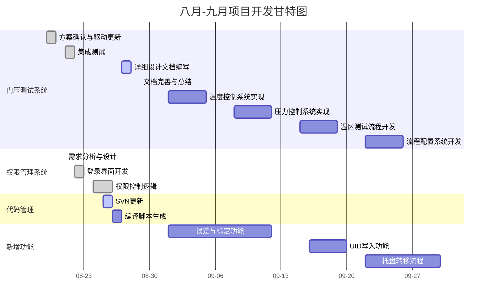

# 八月项目开发进度

> **更新时间**: 2025-08-28  
> **开发周期**: 2025-07-31 至 2025-08-26（进行中）  
> **术语说明**: DUT(Device Under Test)=被测设备 | QC=质量控制 | SOP=标准操作程序

## 🎯 总体进度

- ✅ **工作流系统** (100%)
- ✅ **系统架构优化** (100%)
- ✅ **数据处理与 UI** (100%)
- ✅ **权限管理系统** (100%)
- 🔄 **文档编写** (80%)

---

## ✅ 已完成（汇总）

以下为本阶段已完成的条目：

### 日常与核心任务

- **8月1日**: 修复 LoopBack 循环问题、添加芯片信号超时机制、寄存器操作配置优化、智能芯片计数实现
- **8月2日**: 线程安全机制优化、UI 组件重构、工作流系统全面优化
- **8月5日**: 项目构建系统重构、CSV 数据过滤修复、设备资源管理系统
- **8月6日**: 工作流配置管理、数据保存测试界面、UI 交互优化、时间显示修复、暂停/继续功能
- **8月7日**: QC 手动 workflow、64 个 DUT 处理方案、温度测试逻辑完善、压力测试数据收集
- **8月8日**: 日志系统统一、CSV 表格标准化、温度/压力求平均值优化
- **8月18日**: aprog 更新与文档说明、log 系统错误信息展示完善
- **8月28日**: 删除testboarddevice和turntabledevice相关文件、引用和代码，系统架构简化；asensing的MES软件新增接口以及SN烧录的sn_asmes已实现并自测

### 权限管理系统（已完成）

- ✅ 用户登录界面 - 简单的用户名/密码验证
- ✅ 权限分级控制 - admin/cyy 可访问 "设备测试" Tab，普通用户只读
- ✅ 会话管理 - 登录状态保持，自动登出机制
- ✅ 权限配置文件 - users.json 或数据库存储用户信息
- ✅ UI 权限控制 - 根据用户级别显示/隐藏功能模块

**技术实现（概要）**

- **用户类型**: admin / cyy / user  
- **权限控制点**: “设备测试”Tab、工作流配置、系统设置、数据导出

## 🔄 进行中任务

### 8月25-29日 — 本周任务

- 🔄 门压软件详细设计文档完成（本周四8.29截止）
- 🔄 门压项目代码SVN更新，生成编译脚本
- 📝 文档完善与总结（8.29周五）

### 9月1-5日 — 下周任务

- 🆕 温度控制系统实现（从PSI5读取环境温度）
- 🆕 误差与标定功能开发（第一阶段）

---

## 📅 任务排期表

### 第3周 (8.19-8.22)

- **8.19 周一**: 门压系统方案确认，log的修复，统一使用utf8，方便后续多语言切换
- **8.20 周二**: 优化工作流加载的逻辑，gui线程安全性检查，修复日志占位符风险问题
- **8.21 周三**: 问题点总结，构思错误处理机制，同步开始设计文档编写；优化视图显示的功能，getlotdata有详细数据；注释自动停止workflow的设定，待与自动机对齐
- **8.22 周四**: 文档编写推进，错误处理机制方案-50%，详细设计20%

### 第5周 (08-25 至 08-29)

- **08-25 周一**: 门压项目代码SVN更新，开始编译脚本编写
- **08-26 周二**: 编译脚本完善与测试
- **08-27 周三**: 门压软件详细设计文档编写
- **08-28 周四**: 门压软件详细设计文档完成与审查
- **08-29 周五**: 文档完善与总结

### 第6周 (09-01 至 09-05)

- **09-01 周一**: 温度控制系统开发启动
- **09-02 周二**: PSI5温度读取功能实现
- **09-03 周三**: 误差与标定功能需求分析
- **09-04 周四**: 标定流程开发
- **09-05 周五**: 温度控制系统测试

### 第7周 (09-08 至 09-12)

- **09-08 周一**: 压力控制系统需求分析
- **09-09 周二**: SCPI协议接口开发
- **09-10 周三**: 压力设备集成测试
- **09-11 周四**: 误差与标定功能完善
- **09-12 周五**: 系统集成测试

### 第8周 (09-15 至 09-19)

- **09-15 周一**: 温区测试流程设计
- **09-16 周二**: UID写入功能开发
- **09-17 周三**: 温区流程实现
- **09-18 周四**: 数据库集成
- **09-19 周五**: 功能测试与优化

### 第9周 (09-22 至 09-26)

- **09-22 周一**: 流程配置系统设计
- **09-23 周二**: 托盘转移流程设计
- **09-24 周三**: 配置管理功能开发
- **09-25 周四**: 手动转移流程实现
- **09-26 周五**: 系统整体测试

### 第10周 (09-29 至 09-30)

- **09-29 周一**: 最终集成测试
- **09-30 周二**: 项目总结与交付

---

## 📊 甘特图 (8.19-9.30)

### 备用表格格式

| 项目/任务 | 08-19 | 08-20 | 08-21 | 08-22 | 08-25 | 08-26 | 08-27 | 08-28 | 08-29 | 09.01-05 | 09.08-12 | 09.15-19 | 09.22-26 | 09.29-30 |
|------------|------|------|------|------|------|------|------|------|------|---------|---------|---------|---------|---------|
| 门压系统方案确认 | ███ | ███ | - | - | - | - | - | - | - | - | - | - | - | - |
| 门压系统集成测试 | - | - | ███ | ███ | - | - | - | - | - | - | - | - | - | - |
| SVN更新与脚本 | - | - | - | - | ███ | ███ | ███ | - | - | - | - | - | - | - |
| 详细设计文档 | - | - | - | - | - | - | ███ | ███ | ███ | - | - | - | - | - |
| 权限管理系统 | - | - | ███ | ███ | ███ | ███ | - | - | - | - | - | - | - | - |
| 温度控制系统 | - | - | - | - | - | - | - | - | - | ███ | - | - | - | - |
| 压力控制系统 | - | - | - | - | - | - | - | - | - | - | ███ | - | - | - |
| 温区测试流程 | - | - | - | - | - | - | - | - | - | - | - | ███ | - | - |
| 流程配置系统 | - | - | - | - | - | - | - | - | - | - | - | - | ███ | - |
| 误差与标定功能 | - | - | - | - | - | - | - | - | - | ███ | ███ | - | - | - |
| UID写入功能 | - | - | - | - | - | - | - | - | - | - | - | ███ | - | - |
| 托盘转移流程 | - | - | - | - | - | - | - | - | - | - | - | - | ███ | ███ |

---

## 🚨 关键决策点

- **芯片信息追踪**: 芯片在四个温区流转的数据追踪机制设计
- **温区移动方案**: 温区芯片移动方案确认（共同移动 vs 站点单独移动）
- **驱动兼容性**: 驱动更新问题兼容性测试与修复
- **计数规则**: cmd3 计数规则确认（良品数 vs 预期芯片数量）
- **数据追踪机制**: 芯片在四个温区流转时的信息获取和追踪方案待确认
- **温度控制策略**: 预冷区域的温度控制由自动机、Tester还是设备自带逻辑负责
- **协议文档**: 自动机最新版本的标定和误差处理流程协议尚未提供
- **工作流设计**: 整体测试工作流方案需要与驱动端和客户进一步沟通确认
- **DUT管理**: 64个设备(DUT)的标记规则和数据统一处理方案待定
- **权限需求**: 用户权限分级的具体功能需求需要与相关人员确认
- **硬件就绪**: 压力测试设备的准备和接口确认
- **接口文档**: 用户调用可执行程序的接口文档和使用说明编写
- **错误处理**: 软件的失败处理逻辑设计，包括测试流程错误和数据存储错误等异常情况
- **温度控制实现**: 环境温度控制方案，从PSI5读取温度，定期判断设备温度是否满足设计标准
- **压力控制接口**: 压力控制设备的SCPI协议接口实现，压力值读写与标准判断
- **温区配置方案**: 低温、常低、常高、高温四个温区的测试流程设计，OTP写入位置确定
- **流程配置管理**: 所有流程写入配置文件，实现一次加载，管理员权限修改
- **误差温区配置**: 误差温区可配置方案，失败判定逻辑，数据记录与存储设计
- **UID写入支持**: UID写入功能实现，本地数据库存储，为后期MES集成做准备
- **托盘转移流程**: 误差与标定功能的手动托盘转移流程设计

## 📝 待办事项

### 门压项目相关

1. **温度控制系统**
   - 实现从PSI5读取环境温度的功能
   - 开发计量器件，定期判断设备温度是否满足设计标准
   - 实现超时报警功能（可设置超时时间，默认2分钟）

2. **压力控制系统**
   - 实现SCPI协议接口，支持压力值读写
   - 开发压力标准判断功能，支持可设置超时时间
   - 与夏令协调获取协议文档和压力设备

3. **温区测试流程**
   - 实现低温、常低、常高、高温四个温区的测试流程
   - 设计OTP写入位置在四个温区采集完成后执行
   - 评估并实现温区测试顺序优化（低温、常低、高温、常高）

4. **流程配置系统**
   - 开发配置文件管理系统，支持一次加载所有流程
   - 实现类似工程管理的功能
   - 添加管理员权限控制，限制配置修改权限

5. **误差与标定功能**
   - 实现可配置的误差温区功能
   - 开发标定四温区完整流程
   - 实现失败判定与数据记录功能
   - 开发本地数据库存储误差值和阈值
   - 集成标定DLL，支持转换为input_txt格式

6. **UID写入功能**
   - 实现UID写入功能
   - 开发本地数据库存储功能
   - 预留MES系统接口

7. **托盘转移流程**
   - 设计误差与标定功能的手动托盘转移流程
   - 开发相关提示和操作界面

8. **详细设计文档**
   - 完成门压软件详细设计文档（本周四8.29截止）
   - 包含架构设计、模块设计、接口设计等
   - 添加新增需求的详细设计内容

9. **代码管理与构建**
   - 门压项目代码SVN更新
   - 生成标准化的编译脚本
   - 确保构建流程的一致性和可重现性

### SN烧录相关

1. **SOP文档标准化生成**
   - 完成SN烧录的标准操作程序文档
   - 确保文档格式统一、内容完整

2. **SN烧录方案实现**
   - 完成SN烧录方案编写和代码实现
   - MES端接口对接待完成

---

## 📈 整体进度统计

- **门压测试系统**: 28/28 任务完成 (100%)
  - **权限管理系统**: 5/5 任务完成 (100%)
  - **错误处理机制**: 设计中 (30%)
- **文档工作**: 60%
  - 用户操作手册(SOP): 100% 完成
  - 需求文档: 100% 完成
  - 详细设计文档: 10% 完成（需继续编写）

---

## 📅 文档更新记录

- **最后更新**: 2025-08-28
- **下次更新**: 2025-08-29
- **文档版本**: v1.3
- **更新人**: 开发团队