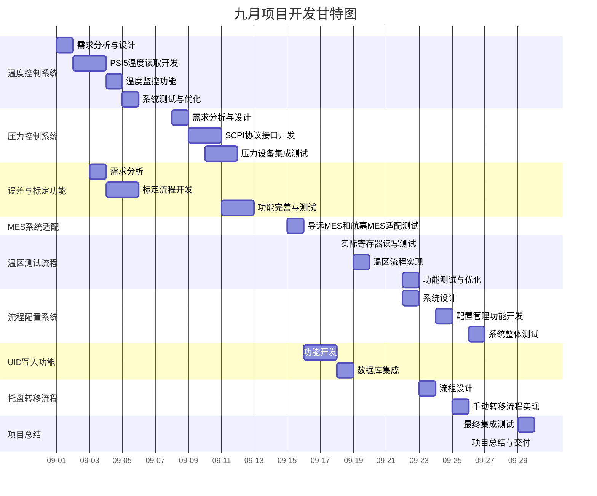

# 九月项目开发进度

> **更新时间**: 2025-09-16
> **开发周期**: 2025-09-01 至 2025-09-30
> **术语说明**: DUT(Device Under Test)=被测设备 | QC=质量控制 | SOP=标准操作程序

- [总体进度](#总体进度)
- [本月计划任务](#本月计划任务)
- [已完成（汇总）](#已完成汇总)
- [任务排期表](#任务排期表)
- [甘特图](#甘特图)
- [备用表格格式](#备用表格格式)
- [关键决策点](#关键决策点)
- [与最新沟通记录对齐补充](#与最新沟通记录对齐补充)
- [待办事项](#待办事项)
- [整体进度统计](#整体进度统计)
- [文档更新记录](#文档更新记录)

> **更新时间**: 2025-09-10
> **开发周期**: 2025-09-01 至 2025**总体进度*## 📈 整体进度统计

- **温度控制系统**: 0/4 任务完成 (0**总体进度**: 5/28 任务完成 (17.9%)
  （临时更新）已完成：工作流自定义步骤显示缺陷修复 + 新需求优先级梳理 + 数据库功能50% + 压力设备TCP集成 + 配方管理系统开发完毕 + QSS加载调整（不计入原 28 功能点，可在下次版本中将"配置系统"进度标记为 10%）。9.15新增航嘉MES适配工作和导远MES重新上传按钮新需求。
- **压力控制系统**: 1/4 任务完成 (25%)
- **误差与标定功能**: 0/4 任务完成 (0%)
- **温区测试流程**: 0/4 任务完成 (0%)
- **MES系统适配**: 导远MES和航嘉MES的适配和测试（争取不需要出差就可以搞定）
- **重新上传功能**: 导远MES重新上传按钮的设计和实现策略
- **流程配置系统**: 4/4 任务完成 (100%)
- **UID写入功能**: 0/4 任务完成 (0%) [数据库存储: 90%]
- **托盘转移流程**: 0/4 任务完成 (0%)

**总体进度**: 5/30 任务完成 (16.7%)
（临时更新）已完成：工作流自定义步骤显示缺陷修复 + 新需求优先级梳理 + 数据库功能50% + 压力设备TCP集成 + 配方管理系统开发完毕 + QSS加载调整（不计入原 28 功能点，可在下次版本中将"配置系统"进度标记为 10%）。9.15新增航嘉MES适配工作。 (17.9%)

> （临时更新）已完成：工作流自定义步骤显示缺陷修复 + 新需求优先级梳理 + 数据库功能50% + 压力设备TCP集成 + 配方管理系统开发完毕（9.11-9.12完成，包括工作流参数点击弹出窗口修改功能） + QSS加载调整（不计入原 28 功能点，可在下次版本中将"配置系统"进度标记为 10%）。9.15开始实际寄存器读写测试。9-30
> **术语说明**: DUT(Device Under Test)=被测设备 | QC=质量控制 | SOP=标准操作程序

## 🎯 总体进度

- 🆕 **温度控制系统** (0%)
- 🆕 **压力控制系统** (25%)
- 🆕 **误差与标定功能** (0%)
- 🆕 **温区测试流程** (0%)
- 🆕 **流程配置系统** (100%)
- 🆕 **UID写入功能** (0%)
- 🆕 **托盘转移流程** (0%)

---

## 🆕 本月计划任务

### 核心功能开发

- **温度控制系统** (0%):
  - 从PSI5读取环境温度（需嵌入式工程师配合，提供接口文档与测试环境）。通过寄存器读取cic的温度
  - 开发温度监控与报警机制（需确定方案：滑动窗口判定、阈值配置、可设置超时时间）。
- **压力控制系统** (25%):
  - 实现SCPI协议接口，支持压力值读写和标准判断（已实现基本通讯协议 PaceDevice；实际需测试设备集成与稳定性）。
- **误差与标定功能** (0%):
  - 开发可配置的误差温区功能（需集成标定DLL，目前未开发；依赖外部文档与接口）。
- **温区测试流程** (0%):
  - 实现四个温区（低温、常低、常高、高温）的测试流程（目前未开发；需设计OTP写入顺序与温区切换逻辑）。
- **流程配置系统** (100%):
  - 开发配置文件管理系统，支持一次加载所有流程（已完成：配方管理系统开发完毕，按MD文档实现）。
- **UID写入功能** (0%):
  - 实现UID写入功能（方案未定义；需设计写入接口与错误处理）。
  - 开发本地数据库存储（目前开发90%：基础表结构与CRUD操作；需完善索引与事务）。
- **托盘转移流程** (0%):
  - 设计手动托盘转移流程和操作界面（方案暂未开发；需定义状态机、步骤指引与异常恢复）。

---

### 2025-09-01

- 梳理门压新增需求并明确开发优先级（产出：优先级顺序草案 / 已映射至待确认决策点与配置系统任务）。
- 修复：加载工作流时自定义步骤（自定义节点）未显示的问题（原因：解析时过滤逻辑未包含 custom 类型，已调整并补充配置校验）。

### 2025-09-02

- 添加数据库功能50%（实现本地数据库表结构、连接池与基础 CRUD 操作；已完成 runs、dut_measurements、calibration_results 表）。
- 根据压力设备的 TCP 协议添加对应设备支持（集成 TCP 客户端，解析压力值读写指令；设备型号映射至 hardware.json 配置）。

### 2025-09-03（9.3）

- 配方管理系统开发完毕（按 MD 文档需求实现：配置文件加载、版本管理、管理员权限控制；支持一次加载所有流程）。
- QSS 加载调整完毕（优化样式表加载方式，修复 ID 选择器 # 相关样式应用问题；复用现有框架，仅增量调整）。
- 异步数据库架构落地（DatabaseHelper/DatabaseWorker），新增时间范围查询与明细查看打通。
- 统一文件日志到 exe 同级 logs/，移除重复初始化；恢复 LoggingConfig 信号并联动 LogManager。
- 建立 DatabaseCenterDialog 整合日志与测试历史（首版接入）。
- 文档更新：必需项/优化分档、开发顺序与 MES 接口预留。

### 2024-09-04（9.4）

- 🔧 代码清理和重构：删除未使用的文件（DataAnalysisStep、DataCollectionStep、SiteWorkerThread等）；清理冗余代码；移除注释和UI元素；更新vcxproj；重构工具头文件整合到UtilsCommon.h。
- 📚 文档更新：优化导航（目录移至顶部）；更新目录结构；标记数据库功能90%完成；更新9.5日报。
- ✨ 功能添加：MES网关增强（HTTP POST异步）；UI改进（自动刷新、列大小调整）；DatabaseLogViewer优化（成功用状态栏，失败用弹窗）。
- 🐛 修复：编译错误修复（RecipeManagementDialog）。
- 启动时自动创建必要索引；移除测试历史页重复"关闭"；DatabaseCenterDialog 新增"日志配置"；显示时自动刷新；历史表列宽自适应；新增 MesGateway HTTP POST 异步接口；同步更新指南。

### 2024-09-05（9.5）

- 数据库功能开发完成（90%），所有核心功能已实现并可投入使用；异步数据库架构稳定运行；UI 组件完善；MES 接口集成完成；数据库索引优化；文档更新完成。剩余10%为测试验证和优化阶段。
- 📚 日报更新：记录数据库功能完成情况，标记90%完成预留10%测试阶段。

### 2024-09-06（9.6）

- 完成配方管理系统50%（实现基础配置界面和参数管理功能）。
- 构思工作流参数修改交互：点击参数项弹出模态对话框，支持实时预览和验证。
- 集成DLL和32位包装程序：完成外部库接口封装和跨平台兼容性处理。
- 安装LabVIEW开发环境：配置测试和仿真工具链。

### 2025-09-09

- 完成用户dll的套壳使用，通过新建32位转换exe实现，测试通过可使用；
- 重命名整个代码命名规范为小驼峰，目前完成60%

### 2025-09-10

- 文件重命名需要全部完成并且编译通过，调整预编译版本
- 完成析构函数的debug 解决无法释放设备的问题
- TcpChannel::close() 函数调用时出现卡死现象 导致死锁无法释放pacedevice
- 把 externalExeGroup 移入左侧 scroll 区域、右侧只保留测试结果，并修复布局挤压与横向滚动，统一按钮/输入框高度与间距。引入 StyleManager 样式缓存，去掉切换测试页面的 QSS 延迟，实现“无感”加载并完成提交。

### 2025-09-11

- 梳理思路：9.11-9.12完成全部的配方管理系统，包括工作流的参数点击弹出窗口修改对应参数部分

### 2025-09-12

- 继续完成配方管理系统全部功能
- 今日任务：
  - 解决bugzilla2472、2792相关问题
  - 处理客户反馈，解决sptd软件的使用问题

### 2025-09-15

- 配方管理系统没完成，也就是9.11的任务没有做
- 今天完成导远MES的适配和测试，争取不需要出差就可以搞定 --今日完成vmes multiAprog和mes三个的修改
- 航嘉MES的适配和测试工作--delay 之后进行
- 导远MES新需求 - 新增"重新上传"按钮功能--已有该功能

### 2025-09-16

- 门压项目：配置页面支持点击更改单个 config，已与配方系统联动
- 小转台项目：结果归档与外部调用优化（已落地）
  - PostProcess：归档路径调整为 `archiveRoot/chipType/timestamp/testType-siteId/<文件名>/<文件>`
  - 全局：保存 `archiveBaseDir`（testType-siteId 层）供后续步骤使用
  - 新增 RunProcess：调用 `ChipTest_all.exe`，按“OK/FAILED”判定
  - 更新 workflow 与 vcxproj，保证编译与执行

### 2025-09-18（改期）

- 实际寄存器读写测试启动（由 09-16 延期至周四）：批量读写获取 tcic 和 pcic，并调用 DLL 生成文件

---

---

## 📅 任务排期表

### 第1周 (09-01 至 09-05)

- **09-01 周一**: 温度控制系统开发启动
- **09-02 周二**: PSI5温度读取功能实现
- **09-03 周三**: 误差与标定功能需求分析
- **09-04 周四**: 标定流程开发
- **09-05 周五**: 温度控制系统测试

### 第2周 (09-08 至 09-12)

- **09-08 周一**: 压力控制系统需求分析
- **09-09 周二**: SCPI协议接口开发
- **09-10 周三**: 压力设备集成测试
- **09-11 周四**: 配方管理系统完成（包括工作流参数点击弹出窗口修改功能）
- **09-12 周五**: 配方管理系统全部功能完成与测试

### 第3周 (09-15 至 09-19)

- **09-15 周一**: 导远MES和航嘉MES的适配和测试（争取不需要出差就可以搞定）
- **09-16 周二**: 配方/配置联动与小转台外部调用优化（原寄存器测试改期）
- **09-17 周三**: UID写入功能开发
- **09-18 周四**: 实际寄存器读写测试启动，批量读写获取tcic和pcic，调用dll生成文件
- **09-19 周五**: 温区流程实现与数据库集成预研

### 第4周 (09-22 至 09-26)

- **09-22 周一**: 流程配置系统设计
- **09-23 周二**: 托盘转移流程设计
- **09-24 周三**: 配置管理功能开发
- **09-25 周四**: 手动转移流程实现
- **09-26 周五**: 系统整体测试

### 第5周 (09-29 至 09-30)

- **09-29 周一**: 最终集成测试
- **09-30 周二**: 项目总结与交付

---

## 📊 甘特图 (09-01 至 09-30)

### 备用表格格式

| 项目/任务      | 09.01-05 | 09.08-12 | 09.15-19 | 09.22-26 | 09.29-30 |
| -------------- | -------- | -------- | -------- | -------- | -------- |
| 温度控制系统   | ███   | -        | -        | -        | -        |
| 压力控制系统   | -        | ███   | -        | -        | -        |
| 误差与标定功能 | ███   | ███   | -        | -        | -        |
| 温区测试流程   | -        | -        | ███   | -        | -        |
| MES系统适配    | -        | -        | ███   | -        | -        |
| 流程配置系统   | -        | ███   | -        | ███   | -        |
| UID写入功能    | -        | -        | ███   | -        | -        |
| 托盘转移流程   | -        | -        | -        | ███   | -        |
| 项目总结       | -        | -        | -        | -        | ███   |

---

## 🚨 关键决策点

- **温度控制策略**: 预冷区域的温度控制由自动机、Tester还是设备自带逻辑负责
- **压力设备接口**: 压力测试设备的准备和SCPI协议接口确认--协议接口已确认，通过传感器读写寄存器；压力实际设备等待联调，已集成
- **标定流程优化**: 标定四温区完整流程的优化和失败判定逻辑--待设
- **温区测试顺序**: 四个温区测试顺序优化（低温、常低、高温、常高）--不归软件处理，软件只负责设置温度，不产出方案
- **配置文件管理**: 流程配置文件的结构设计和管理员权限控制--目前开发中 80%
- **数据库设计**: 本地数据库结构设计，支持UID写入和MES系统预留接口--数据库已开始构建，等待联调 80%
- **手动流程设计**: 误差与标定功能的手动托盘转移流程设计 --暂未设计
- **集成测试策略**: 各子系统的集成测试顺序和验证标准

---

## � 与最新沟通记录对齐补充（2025-09-01）

### 新增/细化点（原文档未充分覆盖）

1. 温度控制以“环境温度达标”作为判定标准，需显式配置目标阈值来源（美泰提供精度 & 允许偏差）。
2. 压力设备外部依赖：协议文档、型号、硬件到货跟踪（Owner: 夏令；到货前需提供 Mock）。
3. 高温托盘耐温假设：托盘可直接进入高温区；需记录为约束并设置若不满足的回退策略（改顺序或冷却窗口）。
4. 标定流程当前“强制 4 温区” vs 需求“支持少于 4 温区”存在冲突 → 标记为待确认（见“待确认决策”）。
5. 误差/标定失败策略需细化：失败即终止 vs 按 DUT 粒度继续；需保留完整原始数据与阈值快照。
6. 温度控制精度/采样周期/稳定判定算法（滑动窗口/方差判断）依赖外部参数。
7. 标定 DLL 适配流程：获取接口文档 → 定义调用封装层（异常码映射）→ 生成 input_txt → 回放测试。
8. 引用文档：《门压芯片标测流程_20250516版本》加入资料依赖列表。
9. “制作流程” vs “加载流程”：UI 需支持两种模式；制作流程一键串联：标定 + 误差；加载流程仅执行测试。
10. OTP 写入在四温区采集结束后执行；若高温区内失败 → 回退策略（允许降温后单独重试 + 标记 partial）。
11. 本地数据库增加字段：执行批次、时间戳、温压快照、误差阈值版本号、OTP 写入状态、重试次数。
12. 配置文件需含 schema 版本、签名/哈希、权限（管理员修改）、回滚机制。

### 外部依赖追踪

| 依赖         | 内容                              | 状态     | Owner | 备注                             |
| ------------ | --------------------------------- | -------- | ----- | -------------------------------- |
| 温度精度参数 | 目标温度、允许误差、采样间隔      | 待提供   | 美泰  | 配置写入 config.temperature.json |
| 压力设备     | 型号、SCPI 指令集                 | 待到货   | 夏令  | 提供前使用模拟器                 |
| 标定 DLL     | 接口 & 错误码文档                 | 部分获取 | 美泰  | 需补充失败码说明                 |
| 标定流程文档 | 《门压芯片标测流程_20250516版本》 | 已有     | 内部  | 版本需校验                       |
| 导远MES      | 接口文档、API规范                 | 待提供   | 导远  | 需确认数据格式和同步机制         |
| 航嘉MES      | 接口文档、API规范                 | 待提供   | 航嘉  | 需确认数据格式和同步机制         |

### 本地数据库表（简化草案）

TABLE runs(run_id, started_at, finished_at, operator, mode, result, config_version, notes)
TABLE dut_measurements(id, run_id, dut_sn, zone, temperature, pressure, raw_data_path, ts)
TABLE calibration_results(id, run_id, dut_sn, zone, value, dll_version, input_txt_path, ts)
TABLE error_metrics(id, run_id, dut_sn, metric_name, value, threshold, pass, ts)
TABLE otp_events(id, run_id, dut_sn, attempt, status, zone_context, ts, message)
TABLE uid_records(dut_sn, uid, written_at, source, status, mes_sync_status)
TABLE config_versions(version, hash, created_at, author, comment)

索引建议：dut_measurements(run_id, dut_sn, zone), calibration_results(dut_sn), error_metrics(run_id, dut_sn)

### 失败 & 重试流程（建议）

- 标定：单 DUT 某温区失败 → 记录失败即终止该 DUT 后续标定；允许管理员指定“局部重试”（生成新 run_id 关联 parent_run_id）。
- 误差测试：任一误差指标超阈值 → 标记 DUT 失败但继续其它 DUT，不中断整批；批次结果聚合统计。
- OTP 写入：失败 → 降温 / 重新上电后最多重试 N 次（配置 threshold.retry.otp）；仍失败 → 标记并进入人工复核列表。

### 状态机（托盘/流程核心状态草案）

IDLE → LOADING → ZONE_LOW → ZONE_NORMAL_LOW → ZONE_HIGH → ZONE_NORMAL_HIGH → OTP_PENDING → OTP_DONE → COMPLETE
异常分支：ANY → PAUSED（人工干预）→ RESUME / ABORT

托盘转移在每个 Zone 切换前进入 WAIT_TRANSFER（界面提示 + 校验确认），持久化当前 state 便于掉电恢复。

### 待确认决策点（Open Items）

| 编号 | 问题                       | 选项建议                         | 优先级 |
| ---- | -------------------------- | -------------------------------- | ------ |
| D1   | 标定温区数是否可裁剪       | A=强制4区 (当前)+ B=配置裁剪     | 高     |
| D2   | OTP 失败后是否允许单独重试 | A=允许 N 次 B=整批终止           | 高     |
| D3   | 误差失败后流程策略         | A=跳过后续温区 B=继续采集仅标记  | 中     |
| D4   | 压力/温度阈值来源          | A=配置文件 B=远程服务            | 中     |
| D5   | 标定 DLL 错误处理          | A=直接失败 B=错误码映射重试      | 中     |
| D6   | 托盘转移确认方式           | A=人工按钮 B=扫码核验            | 低     |
| D7   | 重新上传功能设计           | A=单条重传 B=批量重传 C=智能重传 | 中     |

### 风险提示 & 缓解

| 风险              | 描述                            | 缓解措施                         |
| ----------------- | ------------------------------- | -------------------------------- |
| R1 标定 DLL 延迟  | 接口文档补全慢影响开发          | 先做模拟接口 + 记录调用序列      |
| R2 设备未到货     | 压力设备迟延导致集成推迟        | SCPI Mock + 回归脚本预置         |
| R3 OTP 高温失败率 | 高温下写入不稳定                | 降温重试策略 + 收集统计          |
| R4 配置漂移       | 手工修改无审计                  | 配置签名 + 审计表 + 只读加载模式 |
| R5 数据不一致     | 部分失败与重试混淆              | run / parent_run_id 结构化关联   |
| R6 MES接口延迟    | 导远和航嘉MES接口文档延迟       | 先开发模拟接口 + 记录调用序列    |
| R7 多MES兼容性    | 同时适配两个MES系统的兼容性问题 | 设计统一的适配层 + 抽象接口      |
| R8 重新上传重复   | 重新上传可能导致数据重复        | 实现去重机制 + 状态追踪          |

---

---

## 🀽� 待办事项

### 温度控制系统

1. **PSI5温度读取功能**

   - 实现从PSI5读取环境温度的接口
   - 开发温度数据解析和处理逻辑
   - 实现温度数据的实时显示
2. **温度监控与报警**

   - 开发计量器件，定期判断设备温度是否满足设计标准
   - 实现超时报警功能（可设置超时时间，默认2分钟）
   - 添加温度异常处理机制

### 压力控制系统

1. **SCPI协议接口**

   - 实现SCPI协议接口，支持压力值读写
   - 开发压力设备通信驱动
   - 实现压力数据的实时监控
2. **压力测试功能**

   - 开发压力标准判断功能，支持可设置超时时间
   - 实现压力测试流程集成
   - 与夏令协调获取协议文档和压力设备

### 误差与标定功能

1. **标定流程开发**

   - 实现可配置的误差温区功能
   - 开发标定四温区完整流程
   - 实现失败判定与数据记录功能
2. **数据处理与存储**

   - 开发本地数据库存储误差值和阈值
   - 集成标定DLL，支持转换为input_txt格式
   - 实现标定结果的验证和报告生成

### 温区测试流程

1. **四温区流程实现**

   - 实现低温、常低、常高、高温四个温区的测试流程
   - 设计OTP写入位置在四个温区采集完成后执行
   - 评估并实现温区测试顺序优化
2. **流程优化与控制**

   - 开发温区间切换逻辑
   - 实现温区测试状态监控
   - 添加温区测试异常处理

### 流程配置系统

1. **配置管理功能**

   - 开发配置文件管理系统，支持一次加载所有流程
   - 实现类似工程管理的功能
   - 添加管理员权限控制，限制配置修改权限
2. **配置界面开发**

   - 设计用户友好的配置界面
   - 实现配置参数的验证和保存
   - 添加配置历史和版本管理

### UID写入功能

1. **UID写入实现**

   - 实现UID写入功能
   - 开发本地数据库存储功能
   - 预留MES系统接口
2. **数据管理**

   - 设计UID数据的存储结构
   - 实现UID数据的查询和管理
   - 添加UID写入状态监控

### 托盘转移流程

1. **手动转移流程**

   - 设计误差与标定功能的手动托盘转移流程
   - 开发相关提示和操作界面
   - 实现转移状态的跟踪和记录
2. **用户交互设计**

   - 设计直观的操作提示界面
   - 实现转移流程的步骤引导
   - 添加操作确认和安全机制

### MES系统适配

1. **导远MES适配**

   - 实现导远MES系统接口对接
   - 开发数据上传和同步功能
   - 新增"重新上传"按钮功能，支持失败数据的重新上传
   - 测试接口稳定性和数据准确性
2. **航嘉MES适配**

   - 实现航嘉MES系统接口对接
   - 开发数据上传和同步功能
   - 测试接口稳定性和数据准确性

---

## 📈 整体进度统计

- **温度控制系统**: 0/4 任务完成 (0%)
- **压力控制系统**: 1/4 任务完成 (25%)
- **误差与标定功能**: 0/4 任务完成 (0%)
- **温区测试流程**: 0/4 任务完成 (0%)
- **流程配置系统**: 4/4 任务完成 (100%)
- **UID写入功能**: 0/4 任务完成 (0%) [数据库存储: 90%]
- **托盘转移流程**: 0/4 任务完成 (0%)

**总体进度**: 5/28 任务完成 (17.9%)
（临时更新）已完成：工作流自定义步骤显示缺陷修复 + 新需求优先级梳理 + 数据库功能50% + 压力设备TCP集成 + 配方管理系统开发完毕 + QSS加载调整（不计入原 28 功能点，可在下次版本中将“配置系统”进度标记为 10%）。

---

## 📅 文档更新记录

- **创建时间**: 2025-08-29
- **更新时间**: 2025-09-16
- **下次更新**: 2025-09-17
- **文档版本**: v1.11
- **更新内容**: 补充外部依赖、配置与数据库设计、失败重试策略、决策点与风险列表；新增9月1-6日完成任务；添加9.4-9.5 git历史总结；优化目录结构，删除进行中任务部分，新增临时todolist区域；添加9.6配方管理系统进度和工作流参数交互设计；新增9.9-9.10进度更新；新增9.10析构函数debug内容；新增9.10 TcpChannel::close() 卡死现象内容；新增9.10 UI布局和样式缓存内容；新增9.11-9.12配方管理系统完成计划；新增9.15 MES适配任务和9.16寄存器读写测试任务调整；新增9.15航嘉MES适配工作；新增9.15导远MES重新上传按钮新需求；新增9.16完成项（门压配置页面单项修改与配方联动、小转台项目文件夹重构与外部 exe 调用）。
- **创建人**: 开发团队
