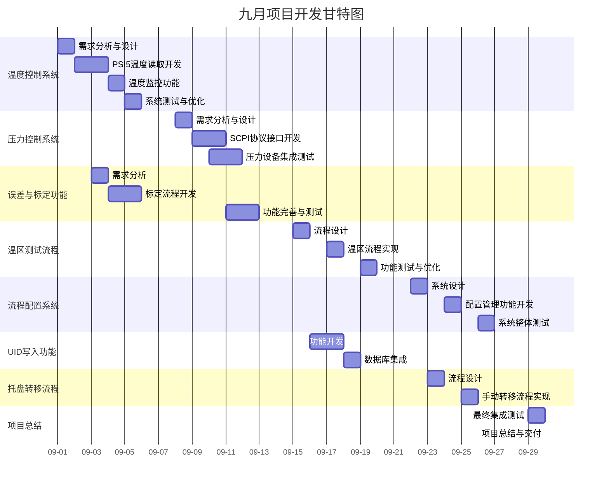

# 九月项目开发进度

> **更新时间**: 2025-08-29  
> **开发周期**: 2025-09-01 至 2025-09-30  
> **术语说明**: DUT(Device Under Test)=被测设备 | QC=质量控制 | SOP=标准操作程序

## 🎯 总体进度

- 🆕 **温度控制系统** (0%)
- 🆕 **压力控制系统** (0%)
- 🆕 **误差与标定功能** (0%)
- 🆕 **温区测试流程** (0%)
- 🆕 **流程配置系统** (0%)
- 🆕 **UID写入功能** (0%)
- 🆕 **托盘转移流程** (0%)

---

## 🆕 本月计划任务

### 核心功能开发

- **温度控制系统**: 实现从PSI5读取环境温度，开发温度监控与报警机制
- **压力控制系统**: 实现SCPI协议接口，支持压力值读写和标准判断
- **误差与标定功能**: 开发可配置的误差温区功能，集成标定DLL
- **温区测试流程**: 实现四个温区（低温、常低、常高、高温）的测试流程
- **流程配置系统**: 开发配置文件管理系统，支持一次加载所有流程
- **UID写入功能**: 实现UID写入功能，开发本地数据库存储
- **托盘转移流程**: 设计手动托盘转移流程和操作界面

---

## ✅ 已完成（汇总）

目前暂无已完成项目，将在开发过程中更新。

---

## 🔄 进行中任务

### 9月1-5日 — 第一周任务

- 🆕 温度控制系统开发启动
- 🆕 PSI5温度读取功能实现
- 🆕 误差与标定功能需求分析

### 9月8-12日 — 第二周任务

- 🆕 压力控制系统需求分析
- 🆕 SCPI协议接口开发
- 🆕 误差与标定功能完善

---

## 📅 任务排期表

### 第1周 (09-01 至 09-05)

- **09-01 周一**: 温度控制系统开发启动
- **09-02 周二**: PSI5温度读取功能实现
- **09-03 周三**: 误差与标定功能需求分析
- **09-04 周四**: 标定流程开发
- **09-05 周五**: 温度控制系统测试

### 第2周 (09-08 至 09-12)

- **09-08 周一**: 压力控制系统需求分析
- **09-09 周二**: SCPI协议接口开发
- **09-10 周三**: 压力设备集成测试
- **09-11 周四**: 误差与标定功能完善
- **09-12 周五**: 系统集成测试

### 第3周 (09-15 至 09-19)

- **09-15 周一**: 温区测试流程设计
- **09-16 周二**: UID写入功能开发
- **09-17 周三**: 温区流程实现
- **09-18 周四**: 数据库集成
- **09-19 周五**: 功能测试与优化

### 第4周 (09-22 至 09-26)

- **09-22 周一**: 流程配置系统设计
- **09-23 周二**: 托盘转移流程设计
- **09-24 周三**: 配置管理功能开发
- **09-25 周四**: 手动转移流程实现
- **09-26 周五**: 系统整体测试

### 第5周 (09-29 至 09-30)

- **09-29 周一**: 最终集成测试
- **09-30 周二**: 项目总结与交付

---

## 📊 甘特图 (09-01 至 09-30)

### 备用表格格式

| 项目/任务 | 09.01-05 | 09.08-12 | 09.15-19 | 09.22-26 | 09.29-30 |
|------------|---------|---------|---------|---------|---------|
| 温度控制系统 | ███ | - | - | - | - |
| 压力控制系统 | - | ███ | - | - | - |
| 误差与标定功能 | ███ | ███ | - | - | - |
| 温区测试流程 | - | - | ███ | - | - |
| 流程配置系统 | - | - | - | ███ | - |
| UID写入功能 | - | - | ███ | - | - |
| 托盘转移流程 | - | - | - | ███ | - |
| 项目总结 | - | - | - | - | ███ |

---

## 🚨 关键决策点

- **温度控制策略**: 预冷区域的温度控制由自动机、Tester还是设备自带逻辑负责
- **压力设备接口**: 压力测试设备的准备和SCPI协议接口确认
- **标定流程优化**: 标定四温区完整流程的优化和失败判定逻辑
- **温区测试顺序**: 四个温区测试顺序优化（低温、常低、高温、常高）
- **配置文件管理**: 流程配置文件的结构设计和管理员权限控制
- **数据库设计**: 本地数据库结构设计，支持UID写入和MES系统预留接口
- **手动流程设计**: 误差与标定功能的手动托盘转移流程设计
- **集成测试策略**: 各子系统的集成测试顺序和验证标准

---

## 📝 待办事项

### 温度控制系统

1. **PSI5温度读取功能**
   - 实现从PSI5读取环境温度的接口
   - 开发温度数据解析和处理逻辑
   - 实现温度数据的实时显示

2. **温度监控与报警**
   - 开发计量器件，定期判断设备温度是否满足设计标准
   - 实现超时报警功能（可设置超时时间，默认2分钟）
   - 添加温度异常处理机制

### 压力控制系统

1. **SCPI协议接口**
   - 实现SCPI协议接口，支持压力值读写
   - 开发压力设备通信驱动
   - 实现压力数据的实时监控

2. **压力测试功能**
   - 开发压力标准判断功能，支持可设置超时时间
   - 实现压力测试流程集成
   - 与夏令协调获取协议文档和压力设备

### 误差与标定功能

1. **标定流程开发**
   - 实现可配置的误差温区功能
   - 开发标定四温区完整流程
   - 实现失败判定与数据记录功能

2. **数据处理与存储**
   - 开发本地数据库存储误差值和阈值
   - 集成标定DLL，支持转换为input_txt格式
   - 实现标定结果的验证和报告生成

### 温区测试流程

1. **四温区流程实现**
   - 实现低温、常低、常高、高温四个温区的测试流程
   - 设计OTP写入位置在四个温区采集完成后执行
   - 评估并实现温区测试顺序优化

2. **流程优化与控制**
   - 开发温区间切换逻辑
   - 实现温区测试状态监控
   - 添加温区测试异常处理

### 流程配置系统

1. **配置管理功能**
   - 开发配置文件管理系统，支持一次加载所有流程
   - 实现类似工程管理的功能
   - 添加管理员权限控制，限制配置修改权限

2. **配置界面开发**
   - 设计用户友好的配置界面
   - 实现配置参数的验证和保存
   - 添加配置历史和版本管理

### UID写入功能

1. **UID写入实现**
   - 实现UID写入功能
   - 开发本地数据库存储功能
   - 预留MES系统接口

2. **数据管理**
   - 设计UID数据的存储结构
   - 实现UID数据的查询和管理
   - 添加UID写入状态监控

### 托盘转移流程

1. **手动转移流程**
   - 设计误差与标定功能的手动托盘转移流程
   - 开发相关提示和操作界面
   - 实现转移状态的跟踪和记录

2. **用户交互设计**
   - 设计直观的操作提示界面
   - 实现转移流程的步骤引导
   - 添加操作确认和安全机制

---

## 📈 整体进度统计

- **温度控制系统**: 0/4 任务完成 (0%)
- **压力控制系统**: 0/4 任务完成 (0%)
- **误差与标定功能**: 0/4 任务完成 (0%)
- **温区测试流程**: 0/4 任务完成 (0%)
- **流程配置系统**: 0/4 任务完成 (0%)
- **UID写入功能**: 0/4 任务完成 (0%)
- **托盘转移流程**: 0/4 任务完成 (0%)

**总体进度**: 0/28 任务完成 (0%)

---

## 📅 文档更新记录

- **创建时间**: 2025-08-29
- **下次更新**: 2025-09-06
- **文档版本**: v1.0
- **创建人**: 开发团队