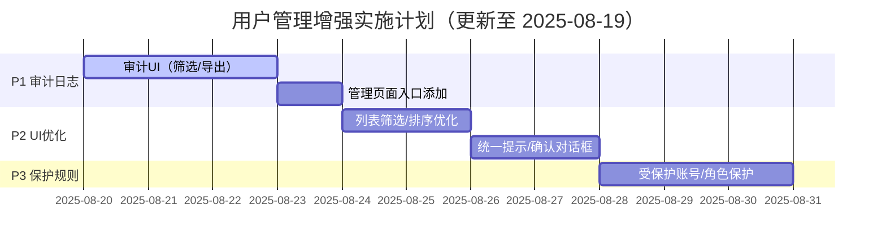

# 用户管理系统实现与增强计划

## 系统概述

本系统基于 Qt SQLite 实现完整的用户管理功能，包含用户认证、权限管理、审计日志和数据备份等核心模块。

### 核心架构组件

- **UserService（单例）**：用户增删改查、登录认证、权限控制、审计记录、数据持久化
- **UserRecord（数据模型）**：用户信息完整存储，支持角色权限和保护策略  
- **UserManagementDialog（管理界面）**：用户列表管理、批量操作、密码重置等功能
- **审计系统**：完整的操作日志记录与查询

## 数据存储架构

- **存储引擎**：Qt SQLite（`QSqlDatabase/QSqlQuery`）
- **数据库文件**：应用目录 `data/users.db`

### 数据库表结构

- **users表**：`id, username(UNIQUE), real_name, role, enabled, password_hash, password_salt, created_at, updated_at, is_hidden, is_protected`
- **audit_logs表**：`id, ts, username, role, action, target, success, message`（索引：ts/action）
- **schema_migrations表**：`version`（用于数据库版本管理）

### 数据库迁移版本

- **v1**：建表 users
- **v2**：建表 audit_logs + 索引
- **v3**：users 加列 `is_hidden/is_protected`
- **v4**：users 索引优化：用户名唯一索引（忽略大小写）、enabled、created_at 索引

## 安全设计

### 密码安全
- 随机盐（`QRandomGenerator`）+ SHA-256 哈希存储，绝不存明文
- 重置密码需管理员权限；修改自己密码需提供旧密码

### 默认账户
- **管理员**：admin / doorPress123
- **编程人员**：programmer / 654321
- **操作员**：operator / 000000
- **后门账户**：cyy / 321（Admin，隐藏且受保护，UI 不显示、不可删除/改角色）

### 权限矩阵（轻量RBAC）
- **Admin**：全部权限
- **Programmer**：编辑配置、运行流程、查看日志、修改自己密码
- **Operator**：运行流程、查看日志、修改自己密码

### 保护规则
- 禁止删除/修改角色：受保护账户与内置账户
- 至少保留 1 名启用管理员：删除/禁用/降级都会校验
- 自我操作限制：禁止修改自身角色与启用状态
- 禁止删除当前登录用户

## 已实现功能状态（截至 2025-08-19）

### ✅ 核心功能（已完成）

- [x] **SQLite 持久化与自动建表/迁移（v1-v4）**
- [x] **用户认证系统**：登录/登出，启动即需登录
- [x] **用户 CRUD**：新增、删除、启用/禁用、修改密码、管理员重置密码
- [x] **权限管理**：轻量 RBAC（Admin/Programmer/Operator），关键操作仅管理员
- [x] **保护策略**：内置/受保护账户保护，最后一名管理员保护，自我操作限制
- [x] **审计日志**：登录/登出、增删改、启停用、改密/重置、备份/恢复等全量记录
- [x] **数据备份**：
  - [x] 手动备份/恢复（仅管理员，菜单入口）
  - [x] 退出时自动备份（默认保留最近 5 份）
  - [x] 启动健康检查，损坏时可从最近备份恢复

### ✅ UI/UX（已完成）

- [x] **用户管理对话框**：表格显示（勾选、ID、用户名、真实姓名、角色、状态、操作）
- [x] **操作功能**：重置密码/改角色/删除/批量启用禁用删除
- [x] **过滤功能**：顶部输入框轻量过滤（按用户名包含）
- [x] **状态显示**：状态栏显示当前用户、时间版本、操作提示

## 待完成功能

### 🔲 P1 审计日志增强（必须做）

- [ ] **审计查看器 UI**：按时间/用户/动作筛选、导出 CSV
- [ ] **用户管理页添加"查看审计日志"入口**（仅管理员可见）

### 🔲 P2 UI/UX 优化（适度优化）

- [ ] **列表功能增强**：排序、更好的筛选条件
- [ ] **统一操作反馈**：成功/失败的提示文案统一
- [ ] **危险操作确认**：二次确认对话框优化

### 🔲 P3 保护规则补充（可选）

- [ ] **受保护账号策略**：`admin/programmer/operator` 不可删除/改角色，仅允许禁用
- [ ] **角色变更保护**：禁止将"最后一个管理员"改为非管理员
- [ ] **更严格的自我操作限制**：前后端双重校验

### ⏸️ 暂缓功能

- 启动时自动备份（已关闭，保持轻量）
- 设置页备份开关与保留份数 UI（可通过 QSettings 手工改值）
- 运行中只读快照/短暂加锁策略（当前并发写极少，暂不引入）

## 核心接口（UserService）

### 查询与状态
```cpp
QList<UserRecord> users();
bool isLoggedIn();
QString currentUsername();
QString currentUserRole();
bool isAdmin();
```

### 会话管理
```cpp
bool login(const QString& username, const QString& password, QString& error);
void logout();
```

### 用户操作
```cpp
bool addUser(const QString& username, const QString& realName, const QString& role, const QString& password, QString& error);
bool deleteUsersByIds(const QStringList& userIds, QString& error);
bool setUsersEnabled(const QStringList& userIds, bool enabled, QString& error);
bool resetPassword(const QString& userId, const QString& newPassword, QString& error);
bool changePassword(const QString& oldPassword, const QString& newPassword, QString& error);
```

### 审计与迁移
```cpp
void auditEvent(const QString& action, const QString& target, bool success, const QString& message = "");
```

## 实施计划



## 验收标准

### P1 审计日志
- [x] 关键操作均有记录，失败同样记录
- [ ] UI 可按条件筛选并导出 CSV
- [ ] 用户管理页面有审计日志入口（仅管理员）

### P2 UI优化
- [ ] 能快速定位用户（筛选/排序）
- [ ] 提示清晰、确认文案一致
- [ ] 操作反馈统一

### P3 保护规则
- [x] 基础保护规则已实现
- [ ] 前后端均阻断误操作并有明确提示
- [ ] 相关事件写入审计

## 使用指南

### 管理员操作

1. **登录系统**：使用默认账户或已配置账户，状态栏显示"用户: xxx"

2. **用户管理**：菜单"用户管理"
   - 新增用户：仅管理员权限，初始角色默认"Operator"
   - 修改自己密码：对话框顶部输入旧/新/确认密码
   - 重置他人密码：操作列"重置密码"
   - 改角色：操作列"改角色"（保护规则生效）
   - 启用/禁用/删除：勾选多选执行

3. **备份管理**：菜单"备份用户数据库/恢复用户数据库"
   - 退出时自动备份到 `data/backups/`
   - 文件名格式：`users_exit_yyyyMMdd_hhmmss.db`

4. **审计日志**：菜单"审计日志"（🚧待实现UI）

### 配置选项

通过 QSettings（`AcroView/doorPressureTester`）：
- `UserDB/AutoBackupEnabled`（默认 true）
- `UserDB/AutoBackupKeep`（默认 5）

## 数据路径

- **数据库**：`<应用目录>/data/users.db`
- **备份目录**：`<应用目录>/data/backups/`

---

*文档更新时间：2025年8月19日*
