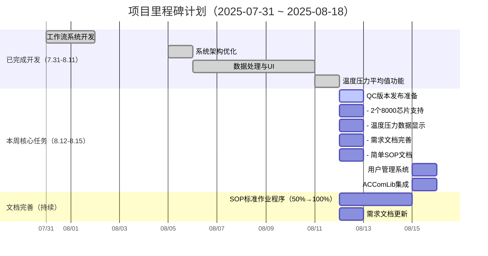

# 八月项目开发 TodoList

> **更新时间**: 2025年8月11日 | **开发周期**: 7.31-8.18（进行中）

## 🎯 总体进度

- [X] 工作流系统 (100%)
- [X] 系统架构优化 (100%)
- [X] 数据处理与UI (100%)
- [ ] 文档编写 (25%)

---

## ✅ 已完成 (25/28)

### 8月1日完成

- [X] 修复LoopBack循环问题 - JsonWorkflowRunner跳转逻辑
- [X] 添加芯片信号超时机制 - 10秒超时通知
- [X] 寄存器操作配置优化 - 读写参数格式修正
- [X] 智能芯片计数实现 - 动态适配标定/误差阶段

### 8月2日完成

- [X] 线程安全机制优化 - QMutex崩溃修复
- [X] UI组件重构 - 温区表格状态同步
- [X] 工作流系统全面优化 - 异步信号传递

### 8月5日完成

- [X] 项目构建系统重构 - 目录结构统一，4.3MB释放
- [X] CSV数据过滤修复 - SocketIndex过滤逻辑
- [X] 设备资源管理系统 - 多站点设备分配

### 8月6日完成

- [X] 工作流配置管理 - 导出/加载功能
- [X] 数据保存测试界面 - 4种测试模式，DUT-X格式
- [X] UI交互优化 - 样式管理器，错误处理
- [X] 时间显示修复 - LotEnd多格式解析
- [X] 暂停/继续功能 - 多层级控制实现
- [X] 日志系统统一 - LOG_INFO集成

### 8月11日完成

- [X] 统一温度和压力求平均值功能 - 数据处理一致性优化
- [X] QC构建专属手动workflow - 发布质量控制流程
- [X] SOP标准作业程序 - 完成50%内容编写

---

## 🔄 进行中 (1/25)

- [ ] **需求文档编写** - 基于实际开发成果更新技术方案 (75%完成，还需1天)

---

## ⏳ 待开始 (2/25)

- [ ] **用户管理系统** - 实现用户权限管理功能 (预计1天)
- [ ] **ACComLib集成** - 参考MultiAprog\trunk\ACICTComMes实现通信库 (预计1天)

---

## 🚨 注意事项

- **需求文档**: 要基于实际完成的22个功能点来写，不是原来的计划
- **SOP文档**: 重点写工作流系统、设备管理、数据保存的操作流程
- **设计文档**: 突出智能工作流引擎和设备资源管理的技术架构

---

## 💡 后续可能的新功能 (备忘)

- [ ] dut的流水线标定和测试这一步骤需要确认具体的内容

  - [ ] 如何对64个DUT做好标记 也就是16个芯片在四个温区的转移之后 需要统一数据
  - [ ] 需要同时记录采样数据或四个温区结束后统一实现数据的合并
  - [ ] 确认四个温区的数据格式csv表格定义
  - [ ] 目前的定义是温度 压力采样都需要取平均值进行处理
  - [ ] 保存的文件夹需要可以设置 一般是在设置页面进行实现 我们的软件得到DUT-X-Sample.csv 然后经过客户的exe 校准结果保存到DUT-X-OTPResult.csv 都有具体的格式说明的 需要注意修改
- [ ] **DUT-X-OTPRESULT**.**CSV 格式**

  - [X] 目前已根据定义格式完成
- [ ] customtag仍需更新

  - [ ] powerctrl模式需要确认
  - [ ] regopt和regverify和目前寄存器读写的差别
  - [ ] 
- [ ] 工作流定义 计算误差的步骤目前没有
- [X] 设置温区温度之后 需要读取温区温度 如何实现 --已完成
- [X] 设备状态监控面板 --已完成
- [X] 数据分析和报告生成
- [ ] 远程设备控制接口
- [ ] 用户权限管理系统

---

**进度统计**: 25/28 任务完成 (89%)，主要开发工作已完成，文档整理中

---

## 📌 今日更新（2025-08-11）

- **统一温度和压力求平均值功能** - 实现了温度和压力数据的统一平均值计算，确保数据处理的一致性
- **QC构建专属手动workflow** - 为发布QC版本构建了专门的手动工作流程，提升发布质量控制
- **SOP文档进度** - 完成SOP标准作业程序50%的内容，包含核心操作流程和规范

## 📌 历史更新（2025-08-08）

- 需求文档（SRD）已完成并合并至仓库（docs/SoftwareRequirementsDocument.md）
- 工作流说明、步骤规范与验收标准已纳入SRD（3.5.6~3.5.8）
- 完成设置页面对于门压测试的支持，目前数据根据需求文档保存到指定文件夹并在otp和误差检测时加载对应cache文件
- 优化设置页面的qss设计

## ❗ 本周任务清单（高优先级）

### 8月12日任务--已完成

- **QC版本发布** - 版本发出来到QC，手动模式
  - 2个8000芯片支持
  - 温度压力数据显示功能
  - 需求文档完善
  - 简单的SOP文档

### 8月15日任务

- **用户管理系统** - 实现用户权限管理功能
- **ACComLib集成** - 参考MultiAprog\trunk\ACICTComMes实现通信库

**本周专注**: 只做这两个核心任务，确保质量和进度

## 📅 任务排期（跳过周末）

- 2025-08-08（周五）
  - 自动机对接 1.1 轮次1/2（Day 1/2）
- 2025-08-11（周一）
  - 自动机对接 1.1 轮次1/2（Day 2/2）
- 2025-08-12（周二）
  - 自动机对接 1.2 加载不同JSON并修改SProtocol（1天）
- 2025-08-13（周三）
  - 自动机对接 1.3 修改VAuto并进行测试（1天）
- 2025-08-14（周四）
  - 压力采集与控制 2.1 采集格式适配与实现（1天）
- 2025-08-15（周五）
  - 压力采集与控制 2.2 压力设备控制（文档+模拟设备）Day 1/2
- 2025-08-18（周一）
  - 压力采集与控制 2.2 压力设备控制（文档+模拟设备）Day 2/2
- 2025-08-19（周二）
  - SOP标准作业程序（3.2，1天）
- 2025-08-20（周三）至 2025-08-26（周二）
  - 软件详细设计（3.3，5个工作日；跨周末自动顺延）

备注：若过程中出现设备联调阻塞，可将SOP/设计文档提前插入空档日，保证整体进度。

## 📊 甘特图（更新至8月11日）

## 📌 今日更新（2025-08-08）

- 时间线已对齐 2025-07-31 开始；当前完成度已同步至甘特图（done 标记）。
