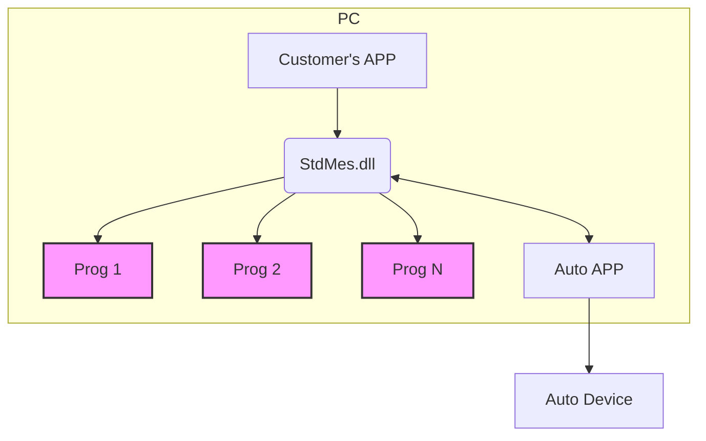
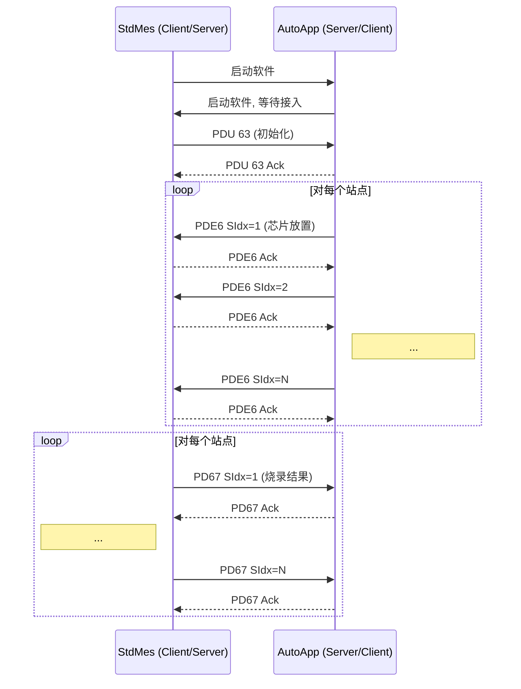

好的，这是根据您提供的文档转换的 Markdown 文件。文档中的所有信息都已尽可能准确地转录。对于不明确或可能存在笔误的地方，已添加了 `[存疑]` 标记和说明。

---

# StdMes与自动化设备的通信协议

**MODEL AP8X000 SERIES HARDWARE DOCUMENT**
**DOCUMENT NUMBER: A8X00-001**

## 引言

本文档用于说明 StdMes 与自动化设备的通信协议及操作流程。

## 本档案适用对象

*   技术支持工程师
*   维护工程师

## 版本记录

| 文档版本 | 文档编者 | 发布日期   | 修改说明                                                     |
| :------- | :------- | :--------- | :----------------------------------------------------------- |
| V1.0     | Jony     | 2017/03/09 | ● 初稿拟定                                                   |
| V2.3     | Jony     | 2018/05/07 | ● 新增 InsertionCheck 功能，E8 和 68 功能码                  |
| V2.4     | Jony     | 2018/12/07 | ● 新增 64 功能码, 自动化设置有机会告知客户的座子选择         |
| V2.5     | Jony     | 2020/06/15 | 修改部分描述错误                                             |
| V2.6     | Jony     | 2021/11/03 | 增加E7功能码                                                 |
| V3.0     | LJ       | 2024/03/25 | 增加附加功能开批结批                                         |
| V4.0     | ZJX      | 2024/06/25 | 扩展至64Socket                                               |
| V4.1     | ZJX      | 2024/06/27 | 修改63功能码                                                 |
| V4.2     | ZJX      | 2024/09/14 | 修改E6与63功能码示例                                         |
| V4.3     | JWL      | 2025/04/23 | 增加E1与61功能码                                             |
| V4.4     | ZJX      | 2025/05/19 | 修改接触检查功能E8 & 68功能码的说明与示例                    |
| V4.5     | ZJX      | 2025/05/23 | 增加残料检测功能E5 & 65功能码<br>修改63、E6 & 67的功能码示例<br>修改E6与63功能码示例 |

---

## 1 系统框图


*图1-1 系统框图*

上图中显示了整个系统的框图，其中：
1.  **StdMes.dll** 负责控制 N 个编程器 Prog1-N。
2.  **AutoApp** 负责控制自动化设备 Auto Device。
3.  **Customer's APP** 为客户自己实现的 APP，通过调用 StdMes.dll 进行量产任务操作。

---

## 2 StdMes 与 Auto App 的协议说明

StdMes 与 Auto APP 之间采用 Socket 进行信息通信，协议使用 TCP 协议，IP 地址使用本机回环地址 `127.0.0.1`。

*   **StdMes 端:** Client 端口为 `64100`，Server 端口号为 `64101`；
*   **AutApp 端:** Server 端口为 `64100`，Client 端口号为 `64101`；

### 2.1 应用层协议说明

| 包标志 (2个字节) | 包功能 (1个字节) | 包数据长度 (1字节) | 包数据 (N个字节) | 包校验 (1个字节) |
| :--- | :--- | :--- | :--- | :--- |

发送的包字节序如上图所示：

* **包标志 (PFLAG):**
    占 2 个字节，指示包的信息标志。
    *   数据从 **StdMes → AutoApp** 的包固定为 `SA` 这两个字符。
    *   数据从 **AutoApp → StdMes** 的包固定为 `AS` 这两个字符。

* **包功能 (PDU):**
    占 1 个字节，指明该包所携带的数据功能，不同的包功能所携带的数据长度和字节数是不一样的。

* **包数据长度 (PLEN):**
    占 1 个字节，表明后面的包数据占多少个字节，假设为 N，N>=0。

* **包数据 (PDATA):**
    占 N 个字节，为实际的传输数据，不同的包功能需要传输的实际数据是不一样的。具体含义参看后面说明。

* **包校验 (PCRC):**
    占 1 个字节，从包标志开始到包数据结束的所有字节的累加和。
    C 语言示例代码如下：
    ```c
    BYTE GetChkSum(BYTE *pPckData, INT Size)
    {
        INT i;
        BYTE Sum=0;
        for(i=0; i<Size; ++i){
            Sum += *(pPckData+i);
        }
        return Sum;
    }
    ```
    假设从包标志到包数据结束的字节综合为 `4+N`，已经放在 `PckData` 中，调用如下：
    `PCRC = GetChkSum(PckData, 4+N)`

> **注意：** 无论是 StdMes 还是 AutoApp 发起的包，对方都需要对包进行 ACK 回复。

### 2.2 包功能码 PDU 说明

#### 2.2.1 PDU: `0x63` StdMes 告知 AutoApp 初始化情况

**功能包:**
| 数据域 | 值(16进制表示) | 说明                                                         |
| :----- | :------------- | :----------------------------------------------------------- |
| PFLAG  | `0x5341`       | 表示 `SA` 两个字符                                           |
| PDU    | `0x63`         | StdMes 告知 AutoApp 芯片烧录结果 `[存疑: 根据内容应为初始化情况]` |
| PLEN   | XX             | (站点总个数 * 单个站点最大 Socket 数) / 8 + 2                |
| PDATA  | XX             | 参看后面说明                                                 |
| PCRC   | XX             | 通过公式计算得到                                             |

**PDATA 说明:**
| 字节序  | 占用字节数             | 值(16进制表示)   | 说明                                                         |
| :------ | :--------------------- | :--------------- | :----------------------------------------------------------- |
| SiteCnt | 1                      | 0x02             | 初始化站点数量                                               |
| SKTCnt  | 1                      | 0x40             | 单个站点最大 Socket 数                                       |
| SiteEn  | (SiteCnt * SKTCnt) / 8 | FFFFFFFFFFFFFFFF | 每个站点最多有 64 个 Socket, bit0-63 表示 Socket1-64。使能时相应的位要置 1, 否则为 0。 |

**示例:**
*   **单个站点最大支持 8 座子时:** `5341630402080FF0XX`
    StdMes 告知 AutoApp 有 2 个站点，单个站点最大 8 个座子。1 站点 Socket01-04 有效，其余无效。2 站点 Socket05-08 有效，其余无效。 `[存疑: 根据0xFF0F，应为1站点S1-S4有效，2站点S5-S8无效]`

*   **单个站点最大支持 16 座子时:** `5341630602100F0000F0XX`
    StdMes 告知 AutoApp 有 2 个站点，单个站点最大 16 个座子。1 站点 Socket01-04 有效，其余无效。2 站点 Socket13-16 有效，其余无效。

*   **单个站点最大支持 64 座子时:** `5341631202400F000000000000000000000000000000F0XX`
    StdMes 告知 AutoApp 有 2 个站点，单个站点最大 64 个座子。1 站点 Socket1-4 有效，其余无效。2 站点 Socket61-64 有效，其余无效。

**应答包:**
接收到该包之后 AutoAPP 要发送 ACK 包，表明接收情况。
| 数据域 | 值(16进制表示) | 说明               |
| :----- | :------------- | :----------------- |
| PFLAG  | `0x4153`       | 表示 `AS` 两个字符 |
| PDU    | `0x63`         |                    |
| PLEN   | 1              |                    |
| PDATA  | XX             | 参看后面说明       |
| PCRC   | XX             | 通过公式计算得到   |

**PDATA 说明:**
| 字节序  | 占用字节数 | 说明                          |
| :------ | :--------- | :---------------------------- |
| ErrCode | 1          | 错误码 (0 为成功，其余为错误) |

**示例:**
`4153630100XX`
表明 AutoApp 顺利接收到 0x63 请求包。

#### 2.2.2 PDU: `0xE6` AutoApp 告诉 StdMes 芯片放置情况

**功能包:**
| 数据域 | 值(16进制表示) | 说明                                                         |
| :----- | :------------- | :----------------------------------------------------------- |
| PFLAG  | `0x4153`       | 表示 `AS` 两个字符                                           |
| PDU    | `0xE6`         | AutoApp 告诉 StdMes 芯片放置情况                             |
| PLEN   | XX             | 单个站点最大 Socket 数 `[存疑: 根据内容应为 (单个站点最大Socket数/8)+1]` + 1 |
| PDATA  | XX             | 参看后面说明                                                 |
| PCRC   | XX             | 通过公式计算得到                                             |

**PDATA 说明:**
| 字节序  | 占用字节数                               | 值(16进制表示) `[存疑: 此列为二进制示例]` | 说明                                                         |
| :------ | :--------------------------------------- | :---------------------------------------- | :----------------------------------------------------------- |
| SiteIdx | 1                                        | 0x04                                      | 被请求的芯片放置站点编号                                     |
| SKTEn   | 单个站点最大 Socket 数 `[存疑: 应为 /8]` | 01010101...                               | 每个站点最多有 64 个 Socket, 对应位置 1 表示有芯片放入, 为 0 表示没有芯片放入。 |

**示例:**
*   **单个站点最大支持 8 座子时:** `4153E609040101010100000000XX`
    AutoApp 告诉 StdMes 4 号站点芯片放置成功，SKT1-4 已经放入芯片，其他 SKT 未放入芯片。接收到这个包之后，StdMes 开始启动 4 号站点进行测试操作。

*   **单个站点最大支持 16 座子时:** `4153E6110401010101000000000101010100000000XX`
    AutoApp 告诉 StdMes 4 号站点芯片放置成功，SKT01-04 已经放入芯片，SKT09-12 已经放入芯片，其他 SKT 未放入芯片。接收到这个包之后，StdMes 开始启动 4 号站点进行测试操作。

*   **单个站点最大支持 64 座子时:** `4153E6410401010101...XX`
    AutoApp 告诉 StdMes 4 号站点芯片放置成功，SKT1-4 已经放入芯片，其他 SKT 未放入芯片。接收到这个包之后，StdMes 开始启动 4 号站点进行测试操作。

**应答包:**
接收到该包之后，StdMes 会回应 ACK 包。
| 数据域 | 值(16进制表示) | 说明               |
| :----- | :------------- | :----------------- |
| PFLAG  | `0x5341`       | 表示 `SA` 两个字符 |
| PDU    | `0xE6`         |                    |
| PLEN   | 1              |                    |
| PDATA  | XX             | 参看后面           |
| PCRC   | XX             | 通过公式计算得到   |

**PDATA 说明:**
| 字节序  | 占用字节数 | 说明   |
| :------ | :--------- | :----- |
| ErrCode | 1          | 错误码 |

**示例:**
`5341E60100XX`
表明 StdMes 顺利接收到 0xE6 请求包。

#### 2.2.3 PDU: `0x67` StdMes 告知 AutoApp 芯片烧录结果

**功能包:**
| 数据域 | 值(16进制表示) | 说明                             |
| :----- | :------------- | :------------------------------- |
| PFLAG  | `0x5341`       | 表示 `SA` 两个字符               |
| PDU    | `0x67`         | StdMes 告知 AutoApp 芯片烧录结果 |
| PLEN   | XX             | 单个站点最大 Socket 数 + 1       |
| PDATA  | XX             | 参看后面说明                     |
| PCRC   | XX             | 通过公式计算得到                 |

**PDATA 说明:**
| 字节序  | 占用字节数             | 值(16进制表示)     | 说明                                                         |
| :------ | :--------------------- | :----------------- | :----------------------------------------------------------- |
| SiteIdx | 1                      | 0x04               | 站点编号                                                     |
| Result  | 单个站点最大 Socket 数 | 0101...<br>0202... | 每个站点最多有 64 个 Socket, 对应位置为烧录结果：<br>01. Bin1(PASS)<br>02. Bin2 分类2<br>03. Bin3 分类3<br>04. Bin4 分类4<br>... |

**示例:**
*   **单个站点最大支持 8 座子时:** `53416709040101020203030404XX`
    StdMes 告知 AutoApp 4 号站点的:
    *   SKT01-02 Bin1(PASS)
    *   SKT03-04 Bin2
    *   SKT05-06 Bin3
    *   SKT07-08 Bin4

*   **单个站点最大支持 64 座子时:** `534167410401...02...03...04...XX`
    StdMes 告知 AutoApp 4 号站点的:
    *   SKT01-16 Bin1(PASS)
    *   SKT17-32 Bin2
    *   SKT33-48 Bin3
    *   SKT49-64 Bin4

**应答包:**
接收到该包之后 AutoAPP 要发送 ACK 包，表明接收情况。
| 数据域 | 值(16进制表示) | 说明               |
| :----- | :------------- | :----------------- |
| PFLAG  | `0x4153`       | 表示 `AS` 两个字符 |
| PDU    | `0x67`         |                    |
| PLEN   | 1              |                    |
| PDATA  | XX             | 参看后面说明       |
| PCRC   | XX             | 通过公式计算得到   |

**PDATA 说明:**
| 字节序  | 占用字节数 | 说明   |
| :------ | :--------- | :----- |
| ErrCode | 1          | 错误码 |

**示例:**
`4153670100XX`
表明 AutoApp 顺利接收到 0x67 请求包。

#### 2.2.4 PDU: `0xE1` AutoApp 请求 StdMes 软件版本信息

**功能包:**
| 数据域 | 值(16进制表示)                   | 说明                               |
| :----- | :------------------------------- | :--------------------------------- |
| PFLAG  | `0x5341` `[存疑:应为0x4153, AS]` | 表示 `SA` 两个字符 `[存疑:应为AS]` |
| PDU    | `0xE1`                           | AutoApp 请求 StdMes 软件版本信息   |
| PLEN   | `0x00`                           | 代表长度 0                         |
| PDATA  | (无)                             |                                    |
| PCRC   | XX                               | 通过公式计算得到                   |

**示例:**
`53 41 E1 00 XX` `[存疑:应为 41 53 E1 00 XX]`

**应答包:**
接收到该包之后 StdMes 要发送 ACK 包，表明接收情况。
| 数据域 | 值(16进制表示)                   | 说明                               |
| :----- | :------------------------------- | :--------------------------------- |
| PFLAG  | `0x4153` `[存疑:应为0x5341, SA]` | 表示 `AS` 两个字符 `[存疑:应为SA]` |
| PDU    | `0xE1`                           |                                    |
| PLEN   | 1                                |                                    |
| PDATA  | XX                               | 参看后面说明                       |
| PCRC   | XX                               | 通过公式计算得到                   |

**PDATA 说明:**
| 字节序  | 占用字节数 | 说明   |
| :------ | :--------- | :----- |
| ErrCode | 1          | 错误码 |

#### 2.2.5 PDU: `0x61` StdMes 告知 AutoApp 软件版本信息

**功能包:**
| 数据域 | 值(16进制表示) | 说明                                |
| :----- | :------------- | :---------------------------------- |
| PFLAG  | `0x5341`       | 表示 `SA` 两个字符                  |
| PDU    | `0x61`         | StdMes 告知 AutoApp 软件版本信息    |
| PLEN   | `0x01`         | 代表长度 1 `[存疑: 根据PDATA应为2]` |
| PDATA  | XX             | 参看后面说明                        |
| PCRC   | XX             | 通过公式计算得到                    |

**PDATA 说明:**
| 字节序  | 占用字节数 | 说明                            |
| :------ | :--------- | :------------------------------ |
| Version | 1          | 0x01: 标准 StdMes<br>0x02: AG06 |

**示例:**
`53 41 61 01 02 F8` `[存疑: PLEN应为02]`

**应答包:**
接收到该包之后 AutoAPP 要发送 ACK 包，表明接收情况。
| 数据域 | 值(16进制表示) | 说明               |
| :----- | :------------- | :----------------- |
| PFLAG  | `0x4153`       | 表示 `AS` 两个字符 |
| PDU    | `0x61`         |                    |
| PLEN   | 1              |                    |
| PDATA  | XX             | 参看后面说明       |
| PCRC   | XX             | 通过公式计算得到   |

**PDATA 说明:**
| 字节序  | 占用字节数 | 说明   |
| :------ | :--------- | :----- |
| ErrCode | 1          | 错误码 |

#### 2.2.6 PDU: `0xE8` AutoApp 请求 StdMes 执行接触检查功能判断是否有 IC 放入

**功能包:**
| 数据域 | 值(16进制表示) | 说明                                                   |
| :----- | :------------- | :----------------------------------------------------- |
| PFLAG  | `0x4153`       | 表示 `AS` 两个字符                                     |
| PDU    | `0xE8`         | AutoApp 请求 StdMes 执行接触检查功能判断是否有 IC 放入 |
| PLEN   | XX             | 单个站点最大 Socket 数 / 8 + 1                         |
| PDATA  | XX             | 参看后面说明                                           |
| PCRC   | XX             | 通过公式计算得到                                       |

**PDATA 说明:**
| 字节序  | 占用字节数                 | 值(16进制表示) `[存疑: 此列为二进制示例]` | 说明                                                         |
| :------ | :------------------------- | :---------------------------------------- | :----------------------------------------------------------- |
| SiteIdx | 1                          | 0x04                                      | 被请求的芯片放置站点编号                                     |
| SKTEn   | 单个站点最大 Socket 数 / 8 | 01010101...                               | 每个站点最多有 64 个 Socket, 对应位置 1 表示有芯片放入, 为 0 表示没有芯片放入。 |

**示例:**
*   **单个站点最大支持 8 座子时:** `4153E809040101010101010101XX`
    AutoApp 请求 StdMes 在 4 号站点执行接触检查命令, SKT01-08 已经放入芯片。接收到这个包之后, StdMes 开始启动 4 号站点进行接触检查。

*   **单个站点最大支持 64 座子时:** `4153E8410401010101...XX`
    AutoApp 请求 StdMes 在 4 号站点执行接触检查命令, SKT1-4 已经放入芯片, 其他 SKT 未放入芯片。接收到这个包之后, StdMes 开始启动 4 号站点进行接触检查。

**应答包:**
接收到该包之后, StdMes 会回应 ACK 包。
| 数据域 | 值(16进制表示) | 说明               |
| :----- | :------------- | :----------------- |
| PFLAG  | `0x5341`       | 表示 `SA` 两个字符 |
| PDU    | `0xE8`         |                    |
| PLEN   | `0x01`         |                    |
| PDATA  | XX             | 参看后面           |
| PCRC   | XX             | 通过公式计算得到   |

**PDATA 说明:**
| 字节序  | 占用字节数 | 说明   |
| :------ | :--------- | :----- |
| ErrCode | 1          | 错误码 |

**示例:**
`5341E80100XX`
表明 StdMes 顺利接收到 0xE8 请求包。

#### 2.2.7 PDU: `0x68` StdMes 告知接触检查命令执行结果

**功能包:**
| 数据域 | 值(16进制表示) | 说明                            |
| :----- | :------------- | :------------------------------ |
| PFLAG  | `0x5341`       | 表示 `SA` 两个字符              |
| PDU    | `0x68`         | StdMes 告知接触检查命令执行结果 |
| PLEN   | XX             | 单个站点最大 Socket 数 + 2      |
| PDATA  | XX             | 参看后面说明                    |
| PCRC   | XX             | 通过公式计算得到                |

**PDATA 说明:**
| 字节序  | 占用字节数             | 值(16进制表示)           | 说明                                                         |
| :------ | :--------------------- | :----------------------- | :----------------------------------------------------------- |
| SiteIdx | 1                      | 0x04                     | 站点编号                                                     |
| AdpCnt  | 1                      | 0x40 `[存疑:应为座子数]` | 座子个数                                                     |
| Result  | 单个站点最大 Socket 数 | 0202...0101...           | 每个站点最多有 64 个 Socket, 对应位置为检查结果：<br>00. 无 Socket 无 IC<br>01. 有 Socket 无 IC<br>02. 有 Socket 有 IC<br>... |

**示例:**
*   **单个站点最大支持 8 座子时:** `5341680A04080202020201010101XX`
    StdMes 告知 AutoApp 4 号站点有 8 个座子位置, 其中 SKT01-04 有 IC, SKT05-08 无 IC。

> **注意：** 当芯片不支持接触检查功能时, StdMes 要回复 02 (有 Socket 有 IC)。

**应答包:**
接收到该包之后 AutoAPP 要发送 ACK 包，表明接收情况。
| 数据域 | 值(16进制表示) | 说明               |
| :----- | :------------- | :----------------- |
| PFLAG  | `0x4153`       | 表示 `AS` 两个字符 |
| PDU    | `0x68`         |                    |
| PLEN   | 1              |                    |
| PDATA  | XX             | 参看后面说明       |
| PCRC   | XX             | 通过公式计算得到   |

**PDATA 说明:**
| 字节序  | 占用字节数 | 说明   |
| :------ | :--------- | :----- |
| ErrCode | 1          | 错误码 |

**示例:**
`4153680100XX`
表明 AutoApp 顺利接收到 0x68 请求包。

#### 2.2.8 PDU: `0xE5` AutoApp 请求 StdMes 执行残料检查功能判断是否有 IC 放入

`[存疑: 此功能与 0xE8 功能几乎完全相同，请确认是否为同一功能的不同别名或有细微差异]`

**功能包:**
| 数据域 | 值(16进制表示) | 说明                                                   |
| :----- | :------------- | :----------------------------------------------------- |
| PFLAG  | `0x4153`       | 表示 `AS` 两个字符                                     |
| PDU    | `0xE5`         | AutoApp 请求 StdMes 执行残料检查功能判断是否有 IC 存在 |
| PLEN   | XX             | 单个站点最大 Socket 数 / 8 + 1                         |
| PDATA  | XX             | 参看后面说明                                           |
| PCRC   | XX             | 通过公式计算得到                                       |

**PDATA 说明:**
| 字节序  | 占用字节数                 | 值(16进制表示) `[存疑: 此列为二进制示例]` | 说明                                                         |
| :------ | :------------------------- | :---------------------------------------- | :----------------------------------------------------------- |
| SiteIdx | 1                          | 0x04                                      | 被请求的芯片放置站点编号                                     |
| SKTEn   | 单个站点最大 Socket 数 / 8 | 01010101...                               | 每个站点最多有 64 个 Socket, 对应位置 1 表示有芯片存在, 为 0 表示没有芯片存在。 |

**示例:**
*   **单个站点最大支持 8 座子时:** `4153E509040101010101010101XX`
    AutoApp 请求 StdMes 在 4 号站点执行残料检查命令, SKT01-08 已经放入芯片。接收到这个包之后, StdMes 开始启动 4 号站点进行残料检查。

**应答包:**
接收到该包之后, StdMes 会回应 ACK 包。
| 数据域 | 值(16进制表示) | 说明               |
| :----- | :------------- | :----------------- |
| PFLAG  | `0x5341`       | 表示 `SA` 两个字符 |
| PDU    | `0xE5`         |                    |
| PLEN   | `0x01`         |                    |
| PDATA  | XX             | 参看后面           |
| PCRC   | XX             | 通过公式计算得到   |

**PDATA 说明:**
| 字节序  | 占用字节数 | 说明   |
| :------ | :--------- | :----- |
| ErrCode | 1          | 错误码 |

**示例:**
`5341E50100XX`
表明 StdMes 顺利接收到 0xE5 请求包。

#### 2.2.9 PDU: `0x65` StdMes 告知残料检查命令执行结果

`[存疑: 此功能与 0x68 功能几乎完全相同，请确认是否为同一功能的不同别名或有细微差异]`

**功能包:**
| 数据域 | 值(16进制表示) | 说明                            |
| :----- | :------------- | :------------------------------ |
| PFLAG  | `0x5341`       | 表示 `SA` 两个字符              |
| PDU    | `0x65`         | StdMes 告知残料检查命令执行结果 |
| PLEN   | XX             | 单个站点最大 Socket 数 + 2      |
| PDATA  | XX             | 参看后面说明                    |
| PCRC   | XX             | 通过公式计算得到                |

**PDATA 说明:**
| 字节序  | 占用字节数             | 值(16进制表示)           | 说明                                                         |
| :------ | :--------------------- | :----------------------- | :----------------------------------------------------------- |
| SiteIdx | 1                      | 0x04                     | 站点编号                                                     |
| AdpCnt  | 1                      | 0x40 `[存疑:应为座子数]` | 座子个数                                                     |
| Result  | 单个站点最大 Socket 数 | 0202...0101...           | 每个站点最多有 64 个 Socket, 对应位置为检查结果：<br>00. 无 Socket 无 IC<br>01. 有 Socket 无 IC<br>02. 有 Socket 有 IC<br>... |

**示例:**
*   **单个站点最大支持 8 座子时:** `5341650A04080202020201010101XX`
    StdMes 告知 AutoApp 4 号站点有 8 个座子位置, 其中 SKT01-04 有 IC, SKT05-08 无 IC。

> **注意：** 当芯片不支持残料检查功能时, StdMes 要回复 01 (有 Socket 无 IC)。

**应答包:**
接收到该包之后 AutoAPP 要发送 ACK 包，表明接收情况。
| 数据域 | 值(16进制表示) | 说明               |
| :----- | :------------- | :----------------- |
| PFLAG  | `0x4153`       | 表示 `AS` 两个字符 |
| PDU    | `0x65`         |                    |
| PLEN   | 1              |                    |
| PDATA  | XX             | 参看后面说明       |
| PCRC   | XX             | 通过公式计算得到   |

**PDATA 说明:**
| 字节序  | 占用字节数 | 说明   |
| :------ | :--------- | :----- |
| ErrCode | 1          | 错误码 |

**示例:**
`4153650100XX`
表明 AutoApp 顺利接收到 0x65 请求包。

---

### 2.3 流程说明

**图2-1 功能码发送流程**
```mermaid
graph TD
    A[开始] --> B[Auto APP软件开启,<br>客户设置相应的参数];
    B --> C[客户自己的客户端<br>开启, 启动StdMes];
    C --> D[StdMes发送PDU63];
    D --> E{E8的请求非必须,<br>一般也就在整个生产过程首尾,<br>用于自动化确认<br>是否有芯片在座子内部残留};
    E --> F[Auto App请求执行E8,<br>StdMes返回0x68];
    F --> G[StdMes等待PDUE6];
    C --> H[根据客户设置初始<br>化相关站点使能];
    G --> I[开始进行烧录];
    I --> J[StdMes发送PDU64 `[存疑:应为0x67]`];
    J --> K[StdMes等待PDUE4 `[存疑:应为ACK]`];
    K --> L{量产是否结束?};
    L -- 否 --> I;
    L -- 是 --> M[Auto App请求执行E8,<br>StdMes返回0x68];
    M --> N[结束];
```
> **注意：** 无论功能包是哪方发起的，另外一方都需要进行及时应答，如果在 2s 内没有应答则会触发重传机制，如果重传超过 3 次，则要提示用户出错。

**图2-2 端口发送功能包时序图**


---

### 错误码定义

| 错误码值 ErrCode | 定义         |
| :--------------- | :----------- |
| `0x00`           | 没有错误     |
| `0x01`           | 出现错误     |
| `0x02`           | 不支持该 PDU |
| `0x03`           | CRC 错误     |