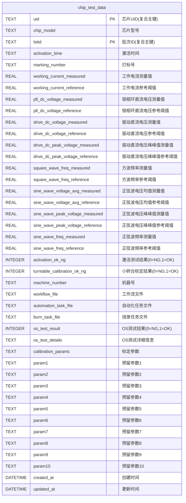
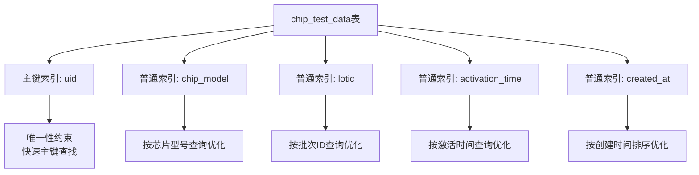
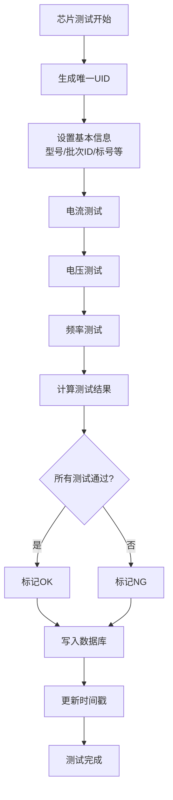
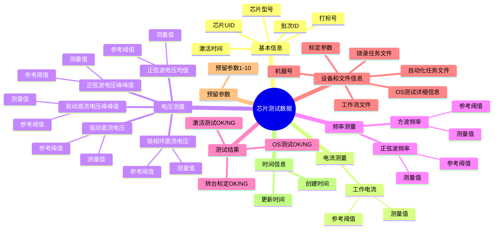
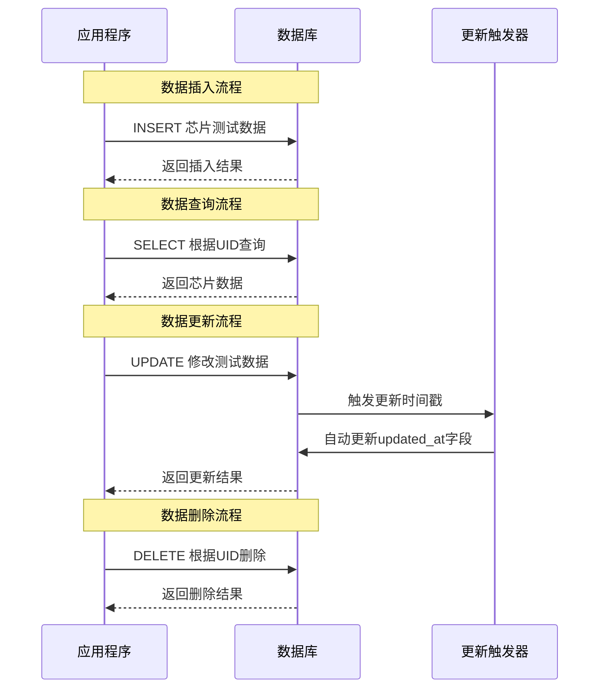
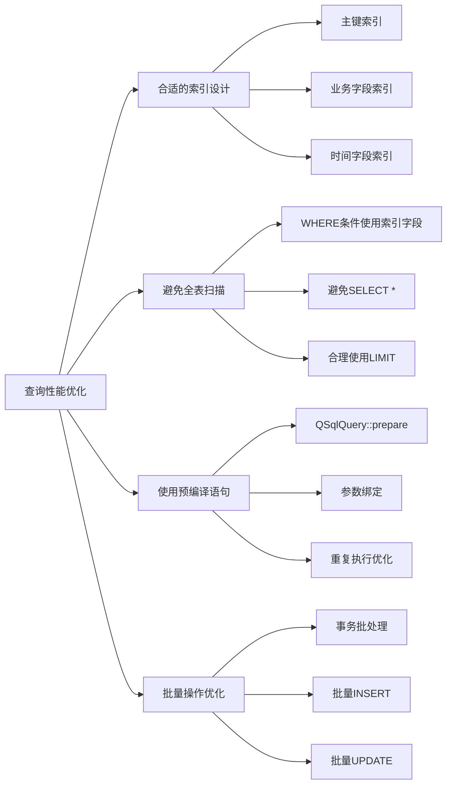

# 芯片测试数据库设计

## 数据库概述

本数据库用于存储芯片测试过程中的各项测量数据和测试结果，以芯片UID和批次ID作为复合主键，记录每个芯片在不同批次中的完整测试信息。

## 数据库表结构 (Mermaid ER图)

## 数据库索引设计

## 数据流程图

## 数据表关系说明

### 主表：chip_test_data
- **复合主键**: `uid, lotid` - 芯片UID和批次ID的组合
- **基本信息**: 芯片型号、批次ID、激活时间、打标号
- **测量数据**: 各项电压、电流、频率的测量值和参考阈值
- **测试结果**: 激活测试、转台标定和OS测试的OK/NG状态
- **设备和文件信息**: 机器号、工作流文件、自动化任务文件、烧录任务文件、OS测试详细信息、标定参数
- **预留参数**: 10个TEXT类型的预留字段(param1-param10)，用于扩展功能
- **时间戳**: 记录创建和更新时间

### 数据分类

## 数据库操作流程

## 查询优化建议

### 常用查询模式
1. **按UID精确查询** - 使用主键索引，性能最优
2. **按芯片型号查询** - 使用chip_model索引
3. **按批次ID查询** - 使用lotid索引
4. **按时间范围查询** - 使用created_at索引
5. **复合查询** - 可结合多个索引条件

### 性能优化策略

## 数据完整性约束

- **复合主键约束**: UID和批次ID的组合必须唯一
- **非空约束**: 芯片型号必须非空
- **默认值**: 测试结果默认为0(NG状态)
- **自动时间戳**: 创建和更新时间自动维护
- **触发器**: 自动更新updated_at字段

## 扩展建议

1. **数据归档**: 可考虑按时间分表存储历史数据
2. **统计表**: 可增加汇总统计表提升查询性能
3. **日志表**: 可增加操作日志表记录数据变更
4. **配置表**: 可增加参考阈值配置表便于管理
5. **预留字段使用**: param1-param10字段可用于存储自定义测试参数、工艺参数或其他扩展数据
