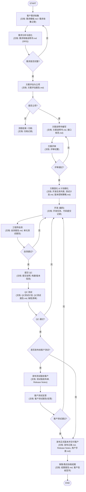

# 产品线研发流程

本文档将从流程图抽象出可执行、可复用的产品线（项目）研发流程，包含每一步的目的、参与者、输出物、入口/出口准则和常用模板要点，便于团队实施与审核。

> 目标：把图中流程转为结构化、可执行的研发过程文档，便于项目管理、质量控制与交付。

---


## 流程总览（高层）

1. 客户需求收集
2. 需求分析与固化
3. 方案评估与立项
4. 方案说明书编写与评审
5. 方案确认与分解（开发/测试/发布计划）
6. 开发（编码）与工程师自测
7. 内部 QC（质量检查）与用户测试（交付测试版）
8. 发布正式版本并交付客户
9. 销售/售后协助结案

<!-- Mermaid 流程图：在此处可被支持 Mermaid 的 Markdown 渲染器直接渲染 -->
```markdown
# 产品线研发流程

本文档将从流程图抽象出可执行、可复用的产品线（项目）研发流程，包含每一步的目的、参与者、输出物、入口/出口准则和常用模板要点，便于团队实施与审核。

> 目标：把图中流程转为结构化、可执行的研发过程文档，便于项目管理、质量控制与交付。

---

## 流程总览（高层）

1. 客户需求收集
2. 需求分析与固化
3. 方案评估与立项
4. 方案说明书编写与评审
5. 方案确认与分解（开发/测试/发布计划）
6. 开发（编码）与工程师自测
7. 内部 QC（质量检查）与用户测试（交付测试版）
8. 发布正式版本并交付客户
9. 销售/售后协助结案

<!-- Mermaid 流程图：在此处可被支持 Mermaid 的 Markdown 渲染器直接渲染 -->




每一步包含明确的入口条件、参与角色、输出物和退出条件（决策门）。下面逐步展开。

---

## 参与角色（建议）

- 方案经理 / 项目经理（PM） — 负责需求梳理、方案、立项与交付管理
- 客户代表 — 提供需求、参与验收
- 销售人员 — 协助需求获取与合同/报价
- 测试工程师 / QC — 负责测试计划与执行
- 开发工程师（软件/硬件） — 实现方案并自测
- 技术文档/技术支持 — 编写用户手册、安装与维护文档
- 生产/运维（如适用） — 支持部署、上线


### 参与角色 — 详细角色表（来源：`specs/imported/技术研发流程说明V1.0 --Jony.md`）

> 下面表格为从示例文档摘录的详细角色、职责与常见系统权限，供参考与模板化使用；如采纳请在表格旁注明对应职责与组织内的实际人选。

| 角色 | 描述 | 主要职责 | 常见系统权限 |
|---|---|---|---|
| 系统管理员 | 负责系统维护和配置管理 | • 系统配置管理；• 用户权限分配；• 设备连接与监管；• 数据库维护 | • 所有模块访问；• 系统参数修改；• 用户管理 |
| 测试工程师 / QA | 负责执行自动化测试与结果分析 | • 执行自动化测试流程；• 测试参数设置；• 测试结果分析；• 异常上报与处置 | • 测试配置与查看结果；• 启停测试任务 |
| 操作员 | 负责日常测试操作与现场执行 | • 启动/停止测试；• 装/卸芯片与上电；• 监控测试状态；• 基本故障处理 | • 测试操作界面；• 设备操作权限 |
| 客户代表 | 提供需求与验收意见 | • 提交需求；• 参与验收与反馈 | • 查看报告/参与验收 |
| 产品/项目经理 (PM) | 负责需求、方案、立项与交付管理 | • 需求评审与优先级决策；• 方案立项与资源协调；• 验收决策 | • 立项与发布权限（视组织而定） |

---

### 流程補充（节选自 `技术研发流程说明V1.0 --Jony`，供参考）

> 下列为示例文档中对测试/标定流程的动作级摘要，建议作为 `详细流程与工作项` 的补充描述或可直接引用为 SOP 草案的一部分，并注明来源。

1. Step1：将 DUT 放置到 Station-1，视需进行预冷准备；由硬件自动化系统执行放置动作。
2. Step2：将 DUT 从 Station-1 移动至 Station-3，进行多个压力/温度点的数据采集（各点多次采样取平均）。
3. Step3：在 Station-4 执行标定流程与部分软件测验（如标定写入、OTP 写入），并完成相关数据存储。
4. Step4：汇总并分析所有采样数据，依据结果产生最终判定（OK/NG）并记录到结果文件。
5. Step5：自动化系统根据 OK/NG 分 Bin 并完成后续分拣/处理动作。

(已摘录自 `specs/imported/技术研发流程说明V1.0 --Jony.md`，保留原文来源供审阅）

---

## 详细流程与工作项


### 1) 客户需求收集

- 目标：获取客户的业务目标、功能需求、约束条件（成本、交付时间、合规等）
- 参与者：方案经理、客户、销售
- 输出物：需求收集记录（会议纪要、需求草稿、用户场景、优先级）
- 入口：客户表达意向或销售线索
- 退出/决策：需求是否足够完整？（是 -> 继续；否 -> 继续收集/澄清）

要点：

- 使用统一模板记录：需求来源、联系人、版本、优先级、验收标准。


### 2) 需求分析与固化

- 目标：把模糊需求具体化、可实现并评估风险
- 参加人员：方案经理、技术负责人、客户代表（视情况）
- 输出物：需求文档（SRS 或 需求清单）、风险与依赖清单
- 决策点：是否满足立项条件（业务价值、可实现性、资源可用）

验收准则示例：

- 每条需求应包含描述、使用场景、成功标准、不可接受情况、优先级和测试要点。


### 3) 方案评估与立项

- 目标：评估实现方案（技术路径、工期、成本）并决定是否立项
- 参加人员：方案经理、技术负责人、测试代表、销售/财务（如需）
- 输出物：方案评估报告（含预算、计划）、立项决议
- 决策门：立项（是/否）；若否，记录原因并回退需求或归档

输出应包含：

- 初步时间表、里程碑、需要的资源（人力、硬件、第三方）及关键风险


### 4) 方案说明书编写与评审

- 目标：把选定方案写成正式说明书，明确接口、模块划分、测试点和交付物
- 参加人员：方案经理（主编）、技术工程师、测试工程师、客户（评审）
- 输出物：方案说明书（包含需求映射、界面说明、API/协议、验收测试要点）
- 决策门：评审通过 -> 固化方案；不通过 -> 修改

评审注意：列出所有影响交付的技术风险与待确认项（Action Items）并分配责任人。


### 5) 立项后方案固化与计划细化

- 目标：拆解开发任务、编写详细计划（迭代/里程碑）、准备测试用例
- 输出物：开发任务列表、详细时间表、测试计划、部署/发布计划、配置管理策略（SVN/Git 分支策略）

工具/实践建议：Jira/Redmine 任务追踪，SVN/Git 做版本管理并建立发布分支。


### 6) 开发（编码）与工程师自测

- 目标：实现方案中定义的功能并完成自测
- 关键活动：模块编码、单元测试、代码审查（必要时PR/CR）、工程师自测
- 输出物：代码（提交到 repo）、自测报告、自动化测试（如有）
- 决策点：自测通过 -> 准备提交 QC；自测不通过 -> 返工

自测准则举例：所有功能点对应的验收用例通过，严重缺陷为0，中等缺陷<=可接受阈值。


### 7) 内部 QC 与用户测试

- 阶段 A：内部 QC

  - QC 执行：下载指定 SVN/Git 版本，执行完整测试用例（功能、回归、性能、兼容性）

  - 输出：QC 测试报告，缺陷清单

  - 决策：QC 通过 -> 发布正式版本给客户；QC 未通过 -> 修复并重测

- 阶段 B（如需）：发布测试版给客户

  - 用途：让客户在真实环境/场景中验证

  - 输出：客户测试反馈、变更请求

  - 决策：客户测试通过 -> 进入正式发布；未通过 -> 处理反馈并回到开发/测试循环

测试交付注意：

- 明确提供给 QC 和客户的版本号、编译说明、安装包、Release Notes、回滚方案


### 8) 发布正式版本并交付客户

- 目标：把通过 QC 验证的正式版本发布并交付客户，做好发布通知与支持。
- 输出：发布记录（版本号、时间、发布人员）、交付物（安装包、文档、用户手册）、发布报告
- 后续：跟踪客户问题、发布补丁（若需）

版本控制与路径规范（示例）：

- 主干/Trunk 保持稳定，开发在 Feature 分支，发布分支用于交付与维护，发布时记录版本号与 SVn/Git 路径。

### 9) 结案与销售协助

- 目标：确认客户验收、完成财务/合同相关结案工作
- 输出：结案文档、客户验收签字、售后支持计划

---

## 决策门与验收准则（Gate Criteria）

- 需求固化门：需求文档签字或邮件确认，含验收标准
- 立项门：通过方案评估、预算与时间评估、资源可用性
- 自测门：工程师自测报告通过（无阻塞缺陷）
- QC 门：QC 测试通过，关键用例通过率达到预设阈值（示例：100%关键、>=95%功能）
- 客户验收门：客户测试通过或签字确认

---

## 常用模板与交付物示例

- 需求收集表（字段）：需求ID、描述、来源、优先级、验收标准、提交者、版本
- 方案说明书（结构）：目的、范围、系统架构、模块设计、接口说明、数据结构、测试点、部署说明
- 测试计划/用例（字段）：用例ID、标题、步骤、预期结果、优先级、实际结果
- 发布单/Release Notes：版本号、变更摘要、已知问题、回滚步骤

---

## 质量保证与风险控制要点

- 每次发布必须包含回归测试覆盖关键功能。自动化用例比人工更稳定，建议覆盖核心流程。
- 关键路径（如生产设备控制、数据保存、用户登录）应有冗余验证与监控。
- 对外接口、兼容性、安装/卸载流程必须在发布前验证。

风险管理：列出风险项（技术、资源、依赖、客户延迟），为每项指定缓解措施与责任人。

---

## 推荐的度量指标（可选）

- 需求变更率、开发缺陷密度、平均修复时间 (MTTR)、发布延迟率、客户验收通过率。

---

- ## 示例检查表（交付前）

- [ ] 需求文档已签字确认
- [ ] 方案说明书已评审并分配任务
- [ ] 开发完成并通过工程师自测
- [ ] QC 测试通过并上传测试报告
- [ ] 用户手册、安装说明、Release Notes 已生成
- [ ] 发布记录、版本号及备份路径已记录
- [ ] 客户验收计划与支持联系人已安排

---

## 常见问题与建议

- 问：如何快速定位测试不通过的原因？

  答：查看 QC 报告的失败用例堆栈和日志，定位首次失败提交（first-failure）对应的 commit/版本。

- 问：何时需要发测试版给客户？

  答：当内部 QC 覆盖核心功能并通过，且需要客户在其真实环境检验边界/兼容性时。

---

## 附录：简单流程图文本版（便于复制）

1. 收集需求 -> 2. 需求分析 -> 3. 方案评估 -> 4. 立项 -> 5. 编写方案说明书 -> 6. 方案评审 -> 7. 方案固化 -> 8. 开发编码 -> 9. 工程师自测 -> 10. 提交 QC -> 11. QC 测试 -> 12a. QC 通过 -> 发布正式版本 -> 结案； 12b. QC 未通过 -> 修复并回到开发/测试循环。

---

## 下一步（我可以帮忙的事）

- 把现有流程转为可填写的模板（Word/MD/Excel 表单）。

- 生成一份更精简或更详细的 SOP（按你团队偏好）。

- 把流程转为 Jira 工作流和自动化检查项。

如需我把文档放到项目的特定位置或者生成模板文件（例如 `specs/模板/需求模板.md`），回复要做的项即可。
